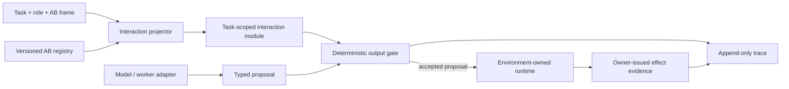

# Universal Agentic Harness

Universal Agentic Harness is a portable, model-agnostic kernel for turning a
language model into a bounded and observable subsystem agent. It compiles a
task-specific interaction module from a versioned abstraction-boundary (AB)
object graph, then gates model output against role ownership, projected
capabilities, and effect-claim authority.

This repository begins with the H0 contract proof extracted from
`ieverythng/nao-ros4hri-bridge`. The core package has no ROS, NAO, model SDK, or
provider dependency. NAO is retained as the first compatibility example, not
as a dependency of the kernel.

## Current status

H0 proves:

- frame-relative AB control bands;
- read-only registry snapshots with SHA-256 content identity;
- task projection with inspectable decomposition closure;
- deterministic output-type, object-reachability, AB-level, and effect-claim
  gates;
- append-only JSONL trace round trips;
- thin NAO chatbot/planner payload adapters.

It does **not** yet provide a complete runnable agent loop. Provider adapters,
full task/environment schemas, lifecycle events, execution, evidence closure,
replay, and cross-domain conformance are the H1-H5 roadmap.



## Quick start

Python 3.10 or newer is required.

```bash
python -m venv .venv
python -m pip install -e ".[test]"
python -m pytest
```

Minimal use:

```python
from ab_harness import ABControlBand, AbstractionFrame, AgentRoleSpec
from ab_harness import InteractionProjector, OutputGate, RegistrySnapshot

registry = RegistrySnapshot.from_json_file("tests/fixtures/ab_registry.json")
role = AgentRoleSpec(
    role_id="planner",
    allowed_output_types=("executable_plan",),
    control_band=ABControlBand(1, 1, 2, inspect_down_to_level=0),
)
frame = AbstractionFrame(
    frame_id="demo",
    substrate="typed task runtime",
    atomicity_rule="AB1 objects are directly callable",
    registry_version=registry.version,
)
module = InteractionProjector(registry).compile(
    task_id="find-and-report",
    role=role,
    frame=frame,
    requested_object_ids=("find_object", "report_result"),
)
```

## Repository map

- `src/ab_harness/` — portable H0 contracts, registry adapter, projector, gate,
  trace store, and NAO compatibility views.
- `tests/` — fail-closed H0 tests and a standalone registry fixture.
- `docs/agentic_harness/` — canonical foundation, adaptive Workbench design,
  implementation masterplan, and generated HTML editions.
- `docs/watson_inference_seams.md` — concrete seams for local-model and
  llama.cpp experimentation.
- `scripts/` — dependency-free Markdown-to-HTML rendering.
- `package.xml`, `resource/` — optional ROS 2 `ament_python` packaging wrapper;
  the Python core remains ROS-independent.

## Design rule

The harness owns semantic projection, typed gates, traces, evaluation, and
promotion governance. Domain runtimes retain execution and evidence ownership.
Provider, sandbox, browser, shell, ROS, MCP, and frontier-worker integrations
belong behind adapters.

See the
[implementation masterplan](docs/agentic_harness/universal_agentic_harness_masterplan.md)
for the H0-H6 release spine and [source
provenance](docs/provenance.md) for the exact extraction revision.

## License

BSD-3-Clause. See [LICENSE](LICENSE).
