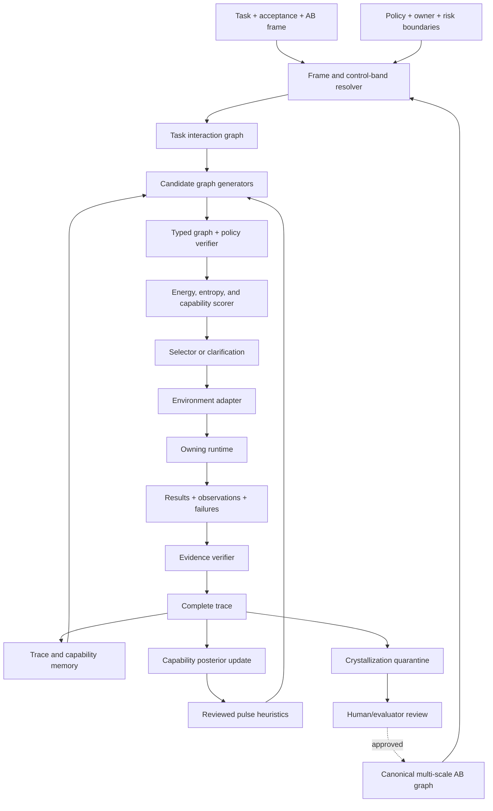

# Adaptive AB Harness: Neural Workbench Search, Memory, and Crystallization

**Status:** Research extension; H0 parent-repo proof implemented
**Date:** 2026-07-13
**Extends:** `universal_agentic_harness_foundation.md`
**Primary theory source:** Neural Workbench documentation and current source on `feat/base-implementation`
**Canonical delivery status:** `universal_agentic_harness_masterplan.md` (2026-07-22)

This document remains the canonical adaptive theory extension. The masterplan
owns current H0-H5 release status and extends the ladder with H5 cross-runtime
federation plus a separately gated AB5 research hypothesis.

## 1. Extension Claim

The Universal Agentic Harness foundation defines how a task receives the
smallest valid interaction surface from an environment capability graph. This
extension adds the harder Neural Workbench claim:

> The interaction surface should not remain a static projection. It should be a
> task-relative search space over typed AB objects, candidate pulse graphs, and
> empirical capability profiles. Complete traces should update future search,
> while repeated verified structures may be proposed as higher-level AB objects.

The result is an adaptive harness that changes with the user and task without
silently self-modifying its trusted runtime.

The distinction matters:

```text
ordinary harness
  = select tools + build context + call model + validate result

adaptive AB harness
  = frame task at an AB scale
  + compile a permitted AB control band
  + generate multiple typed pulse structures
  + verify, score, and select a structure
  + execute through the environment owner
  + preserve the complete trace and counterevidence
  + update empirical pulse and object profiles
  + propose reusable higher-level objects for review
```

## 2. Target Contract

### Required outcome

Define an architecture in which:

- AB objects at every represented scale can participate in planning, search,
  evaluation, or system design;
- the task contract determines which AB levels the agent may directly control;
- lower-level decomposition remains inspectable without always being exposed to
  the model;
- higher-level objects remain unavailable unless the task and policy explicitly
  admit them;
- several candidate plans, graphs, architectures, or policies can compete;
- successful and failed traces update future candidate priors;
- known useful pulse fragments can guide search without becoming unquestioned
  rules;
- repeated structures can crystallize into AB2+ proposals only through measured
  evidence and review;
- the same kernel supports embodied skills, software agents, trading systems,
  and architecture-design systems.

### Non-goals

- Do not claim that AB levels are universal constants attached to names.
- Do not infer causality from successful trace frequency alone.
- Do not let an LLM write directly into a trusted runtime registry.
- Do not treat lower energy as proof of correctness.
- Do not collapse runtime action, offline learning, and human promotion into one
  loop.
- Do not let the Workbench become the owner of ROS execution, trading execution,
  shell permissions, or user-facing speech.
- Do not expose every decomposition leaf when a stable higher-level contract is
  sufficient.

### Evidence budget

This document uses:

- all documents under `src/Neural-Wokbench/docs/neural_workbench/`;
- the extended formal masterplan under `src/Neural-Wokbench/docs/plans/`;
- current `skill_common` and `neural_workbench` source and tests;
- the existing Universal Agentic Harness seam audit of `chatbot_llm` and
  `planner_llm`.

No live ROS, robot, market simulator, Watson runtime, or learned model experiment
was run for this documentation slice. Claims about uplift remain hypotheses with
explicit probes.

## 3. One AB Language, Multiple Coordinate Frames

The Neural Workbench documents use AB levels in two compatible but differently
anchored ways:

1. In the NAO planning frame, AB0 contains effect primitives and runtime seams,
   AB1 contains executable skills, and AB2 contains reviewed skill composites.
2. In the ML architecture frame, AB0 contains tensor primitives, AB1 contains
   learned operators, AB2 contains motifs, AB3 contains model families, and AB4
   contains coupled agentic systems.

This is not a contradiction if AB level is treated as a coordinate relative to
an explicit boundary.

Define an abstraction frame:

```text
F_AB = (frame_id, substrate, atomicity_rule, owner, registry_version)
```

and an object coordinate:

```text
coord_F(o) = (level, kind, input_type, output_type, effect_signature)
```

Examples:

| Object | Frame | Coordinate interpretation |
| --- | --- | --- |
| `walk_to` | `nao_runtime` | AB1 executable embodied skill |
| `navigate_with_recovery` | `nao_runtime` | AB2 proposal over skills |
| attention operator | `ml_architecture` | AB1 learned routing object |
| Transformer block | `ml_architecture` | AB2 reusable motif |
| served LLM | `ml_architecture` | AB3 trained model family |
| WatsonOW agent system | `watson_system` | AB4 coupled model, tools, memory, verifier, runtime |
| iTrader proposer-solver-verifier | `itrader_system` | AB4 coupled decision and learning system |

An object may have mappings across frames, but those mappings must be explicit:

```text
map_F_to_G(o, evidence) -> object coordinate or unresolved
```

The harness must therefore carry `frame_id` with every AB coordinate. A bare
`ab_level: 2` is insufficient outside one registry and one declared boundary.

## 4. Task-Relative AB Control Bands

A task should not simply request one `desired_ab_level`. It should define a
control band:

```text
B_tau = [k_min, k_target, k_max]
```

where:

- `k_min` is the lowest level the model may directly manipulate;
- `k_target` is the preferred level for solving the task;
- `k_max` is the highest level the model may propose or invoke;
- decomposition below `k_min` may remain visible for explanation and
  verification but is not directly controllable;
- objects above `k_max` are outside scope even if they exist in the registry.

A fuller contract is:

```yaml
ab_control:
  frame_id: nao_runtime
  min_direct_level: 1
  preferred_level: 1
  max_direct_level: 2
  inspect_down_to_level: 0
  may_propose_above_max: false
  expansion_policy: on_failure_or_verifier_request
  compression_policy: prefer_stable_reviewed_object
```

### NAO control band

For ordinary NAO tasks:

```text
B_nao = [AB1, AB1, AB2]
```

The planner normally calls `scan`, `find_object`, `walk_to`, or `look_at` as AB1
skills. It can inspect their AB0 effect decomposition for evidence, debugging,
and uncertainty scoring. It may use a reviewed AB2 composite, but it must not
invent joint-level choreography or invoke an unpromoted macro.

### iTrader control band

For a coupled proposer and solver:

```text
B_itrader = [AB2, AB3, AB4]
```

The harness may manipulate TaskSpecs, model/policy roles, adapter selection,
verifier-coupled candidate families, and supervision policies. Tensor operations
and optimizer steps remain below direct task control unless the task is
explicitly architecture or training design.

### Watson control band

For a system-level engineering agent:

```text
B_watson = [AB2, AB4, AB4]
```

The model may coordinate repository interaction modules, recursive reasoning,
memory, provider selection, sandboxes, subagents, and verification policies as
an AB4 system. Shell commands or file edits can be lower-frame primitives, but
the task-facing object is the coupled system policy and its typed effects.

These values are starting hypotheses, not permanent labels. Each subsystem must
validate its own frame and control band against traces and task outcomes.

## 5. The Adaptive Harness as an AB4 System

The harness itself can be described as a coupled AB4 object in the system frame:

```text
H_AB4 = (O, Delta, M, E, V, R, Pi, Phi)

O     = admitted AB objects and interaction modules
Delta = allowed graph, prompt, adapter, or policy transformations
M     = trace, artifact, and capability memory
E     = environment and runtime adapters
V     = schema, effect, safety, and task verifiers
R     = rewards, costs, and uncertainty changes
Pi    = candidate generation, selection, recovery, and escalation policy
Phi   = empirical capability profile
```

The harness does not become a universal executor. Its AB4 behavior is the
coordination of typed objects and evidence while preserving each environment
owner.

### AB3 agent inside an AB4 envelope

For the current NAO stack, `chatbot_llm` and `planner_llm` can each be modeled
as role-bounded AB3 model-agent objects participating in one AB4 coupled system:

```text
NAO_AB4 = {
  AB3 agents: chatbot_llm, planner_llm,
  deterministic owners: dialogue_manager, nao_orchestrator,
  state/evidence: scene, KB, execution feedback, traces,
  tools/effects: admitted AB1 skills and reviewed AB2 composites,
  policy: route, planning, safety, speech, and execution ownership,
  environment: ROS4HRI runtime and robot/simulator
}
```

This representation improves grounding only when it becomes an enforceable
contract. The harness must compile a role-specific view for each agent:

| AB3 role | May observe | May produce | Must not produce |
| --- | --- | --- | --- |
| `chatbot_llm` | bounded dialogue, scene/KB projection, admitted capability summary | user-facing response, route, grounded intent, planner request | executable plan, execution claim, direct skill call |
| `planner_llm` | planner request, admitted AB graph, feedback, relevant traces | typed candidate plan, supervision decision, planner dialogue act | robot dispatch, direct speech, fabricated evidence |

The AB4 envelope then checks output reachability:

```text
output is admissible iff
  output_type in role.output_contract
  and referenced_objects subset of task_interaction_graph
  and every claimed effect has an evidence path
  and requested transition stays inside the AB control band
  and the receiving owner accepts the payload
```

This is a practical gate around model capability, not a claim that the harness
creates reasoning the pretrained or post-trained model does not possess.



## 6. Candidate Structures, Not Only Plans

A `PulseProgram` is currently an ordered sequence. The harder Workbench needs a
typed pulse graph:

```text
Gamma_tau = (V, E_flow, E_control, E_evidence, E_recovery, D)
```

where:

- `V` are AB objects or bounded pulse instances;
- `E_flow` carries typed data or state;
- `E_control` expresses order, gating, branching, recursion, or concurrency;
- `E_evidence` connects an expected effect to its proving observation;
- `E_recovery` connects a failure class to an admitted response;
- `D` contains delta operators that mutate objects, routes, or policies.

Required composition operators include:

| Operator | Meaning | Example |
| --- | --- | --- |
| Sequential | staged effect composition | scan then find then report |
| Parallel | independent or competing views | retrieve traces while inspecting state |
| Residual | preserve previous state while adding a delta | base prompt plus scoped task module |
| Gated | choose a branch from evidence | retry versus clarify |
| Recursive | decompose and synthesize subproblems | repository or long-context reasoning |
| Verifier-coupled | candidate feeds checker before acceptance | plan schema or backtest gate |
| Recovery | failure activates a bounded alternate graph | blocked path to replan or report |
| Inhibit/compete | one candidate suppresses another | grounded answer beats unsupported action |

A graph folds into an executable schedule only after type, scope, owner, and
evidence closure checks pass.

## 7. Search Space and Candidate Families

For task `tau`, state `x`, frame `F`, policy `rho`, memory `M`, and model profile
`Phi_M`, the compiler produces an admitted graph space:

```text
G_tau = Project(G_AB, tau, x, F, B_tau, rho, Phi_M)
```

Candidate generators operate over `G_tau`, not the full registry:

```text
C_tau = union(
  deterministic_templates,
  model_proposals,
  retrieved_trace_variants,
  reviewed_pulse_heuristics,
  local_graph_mutations,
  recovery_variants
)
```

Each candidate must retain provenance:

```yaml
candidate_id: cand_017
frame_id: nao_runtime
generator:
  kind: retrieved_mutation
  source_trace_ids: [trace_031, trace_044]
  heuristic_ids: [pulse.search_verify_report.v2]
control_band: [1, 1, 2]
graph: {}
assumptions: []
expected_effects: []
required_evidence: []
```

Candidate diversity is useful only when mechanisms differ. Ten paraphrases of
the same plan are not ten independent candidates.

## 8. Pulse Heuristics as Reviewed Search Priors

A successful pulse fragment should first become a heuristic, not a skill.

```text
trace fragment
  -> recurring mechanism
  -> heuristic candidate
  -> holdout evaluation
  -> reviewed search prior
  -> possible future AB object proposal
```

A pulse heuristic records:

```yaml
heuristic_id: pulse.try_recover_clarify.v1
frame_id: nao_runtime
applicable_task_features:
  - recoverable_failure
  - insufficient_grounding
suggested_graph_fragment:
  - inspect_failure_evidence
  - attempt_admitted_recovery
  - clarify_if_uncertainty_remains
support:
  successful_trace_ids: []
  failed_trace_ids: []
  counterexample_trace_ids: []
performance:
  posterior_success: {}
  entropy_delta: {}
  cost: {}
status: proposed # proposed | evaluated | approved | deprecated
```

Heuristics influence generation or priors. They do not bypass candidate
verification and do not become runtime-callable endpoints.

## 9. Energy, Entropy, and Performance Selection

The existing symbolic energy function is a good auditable baseline. The adaptive
harness generalizes it without hiding the terms:

```text
E(Gamma | tau, x, M, Phi) =
    w_i invalidity
  + w_r risk
  + w_c expected_cost
  + w_h expected_remaining_entropy
  + w_a abstraction_band_violation
  + w_f failure_posterior
  + w_s scope_complexity
  + w_d decomposition_debt
  - w_p expected_task_success
  - w_g grounding_quality
  - w_t trace_support
  - w_v verifier_coverage
  - w_k expected_information_gain
```

Selection may begin with a Boltzmann distribution:

```text
P(Gamma | tau, x, M) = exp(-E(Gamma) / temperature) / Z
```

but this probability is a policy distribution, not epistemic truth.

### Running uncertainty

For uncertain capability `o` under task family `q`, store a posterior rather
than one scalar confidence:

```text
Phi(o, q) = {
  success: Beta(alpha, beta),
  latency: empirical distribution,
  cost: empirical distribution,
  delta_H: empirical distribution,
  failure_modes: categorical posterior,
  calibration: reliability bins,
  evidence_coverage: empirical rate,
  support_count: n,
  freshness: timestamp and environment version
}
```

For binary verified outcomes:

```text
p_success(o, q) ~ Beta(alpha_0 + successes, beta_0 + failures)
```

Uncertainty should increase or remain unresolved when evidence is missing. An
unknown result must not be counted as success or failure simply to simplify the
posterior.

### Information gain

A candidate may be valuable because it resolves uncertainty even before final
task completion:

```text
IG(Gamma) = H(X | tau, history) - E_y[H(X | tau, history, Gamma, y)]
```

This formalizes scan, query, inspect, test, simulate, and ask-user actions as
information-producing pulses.

### Multi-objective selection

Do not collapse all objectives too early. Preserve a score vector:

```text
J(Gamma) = (
  validity,
  task_success,
  safety,
  evidence_coverage,
  delta_entropy,
  latency,
  compute_cost,
  reversibility,
  portability
)
```

Use hard constraints first, Pareto filtering second, and a deployment-specific
scalar energy only for the remaining candidates.

## 10. Complete Trace as the Unit of Adaptation

The trace must preserve the full causal claim chain:

```text
task contract
  -> AB frame and control band
  -> registry and model versions
  -> candidate set and provenance
  -> verifier decisions
  -> selected graph and score vector
  -> approvals and runtime calls
  -> observations, failures, and evidence
  -> terminal task judgment
  -> capability updates
  -> heuristic and crystallization proposals
```

Proposed trace envelope:

```yaml
trace_id: trace_2026_00042
task_spec_id: task_find_cup
frame_id: nao_runtime
control_band:
  min_direct: 1
  preferred: 1
  max_direct: 2
versions:
  registry: sha256:...
  harness: git:...
  model_profile: qwen_local_v3
candidates: []
selected_candidate_id: cand_017
execution_events: []
evidence_events: []
outcome:
  status: success
  acceptance_checks: []
uncertainty:
  before: {}
  after: {}
  delta: {}
capability_updates: []
heuristics_used: []
proposal_ids: []
```

Trace records are append-only evidence. Derived profiles and indexes may be
rebuilt, but historical observations must not be rewritten to make a policy
look better.

## 11. Adaptation Loop

The adaptive behavior is split into two loops.

### Online bounded loop

```text
frame task
  -> compile admitted interaction graph
  -> generate bounded candidate structures
  -> verify
  -> select
  -> execute through owner
  -> verify effects
  -> append trace
```

The online loop may update temporary candidate priors, but it does not promote
new trusted objects.

### Offline Workbench loop

```text
read immutable traces
  -> cluster by task, mechanism, environment, and failure mode
  -> estimate capability posteriors
  -> identify reusable graph fragments
  -> test counterfactual and holdout variants
  -> propose heuristic or AB object
  -> quarantine
  -> review
  -> publish a new versioned registry/profile
```

This separation keeps adaptation real while preventing uncontrolled online
self-modification.

## 12. Crystallization Lifecycle

Frequency is only the first filter. A candidate higher-level object must pass:

```text
observed
  -> grouped
  -> proposed
  -> replay-tested
  -> holdout-tested
  -> safety-reviewed
  -> owner-approved
  -> published non-runtime
  -> runtime-promoted
  -> monitored
  -> deprecated or retained
```

A crystallization candidate should satisfy:

```text
support_count >= N_min
credible_lower_bound(success) >= theta_success
failure_rate_by_mode <= thresholds
mean_delta_entropy > 0
required_evidence_coverage >= theta_evidence
schema_stability == true
cross_task_generalization >= theta_generalization
cost_or_latency_gain > 0
no_unresolved_safety_counterexample
owner_approval == true
```

### Compression test

A macro is useful only if it compresses complexity without hiding required
control:

```text
compression_gain =
  lower_graph_description_length
  - macro_contract_description_length
  - hidden_risk_penalty
  - lost_observability_penalty
```

### Causal caution

Repeated co-occurrence does not prove that the whole sequence is necessary. The
Workbench should compare:

- full sequence;
- sequence with one pulse removed;
- reordered admissible variants;
- cheaper alternative objects;
- contexts where the candidate fails;
- held-out task families and environment versions.

Only then can it claim that a composition is more than a habit in the trace
corpus.

## 13. Solving the Agentic "Skill" Problem

Many agent systems treat a skill as one of three weak artifacts:

- a static prompt fragment;
- a named bundle of tools;
- a procedure written from one successful trajectory.

These artifacts drift because they rarely bind task scope, environment version,
typed effects, required evidence, failure modes, and measured performance in one
object. The AB and Neural Workbench combination offers a stronger definition:

> An agent skill is a versioned, task-relative interaction object whose
> decomposition, permissions, expected effects, proof obligations, empirical
> capability profile, and counterexamples are maintained together.

The harness can therefore maintain an `InteractionSkill`:

```yaml
interaction_skill_id: repo.fix_failing_unit_test
frame_id: software_engineering
ab_coordinate: 2
task_family: bounded_bug_fix
input_contract: {}
output_contract: {}
interaction_graph: {}
allowed_objects: []
required_evidence:
  - failing_test_reproduced
  - focused_test_passes
  - diff_within_scope
failure_modes: []
recovery_graphs: []
capability_profile: {}
supporting_trace_ids: []
counterexample_trace_ids: []
environment_compatibility: []
status: proposed
version: 1
```

This is broader than a ROS skill and narrower than a global autonomous policy.
It is the stable interaction unit for one task family under one declared frame.

### Agent-proposed, verifier-proven

The agent may:

- discover that the current interaction module is missing an observation,
  validator, recovery edge, or tool;
- propose a new pulse graph or modification;
- state the expected effect and proof obligation;
- generate tests, simulations, or replay cases;
- explain which traces support and contradict the proposal.

The acceptance authority must be independent of the proposal when feasible:

| Claim | Preferred prover |
| --- | --- |
| payload/schema validity | deterministic schema validator |
| code behavior | focused test, compiler, static checker, or runtime observation |
| ROS effect | action result plus fresh skill-owned evidence |
| market behavior | replay, simulator, risk engine, and held-out periods |
| factual grounding | authoritative resource and freshness check |
| safety or permission | policy engine and human approval where required |
| subjective quality | blinded evaluator or human review with rubric |

When only an LLM judge exists, the trace must label the result as model-judged,
retain uncertainty, and avoid promotion to trusted runtime status without a
stronger gate.

### Continuous task Workbench

Each task family can develop its own bounded Neural Workbench:

```text
task family
  -> current InteractionSkill
  -> execution traces and counterexamples
  -> capability posterior
  -> diagnosed interaction gap
  -> candidate module repair
  -> independent proof/evaluation
  -> versioned replacement or rejection
```

This gives the agent continuity without giving it unlimited self-modification.
The system adapts the task interaction module, not the global environment or
the model's authority.

### Maintenance triggers

Re-evaluate an interaction skill when:

- an environment, API, model, registry, or policy version changes;
- calibrated success drops below its accepted interval;
- a new failure mode or counterexample appears;
- required evidence can no longer be obtained;
- task distribution moves outside the supported capability slice;
- a cheaper or safer candidate graph becomes available.

This turns skills into maintained empirical contracts rather than frozen prompt
recipes.

## 14. Delta Operators and Learned Systems

The new Neural Workbench documents introduce `delta_AB` operators: transformations
that modify an object, graph, or policy without necessarily creating a new AB
level.

Examples:

| Delta | Target | Harness interpretation |
| --- | --- | --- |
| LoRA or adapter | model object | task-specific behavior delta with versioned base |
| Router | object family | conditional selection over specialized objects |
| PPO | policy object | bounded reward-conditioned policy update |
| GAE | trajectories | credit-assignment transformation |
| RLVR | generator/policy | verifier-shaped update from checkable outcomes |
| Prompt module | model interaction | scoped residual policy/context delta |
| Trace prior | candidate selector | empirical probability delta |
| Graph mutation | candidate structure | add, remove, reorder, gate, or substitute objects |

The registry should distinguish:

```text
AB object: something with a typed effect contract
AB graph: a composition of objects
AB delta: a transformation over an object or graph
AB profile: measured behavior under a task/environment slice
```

This prevents LoRA, PPO, a tool call, and a runtime skill from being forced into
the same semantic category.

## 15. Subsystem Instantiations

### NAO ROS4HRI

```text
Task: find the cup and report
Frame: nao_runtime
Direct band: AB1 preferred, reviewed AB2 allowed
Candidate objects: scan, find_object, report_result
Hidden/inspectable AB0: target resolution, perception wait, evidence validation
Owner: planner_llm selects; nao_orchestrator dispatches; skills prove effects
Adaptation: trace priors and macro proposals only
```

The harness improves candidate selection and trace reuse. It does not make the
robot controller adaptive or allow the planner to dispatch ROS primitives.

### iTrader

```text
Task: propose and solve a bounded market decision
Frame: itrader_system
Direct band: AB2-AB4
Objects: Market-JEPA, MarketFramer, SolverMLPFiLM, RiskEngine, Executor
Deltas: adapter routing, PPO, GAE, verifier-shaped updates
Evidence: replay, risk checks, execution simulator, realized outcomes
Adaptation: capability profiles by regime and task family
```

The proposer, solver, and verifier can be searched as a coupled AB4 graph. Live
capital execution remains a separately permissioned environment owner.

### WatsonOW

```text
Task: solve a repository or system problem
Frame: watson_system
Direct band: AB2-AB4
Objects: served model, recursive controller, tool modules, memory, sandbox,
         provider router, reviewer/evaluator
Evidence: tests, source diffs, command results, artifacts, holdouts
Adaptation: task-specific interaction modules and reviewed procedure heuristics
```

Watson can use the harness to control an AB4 engineering system while the
repository, shell, browser, and provider remain typed runtime adapters.

## 16. Contracts to Add

The foundation contracts need these extensions:

```text
AbstractionFrame
ABCoordinate
ABControlBand
ABObjectSpec
ABDeltaSpec
ABGraphSpec
PulseHeuristic
InteractionSkill
CapabilitySlice
CapabilityPosterior
CandidateProvenance
EvidenceRequirement
CrystallizationProposal
PromotionDecision
```

Suggested boundary:

```text
skill_common
  owns canonical AB object and delta schemas, registry versions, graph validity

ab_harness
  owns task frames, control bands, interaction projection, provider/runtime
  interfaces, candidate provenance, trace event envelope

neural_workbench
  owns graph generation, energy/entropy scoring, retrieval, capability updates,
  heuristic mining, crystallization proposals, and offline evaluation

domain adapters
  own task features, environment state, verifier bindings, permissions, and
  execution mappings
```

The harness and Workbench must not duplicate the canonical registry.

## 17. Current-to-Target Gap

| Current implementation | Harder target | Required seam |
| --- | --- | --- |
| `desired_ab_level: int` | frame-aware control band | `AbstractionFrame` and `ABControlBand` |
| ordered `PulseProgram` | typed branching/recovery graph | `ABGraphSpec` and graph verifier |
| deterministic templates | mechanism-diverse candidate portfolio | generator provenance and diversity checks |
| hand-tuned scalar energy | constrained multi-objective score plus posterior terms | score vector and policy-specific scalarizer |
| JSONL `TraceRecord` | versioned causal trace envelope | event schema and adapters from live systems |
| recent trace loading | indexed task/mechanism/failure retrieval | trace index and capability slices |
| sequence frequency macro proposal | counterfactual, holdout, entropy, safety gate | crystallization evaluator and quarantine |
| static registry metadata | empirical capability posterior | profile store keyed by object/task/environment |
| optional planner adapter | cooperative harness clients | compatibility adapters for chatbot and planner |

## 18. Implementation Phases

| Phase | Deliverable | Acceptance gate |
| --- | --- | --- |
| A0 | Freeze frames, coordinates, bands, graphs, traces, and promotion schemas | NAO, iTrader, and Watson examples serialize without domain fields in core |
| A1 | Replace scalar AB preference with frame-aware band scoring in a compatibility layer | Existing Workbench tests remain unchanged through adapter |
| A2 | Add typed pulse graph and deterministic graph verifier | Sequential candidates round-trip; invalid/upward/owner-breaking graphs fail |
| A3 | Add trace envelope and adapters from current Workbench, chatbot, planner, and orchestrator traces | One task is reconstructable end to end from versioned events |
| A4 | Add capability posterior store and symbolic entropy updates | Unknown evidence remains unknown; success/failure calibration is testable |
| A5 | Add retrieval and reviewed pulse heuristic registry | Holdout candidate quality improves without route or execution regression |
| A6 | Add crystallization quarantine and replay evaluator | Frequency alone cannot promote; counterexamples block promotion |
| A7 | Run NAO cooperative harness ablation | Same-model parity plus measured projection or recovery benefit |
| A8 | Run one non-NAO AB4 adapter | Same kernel controls iTrader or Watson graph without NAO/ROS imports |
| A9 | Evaluate learned delta operators offline | Versioned model/policy delta outperforms baseline on holdout and verifier gates |

### Complexity ladder and release gates

The phases above are the full research route. Implementation should ship in
four bounded releases so the useful harness arrives before the speculative
Workbench layers.

#### Release H0: AB-grounded harness MVP

Goal: make one model-agent safe, scoped, and traceable inside one subsystem.

```text
TaskSpec
  -> role + AB frame + control band
  -> canonical registry projection
  -> InteractionModuleSpec
  -> existing model call
  -> deterministic output/reachability gate
  -> existing runtime owner
  -> append-only trace
```

Deliverables:

- `AbstractionFrame`, `ABControlBand`, `AgentRoleSpec`, and
  `InteractionModuleSpec`;
- canonical-registry projection with owner, input/output, effect, and evidence
  fields;
- role-specific output schemas for chatbot and planner compatibility adapters;
- deterministic checks for object reachability, AB-band compliance, and output
  ownership;
- one versioned trace envelope containing task, projection, model, output,
  validation, handoff, result, and evidence references;
- replayable fixtures for one dialogue, one knowledge query, one execution
  request, and one rejected out-of-scope output.

Explicitly excluded:

- graph search;
- trace retrieval;
- entropy estimation;
- learned scoring;
- automatic prompt changes;
- macro crystallization.

Acceptance:

```text
existing standalone behavior parity
+ smaller role-correct capability exposure
+ deterministic rejection of an unreachable output
+ complete trace reconstruction
+ no moved ROS4HRI ownership
```

H0 implementation checkpoint (2026-07-13):

- `src/ab_harness/ab_harness/contracts.py` implements frames, bands, roles,
  interaction modules, outputs, gate decisions, and traces;
- `registry.py` reads and hashes the canonical AB registry without changing it;
- `projection.py` compiles a task object set plus inspectable decomposition;
- `gate.py` rejects role-owned output violations, out-of-projection objects,
  direct AB0 use, and model-claimed execution effects;
- `trace.py` round-trips append-only H0 JSONL evidence;
- `nao_h0.py` maps current chatbot and planner payload shapes without importing
  or modifying either nested package;
- focused tests cover accepted planner/chatbot paths and fail-closed cases.

This is a contract proof, not a live node integration. Existing node validators
and runtime ownership remain authoritative until a later cooperative ablation.

#### Release H1: Candidate and recovery Workbench

Goal: use the current symbolic Workbench behind the H0 contracts.

- add deterministic and model-generated candidate portfolios;
- verify typed sequential/recovery graphs;
- retain the existing auditable energy scorer;
- expose candidate, verifier, selection, and fallback stages in the trace;
- preserve provider planning as a compatibility fallback during ablation.

Acceptance: same-model candidate search improves validity or recovery on a
frozen task set without worsening latency beyond the declared budget.

#### Release H2: Trace-adaptive harness

Goal: let prior evidence affect future search conservatively.

- index complete traces by task, object, mechanism, environment, and failure;
- add failure-aware capability posteriors and calibration;
- add reviewed pulse heuristics as search priors;
- add symbolic entropy and information-gain terms only where observables exist;
- compare no-memory, success-only, and success-plus-failure policies.

Acceptance: holdout uplift, calibrated uncertainty, and no regression in scope,
safety, or evidence completeness.

#### Release H3: Crystallizing Neural Workbench

Goal: propose and evaluate reusable higher-level AB objects.

- mine graph fragments rather than sequence frequency alone;
- run removal, substitution, replay, and cross-task counterfactuals;
- quarantine candidates with supporting and opposing traces;
- require owner and safety review before registry publication;
- monitor promoted objects and support deprecation.

Acceptance: a reviewed AB2+ object compresses a repeated solution family while
preserving effect evidence, recovery visibility, and task performance.

#### Release H4: Cross-domain AB4 design and learned deltas

Goal: prove the object calculus beyond NAO.

- instantiate Watson or iTrader through the same core contracts;
- search over AB3/AB4 system arrangements where the task permits it;
- represent adapters, routing, PPO/GAE/RLVR, and other changes as versioned
  `delta_AB` operators;
- evaluate architecture and policy changes offline before activation.

Acceptance: one non-NAO system uses the unchanged kernel and shows measured
benefit from AB-grounded interaction or system search.

### Anti-overengineering budget

Every release must satisfy a deletion test: if an abstraction does not enforce
scope, improve traceability, enable a discriminating experiment, or remove
duplicated harness code, it does not enter the MVP.

Pretraining and post-training remain responsible for broad reasoning and
language competence. The harness is responsible for environment truth:

```text
model training supplies priors and reasoning behavior
harness supplies reachable capabilities, contracts, permissions, state,
evidence, execution ownership, and measured feedback
```

The first release should therefore wrap the existing good model calls and
runtime seams rather than introduce another reasoning layer.

## 19. Required Ablations

1. Scalar desired AB level versus task-relative AB control band.
2. Flat tool list versus closed task AB graph.
3. One candidate versus mechanism-diverse candidate portfolio.
4. Deterministic templates versus templates plus retrieved heuristics.
5. Scalar energy versus hard constraints plus Pareto filtering plus energy.
6. No trace prior versus success-only prior versus success-and-failure posterior.
7. Sequence-frequency macro proposal versus counterfactual crystallization gate.
8. Static node internals versus cooperative harness adapters.
9. NAO AB1 task versus Watson/iTrader AB4 task under the same kernel contracts.
10. Unversioned context versus registry, model, harness, and environment-versioned
    trace replay.

For every ablation, hold model, task set, environment version, and acceptance
checks constant unless that variable is the subject of the test.

## 20. Approach Registry

| ID | Mechanism | Discriminating probe | Status | Exact gap or rejection reason |
| --- | --- | --- | --- | --- |
| AH-01 | Fixed task projection only | Compare repeated tasks before and after traces | Rejected as complete design | Cannot adapt candidate priors or create reusable structures. |
| AH-02 | Global highest-level agent | Give Watson/NAO all AB levels and compare scope violations | Rejected | Ignores task-relative control and exposes unnecessary authority. |
| AH-03 | One universal absolute AB ladder | Map NAO skills and ML operators without frames | Rejected | Same number has different atomicity under different system boundaries. |
| AH-04 | Frame-relative AB bands | Serialize and verify NAO, iTrader, and Watson task contracts | Accepted baseline | Requires schema implementation and empirical band calibration. |
| AH-05 | Online automatic crystallization | Promote frequent sequence during runtime | Rejected | Frequency is not causal proof and bypasses review/safety ownership. |
| AH-06 | Dual online/offline adaptation | Replay traces, evaluate holdouts, quarantine proposals | Accepted baseline | Needs trace normalization and representative holdouts. |
| AH-07 | Scalar energy only | Compare ranking under conflicting safety, cost, and success terms | Rejected as final selector | Weight changes can hide hard constraints and Pareto tradeoffs. |
| AH-08 | Constraints plus score vector and energy | Verify constraints, Pareto-filter, scalarize remainder | Accepted baseline | Deployment scalarization still requires calibration. |
| AH-09 | Trace success frequency as capability | Compare against failure-aware posterior on sparse data | Rejected | Overconfident under small samples and ignores unknown evidence. |
| AH-10 | Task/environment capability posterior | Reliability and holdout calibration by capability slice | Accepted research route | Needs enough stratified traces and versioned environments. |

## 21. Adversarial Audit

- [x] AB coordinates are explicitly frame-relative.
- [x] Task control bands limit both under-decomposition and overreach.
- [x] The Workbench never becomes the environment executor.
- [x] Runtime and offline adaptation loops are separated.
- [x] Failed, unknown, and counterexample traces remain visible.
- [x] The proposing agent is not automatically accepted as its own prover.
- [x] Energy is not treated as proof or collapsed before hard constraints.
- [x] Crystallization is proposal-only until replay, holdout, safety, and owner
  review pass.
- [x] Model and policy deltas are distinguished from AB objects.
- [x] NAO dialogue, planning, execution, and evidence ownership remain intact.
- [x] A non-NAO AB4 proof is required before claiming universality.
- [ ] Relative AB frame mappings have not yet been implemented.
- [ ] Capability posteriors and entropy estimates remain uncalibrated.
- [ ] No live or simulated adaptive-loop experiment has been run.

## 22. Decision

Accept the adaptive, frame-relative, dual-loop architecture as the research
extension to the Universal Agentic Harness.

The immediate implementation target is not a self-improving global agent. It is
a portable set of contracts and compatibility adapters that can:

1. express the task's AB frame and control band;
2. represent candidate pulse graphs and their provenance;
3. preserve complete versioned traces;
4. estimate empirical capability without fabricating certainty;
5. turn recurring mechanisms into reviewed heuristics;
6. quarantine higher-level crystallization proposals;
7. prove unchanged NAO behavior before measuring adaptive benefit.

## 23. Residual Risks and Next Probes

| Risk | Why unresolved | Next discriminating probe |
| --- | --- | --- |
| AB frames become arbitrary labels | Relative levels can lose comparability | Define atomicity invariants and test cross-frame mappings on three systems |
| Trace priors amplify early mistakes | Sparse traces can create false attractors | Use conservative priors, decay, failure-aware posteriors, and exploration floor |
| Entropy proxy rewards easy measurements | Observable uncertainty may not equal task uncertainty | Compare proxy change with terminal acceptance and human labels |
| Macro hides unsafe detail | Compression can erase evidence/recovery seams | Require evidence closure and decompression audit before promotion |
| Candidate portfolios increase latency | More search may hurt interactive systems | Budget generators and use staged early-exit policies |
| AB4 control becomes vague | High-level objects may lack executable grounding | Require typed decomposition and owning adapter for every admitted object |
| Learned deltas drift silently | Adapter or policy updates change behavior | Version every delta and rerun frozen holdouts before activation |

The first probe should implement only `AbstractionFrame`, `ABControlBand`, and a
compatibility scorer over current `PulseProgram` candidates. This is small
enough to validate the central relative-scale claim without prematurely building
the full graph learner.

## 24. Source Map

This extension consolidates the following Neural Workbench documents:

- `01_mission_statement.md`: structured workbench and recursive abstraction.
- `02_mathematical_basis.md`: pulse programs, AB geometry, energy, traces, and
  crystallization.
- `03_architecture_integration.md`: environment ownership and planner boundary.
- `04_implementation_roadmap.md`: staged symbolic-to-adaptive implementation.
- `05_evaluation_protocol.md`: baselines, failures, and AB correctness.
- `06_current_implementation.md`: actual packages and operational limits.
- `07_ab_registry_unification.md`: canonical object graph and projections.
- `08_entropy_machines_and_capability_space.md`: uncertainty reduction,
  probability shift, and maturity.
- `09_registry_metrics_and_probability_visualization.md`: graph and trace
  observability.
- `neural_workbench_mathematical_basis_v3.md`: registry-grounded graph metrics
  and probability profiles.
- `Neural_Workbench_AB_ML_Object_Theory.html`: typed ML operators and effect
  signatures.
- `LoRA, adapters, PPO, GAE and RLVR as operators over AB.html`: delta operators
  over models and policies.
- `Neural_Workbench_Formal_Masterplan_Extended.html`: typed architecture graphs,
  capability profiles, and AB4 system assignments.
- `architecture/workbench_architecture_single_file.md`: concrete NAO runtime and
  trace seams.
- `plans/neural_workbench_codex_handoff.md`: active implementation state and
  standing gaps.
