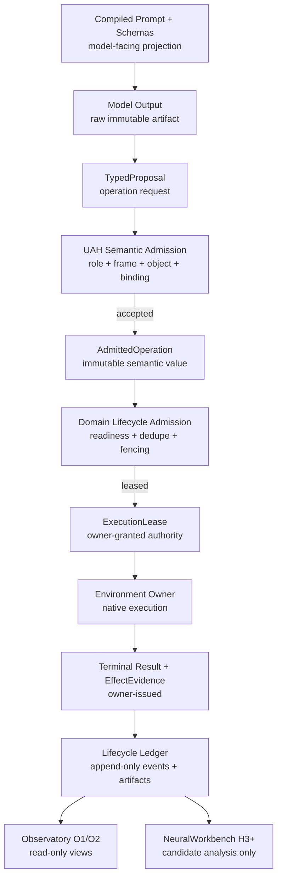

# Observatory Contract

**Status:** O1 API and identity grammar frozen; O2 implementation deferred
**Date:** 2026-09-08
**Applies to:** UAH H0-H6 and NeuralWorkbench H3+

## 1. Decision

The product-facing trace surface is called **Observatory**.

O1 is a small, read-only API with a static HTML renderer. It is required for
H1 lifecycle debugging and H2 NAO parity. O2 is the proper interactive
implementation and may evolve through H4 before H5 product polish.

Observatory is never an execution owner, evidence issuer, policy gate, or
registry authority.

Trace emission and trace inspection are separate authorities. The UAH kernel
records every admitted lifecycle automatically. A model receives Observatory
access only through an explicit, task-scoped, read-only frame projection.

## 2. Authority and Data Flow



Every stage, including rejection, appends its own event. The diagram shows the
accepted path for readability. Neither Observatory nor NeuralWorkbench sits in
the execution call chain.

## 3. Layered Visualization Contract

| Layer | Required views | Source of truth |
| --- | --- | --- |
| UAH H0-H2 | domain and environment-run index; environment, task, actor, and operation-graph views; configuration, frame, role, projected AB graph, bindings, proposals, gates, owner evidence, obligation status, failures, terminal state, replay comparison | UAH registry snapshots and lifecycle ledger |
| NeuralWorkbench H3 | pulse candidates, verification failures, energy terms, entropy proxy, retrieval lineage, counterexamples, recommendation, shadow replacement comparison | versioned Workbench request/candidate/observation payloads |
| H4 review | crystallization clusters, counterfactual results, holdout results, provenance, promotion review, rollback lineage | quarantined candidate and review artifacts |
| H5 product | cross-domain and cross-runtime navigation, capability/configuration comparison, live streams | conformance-qualified adapters and immutable traces |

## 4. O1 API

O1 accepts immutable, JSON-compatible inputs and returns a self-contained review
document:

```text
render_observatory(
  registry_snapshot,
  configuration_manifest,
  lifecycle_events,
  workbench_payloads = optional,
  comparison_run = optional
) -> ObservatoryDocument
```

`ObservatoryDocument` contains:

- one static HTML payload;
- trace and configuration identities;
- source revisions and protocol compatibility state;
- filter facets for environment run, task, actor agent run, role, object,
  owner, gate outcome, event type, and failure stage;
- ordered event cards with inspectable raw payloads;
- graph data embedded as inert JSON for later O2 reuse.

### Mandatory identity envelope

Every lifecycle event carries or resolves without heuristic reconstruction:

| Identity | Scope |
| --- | --- |
| `role_configuration_id` | Immutable semantic role, model admission profile, primary frame, auxiliary frame allowlists and access modes, authority and capability packs |
| `model_configuration_id` | Model artifact, runtime and decoding contract |
| `agent_handle_id`, `agent_handle_revision_id` | Stable routed identity and the immutable active-agent mapping resolved for this run |
| `agent_id` | Immutable role, model, prompt pack and harness composition |
| `environment_profile_id`, `environment_run_id` | Reusable native-environment contract and one attested activation that groups agent runs, tasks, traces, and native evidence |
| `environment_ingress_id` | One immutable native observation, request, feedback item, or control stimulus before deterministic task association |
| `agent_run_id` | One bounded actor activation attached to exactly one environment run; it may span many tasks, leases, and invocations |
| `provider_pool_id`, `resource_snapshot_id` | Runtime supply considered and the measured capacity state used by allocation |
| `model_instance_id`, `model_lease_id` | Loaded process or endpoint replica and its bounded reservation |
| `model_invocation_id` | One exact prompt-to-output call joining an agent run, trace and model lease |
| `registration_preflight_id`, `startup_preflight_id` | Non-reserving compatibility result and post-lease readiness result |
| `trace_id` | One causally connected workflow containing one or more operations |
| `domain_id`, `task_type_id`, `task_id` | Domain namespace, task family and work instance |
| `operation_id`, `parent_operation_id`, `operation_relation` | One frame-relative AB-object lifecycle, related operation, and governed edge type such as decomposition or delegation |
| `proposal_id`, `admission_id`, `execution_lease_id` | Proposal, UAH semantic decision and domain-granted authority |
| `event_id`, `parent_event_id`, `sequence` | Append-only event ordering and causality |

Each operation also records `frame_id`, `registry_version`, `ab_object_id`,
`binding_id`, prompt and projection hashes, evidence obligations, native domain
lineage, and owner-issued result references.

One `trace_id` may include several actor agent runs. The environment, task,
handle, and actor views are query projections over one append-only ledger. They
must not become independent trace stores whose ordering or terminal judgments
can diverge.

### Required lifecycle event families

```text
registration_preflight_started | registration_preflight_passed | registration_preflight_failed
agent_registered
agent_handle_revision_promoted | agent_handle_revision_rolled_back | agent_handle_resolved
environment_run_start_requested | environment_run_attested | environment_run_ready | environment_run_failed
environment_ingress_recorded | environment_ingress_classified | environment_ingress_rejected
task_started | task_resumed | task_notified | environment_state_updated
agent_run_start_requested | agent_run_initializing | agent_run_attached
model_lease_requested | model_lease_acquired | model_lease_rejected
startup_preflight_started | startup_preflight_passed | startup_preflight_failed
agent_run_ready | agent_run_standby | agent_run_startup_failed
prompt_compiled
model_invocation_started | model_invocation_completed | model_invocation_failed
model_output_recorded
proposal_normalized | proposal_rejected
semantic_admission_accepted | semantic_admission_rejected
domain_admission_leased | domain_admission_rejected
execution_started | execution_feedback
execution_completed | execution_failed | execution_cancelled
evidence_issued | evidence_rejected
effect_obligation_satisfied | effect_obligation_failed | effect_obligation_pending
terminal_task_accepted | terminal_task_accepted_with_deficit | terminal_task_rejected | terminal_task_suspended
model_lease_released
agent_run_detached | agent_run_terminated
environment_run_closing | environment_run_closed
```

This is the common startup-to-task order, not a rule that every lease ends with
one task. A lease may be invocation-, task-, or run-scoped; its declared scope
determines the release edge.

The raw model output, normalized proposal, `AdmittedOperation`, execution lease,
native owner result, normalized evidence, and terminal judgment remain distinct
artifacts. Observatory may place them beside each other but may not collapse
them into one generated summary.

`execution_feedback` is evidence-bearing input, not terminal proof by name. A
task closes only after the task acceptance evaluator compares its immutable
required and best-effort obligations with owner-issued evidence. A failed
best-effort report may therefore produce `accepted_with_deficit` while a failed
required manipulation effect produces rejection or suspension. The operation
that succeeded remains succeeded even when a later reporting operation fails.

The first renderer may reuse the proven NAO `interaction_trace_viewer` pattern:
JSONL ingestion, normalization, searchable cards, and static HTML. UAH must
replace dialogue-only correlation heuristics with explicit configuration,
trace, task, frame, proposal, binding, evidence, replay, and Workbench IDs.

### NAO viewer assimilation boundary

The 2026-08-04 source audit found four pieces worth porting as behavior, not as
a ROS dependency:

| Reuse in O1 | Do not inherit |
| --- | --- |
| Frozen normalized event records | ROS subscriptions and `rosout` parsing |
| Append-only JSONL plus deterministic load | A trace ID synthesized from whichever topic arrives first |
| Searchable static cards with raw payload inspection | An AB level guessed from the presence of a skill name |
| Channel-specific normalization and concise summaries | Treating planner dialogue or robot speech as universally terminal |

O1 assigns distinct event types to the existing authority seams:

- `/nao_orchestrator/planner_request` -> `planner_gate_request`;
- orchestrator gate decision -> `planner_gate_accepted` or
  `planner_gate_rejected`;
- `/planner/request` -> `planner_request_admitted`;
- `/intents` -> `planner_output_candidate`;
- `/planner/execution_feedback` -> owner/execution lifecycle events;
- `/planner/dialogue_act` -> planner communication request, never direct speech
  proof.

The NAO `report_result` flow remains one causal trace. The planner-owned AB1
operation may delegate grounded language composition to the chatbot agent run,
which receives its own operation and model-invocation identities. The returned
text cannot prove robot motion or manipulation. Native report dispatch and
speech evidence remain owned by the NAO runtime.

The source `goal_id`, `request_id`, `plan_id`, `plan_version`, and `step_id`
remain payload lineage. UAH role, model, agent, run, trace, operation, and event
identities are mandatory envelope fields and are never reconstructed
heuristically.

## 5. Graph Grammar

Graph nodes may represent:

- AB objects and decomposition relations;
- environment components and implementation bindings;
- proposals, pulse programs, verification decisions, and evidence artifacts;
- complete model-harness-domain configurations;
- trace clusters and reviewed candidate abstractions.

Graph edges must declare a type such as `decomposes_to`, `delegates_to`,
`continues_with`, `bound_by`,
`proposed_by`, `admitted_by`, `leased_by`, `rejected_by`, `executed_by`,
`evidenced_by`, `supersedes`, `retrieved_from`, or `compared_with`. A visual
edge may not imply authorization or causality unless the underlying event or
contract proves it.

An operation node has exactly one source coordinate `(frame_id, ab_object_id,
ab_level, registry_version)`. A parent operation may decompose into children at
other levels in the same frame. `decomposes_to` never crosses a frame boundary.
Cross-frame work uses `delegates_to` and records the source operation, target
frame, target role or handle, closed input artifact, expected output artifact,
and authority boundary. `continues_with` records ordered workflow progression
without claiming abstraction decomposition.

## 6. Metrics and Honesty Rules

Every metric is keyed by the complete content-addressed configuration. Model
family names alone are not aggregation keys.

Metric values carry one of these labels:

- `conceptual`: explanatory geometry with no runtime measurement;
- `synthetic`: generated evaluation data;
- `recorded`: replayed fixture or captured runtime data;
- `measured`: evaluator-produced result under a frozen configuration;
- `reviewed`: measured result accepted through the applicable gate.

Conceptual NeuralWorkbench capability-space, energy-landscape, entropy, and AB
maturity figures are design references. Observatory may reproduce their visual
grammar, but it must never present synthetic or conceptual values as runtime
evidence.

## 7. O1 Exit Gate

O1 is complete when one accepted and one rejected H1 lifecycle plus the H2 NAO
planner parity run can be rendered with:

- complete ordered lineage;
- environment-run activation, ingress classification, attached actor runs, and
  standby or lease transitions;
- configuration and source identity;
- raw model output, proposal, admission, lease, result, evidence, and terminal
  judgment as separate artifacts;
- projected and directly callable object distinction;
- binding and owner-evidence closure;
- required and best-effort obligation evaluation with explicit deficits;
- failure-stage attribution;
- model-free replay comparison;
- optional H3 shadow candidate lineage without granting it authority.

## 8. O2 Deferred Scope

O2 may add a domain index that drills into environment runs, tasks, actor runs,
and operation graphs; live streaming; multi-run comparison; interactive
AB/evidence graphs; Watson/Bonsai overlays; replay controls; counterfactual
controls; Workbench review queues; promotion/rollback inspection; and
cross-domain navigation.
Those features must consume the O1 event and graph contracts rather than invent
a second trace vocabulary.
