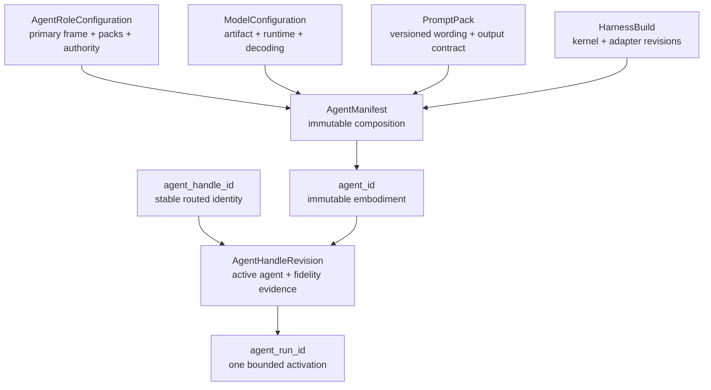
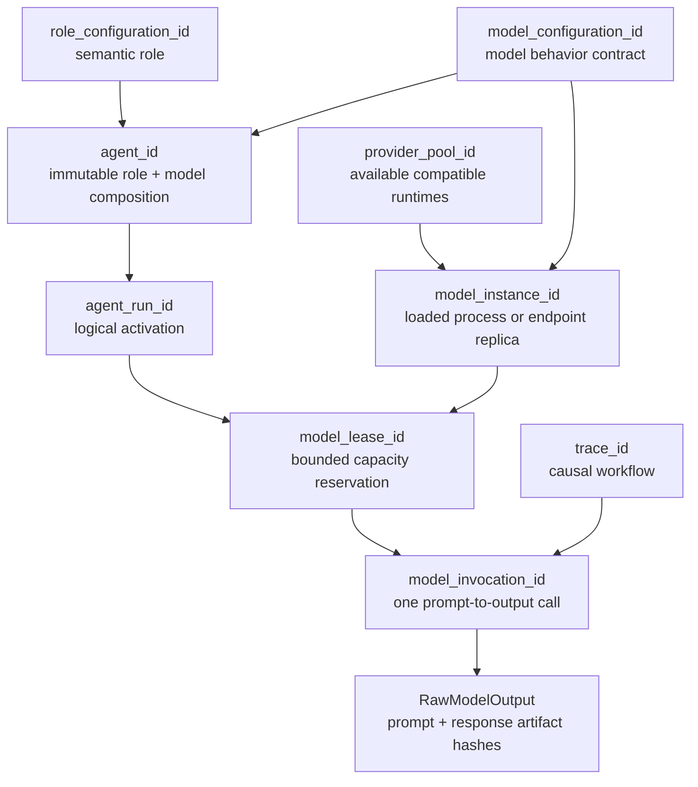
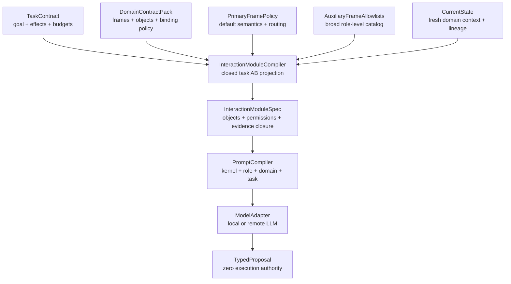
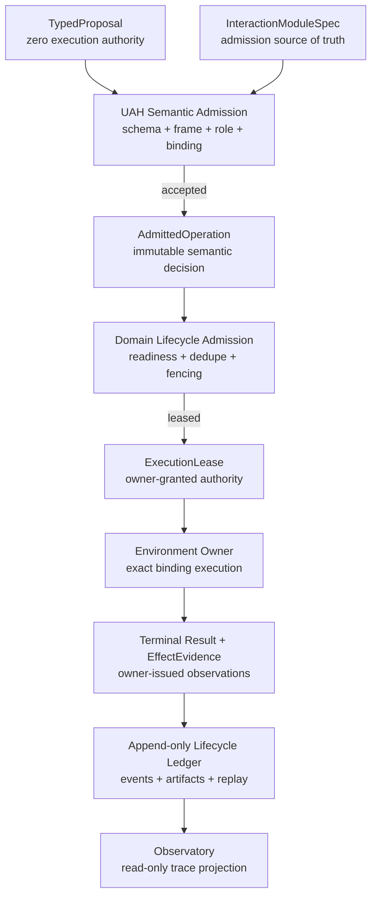
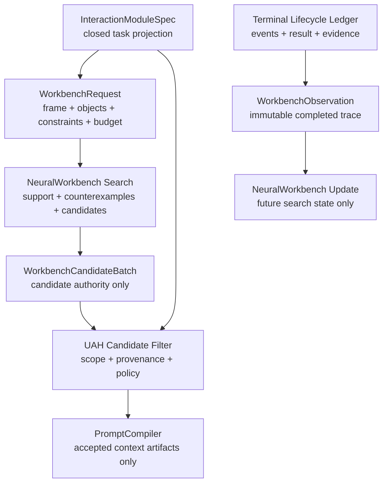
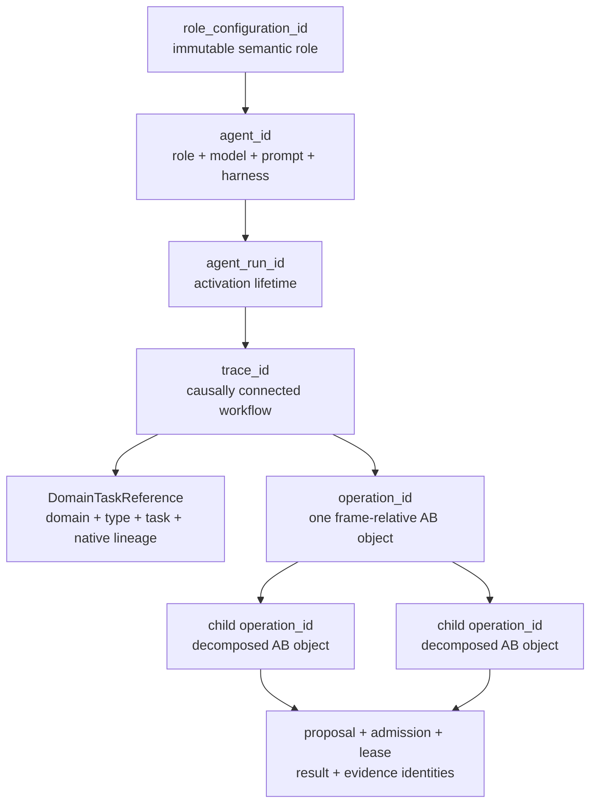
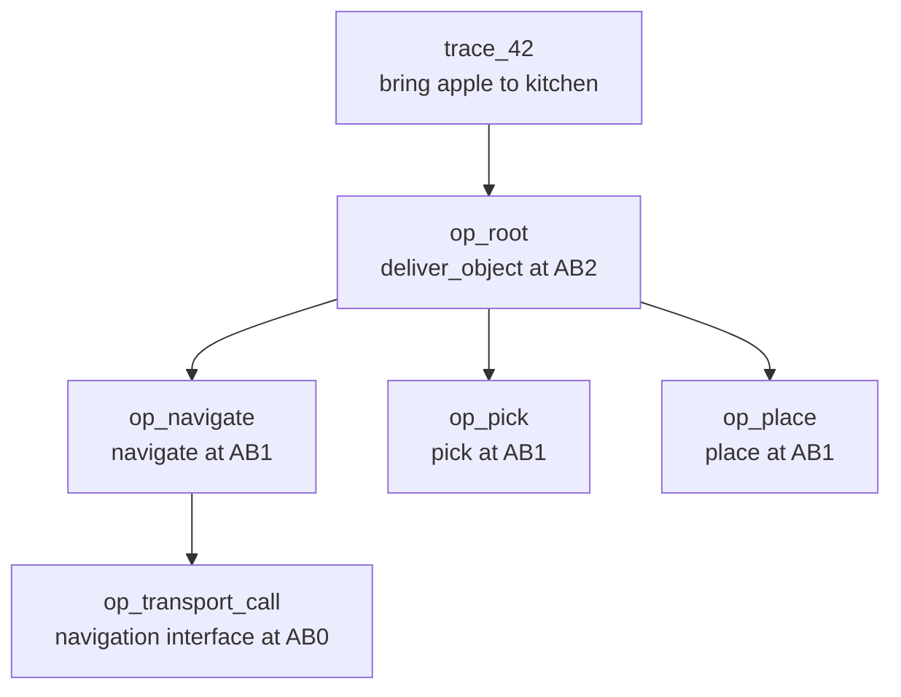

# Universal Agentic Harness: AB-Aware Foundation and Implementation Plan

**Status:** Architecture baseline; H0 synthetic proof implemented; H1-H2 incomplete
**Date:** 2026-09-07
**Branch baseline:** `feat/pre-commit-queue` at `8582ab9`
**Seed artifact:** `Universal Agentic Harness Blueprint.html` (user-provided,
2026-07-12)
**Primary reference subsystem:** NAO ROS4HRI + Neural Workbench
**Canonical delivery status:** `../plans/universal_agentic_harness_masterplan.md` (2026-09-07)

The phase tables in this foundation preserve the original extraction plan. Use
the canonical masterplan for current H0-H5 implementation status, acceptance
gates, and the AB4/AB5 boundary.

## 1. Project Claim

For bounded domain work, the practical capability of an LLM depends as much on
its interaction harness as on the model itself. The reusable system object is
not a prompt and is not a global bag of tools. It is a typed, observable,
permissioned, evaluated compiler from a task and an environment capability graph
to the smallest interaction surface that lets a model act and be verified.

The Neural Workbench supplies the missing semantic basis:

```text
AB0 = effect primitives, observations, validators, memory atoms, and transport seams
AB1 = runtime abilities with declared effects and observable success
AB2 = bounded composite abilities assembled from lower AB objects
AB3 = task strategies, recovery policies, and role policies
AB4 = subsystem operating profile over a capability graph
AB5 = governed policy over a family of AB4 systems, when independently verified
```

AB levels are relative to an environment contract. An HTTP call, ROS action,
shell command, or GUI event can ground an AB0 interaction atom, but the endpoint
name alone is not the semantic object. The semantic object describes the effect,
evidence, risk, ownership, and composition constraints that matter to reasoning.

The resulting thesis is:

> A universal agentic harness should compile per-task interaction modules from
> an AB capability graph. The model sees the capabilities, observations,
> constraints, and evidence paths required for the current task, rather than a
> globally exposed environment.

The deeper adaptive path is specified in
`neural_workbench_adaptive_ab_harness.md`. It extends static task projection
with frame-relative AB control bands, candidate pulse graphs, empirical
capability profiles, maintained interaction skills, and reviewed
trace-to-crystallization. The foundation remains the minimum portable kernel;
the extension is staged behind it rather than required all at once.

## 2. Target Contract

### Required outcome

Define and stage a reusable harness architecture that can:

- load different local or remote model providers without changing domain code;
- expose a task-specific subset of tools, resources, prompts, memory, and
  validators;
- represent those interactions as AB objects and typed decomposition edges;
- preserve environment ownership and deterministic execution boundaries;
- trace every model decision, tool call, result, approval, and validation step;
- measure model capability and harness uplift independently;
- support NAO first, then iTrader, Gamma/RESEARCH-GLOBAL, WatsonOW, and other
  subsystems through adapters.
- permit a temporary reference port in the NAO repository without allowing ROS
  or NAO imports into the universal contracts or kernel.

### Non-goals for the first implementation

- Do not replace `chatbot_llm`, `planner_llm`, or `nao_orchestrator` with one
  global agent.
- Do not expose every available tool to every task.
- Do not make MCP the internal semantic model; MCP is one transport adapter.
- Do not auto-promote learned AB2+ objects into runtime-callable abilities.
- Do not move prompt policy before behavior parity and SkillOpt gates exist.
- Do not claim self-improvement from stored traces until an evaluation shows a
  measurable probability or energy change.

### Protected ownership

| Seam | Current owner | Harness relationship |
| --- | --- | --- |
| Dialogue lifecycle and speaking | `dialogue_manager` | Harness may request a dialogue act; it does not speak directly. |
| User-facing dialogue and route declaration | `chatbot_llm` | Supplies a dialogue task adapter and structured output contract. |
| Planning and supervision | `planner_llm` | Supplies a planning task adapter and owns retry/replan policy. |
| Runtime payload normalization | `planner_common` | Supplies ROS-facing compatibility contracts. |
| Canonical AB graph | Neural Workbench `skill_common` | Becomes the capability substrate. |
| Deterministic dispatch and feedback | `nao_orchestrator` | Remains the execution authority. |
| Fresh action evidence | AB1 skills | Remains the proof of effects. |
| KB transport | `kb_skills` | Remains the KnowledgeCore boundary. |

## 3. Formal Model

Let the complete environment capability graph be:

```text
G_AB = (V, E_d, E_g, E_e, E_p)

V   = AB objects
E_d = decomposition edges
E_g = grounding edges to environment transports
E_e = evidence edges from action to observable success/failure
E_p = policy edges for permission, risk, ownership, and approval
```

For task `tau`, current state `x`, and policy profile `rho`, the harness compiler
builds a task-specific interaction module:

```text
I_tau = Project(G_AB, tau, x, rho)
```

`I_tau` is the smallest closed subgraph that contains:

1. candidate abilities able to produce the requested effect;
2. all lower-level objects required by their decomposition;
3. observations needed to establish preconditions;
4. validators and evidence surfaces needed to prove the result;
5. recovery, escalation, and approval paths allowed by policy.

The full agentic system is:

```text
S = (M, H, G_AB, I_tau, C, P, R, Phi)

M     = model or model pool
H     = harness kernel and task compiler
G_AB  = environment capability graph
I_tau = compiled per-task interaction module
C     = context, state, and memory projection
P     = policy, permissions, approvals, and budgets
R     = runtime adapter and execution substrate
Phi   = measured capability profile
```

This separates four things that many harnesses merge:

- capability graph: what the environment can do and observe;
- task interaction graph: what this model may use for this task;
- execution graph: what actually ran;
- evidence graph: what proves or disproves the claimed effect.

## 4. Core Architecture

### Identity and activation spine



`AgentRoleConfiguration` is model-independent. Changing the role, model,
prompt pack, or harness build creates a new `agent_id`. Restarting the same
immutable agent creates only a new `agent_run_id`. A stable
`agent_handle_id`, such as `watson.system.primary`, may be rebound to a newly qualified
agent while preserving every prior immutable handle revision.

Canonical handles use `<domain>.<role>.<slot>`, for example
`watson.system.primary`, `nao.chatbot.primary`, `nao.planner.primary`, and
`itrader.proposer.primary`. The `agent_id` is the handle's immutable embodiment
for one revision; `agent_run_id` is an activation of that embodiment.

### Hardware-aware model allocation spine

Logical agent identity and model placement are orthogonal. UAH schedules an
agent's fixed `ModelConfiguration` onto a compatible runtime from a provider
pool, records the reservation as a model lease, and identifies every
prompt-to-output call separately.



```text
Semantic identity
role_configuration_id
+ model_configuration_id
+ prompt_pack_id
+ harness_build_id
  -> agent_id

Stable routing identity
agent_handle_id
  -> agent_handle_revision_id
  -> active agent_id
  -> agent_run_id -> trace_id -> operation_id

Hardware allocation
provider_pool_id
  -> model_instance_id
  -> model_lease_id
  -> model_invocation_id

Join
agent_run_id + trace_id + model_lease_id
  -> model_invocation_id
```

A local 27B process and several smaller Bonsai processes are separate model
instances. They may coexist only when the pool's measured RAM, VRAM, context,
and concurrency limits permit it. UAH may unload, reload, or move a compatible
instance without changing `agent_id`. Routing the role to a different
`model_configuration_id` creates a different agent identity. Provider-held
conversation state is not authoritative agent state and cannot cross a model
lease without an explicit isolation contract.

### Frame projection and prompt compilation



The auxiliary allowlist may describe a substantial approved frame. The
`InteractionModuleCompiler` still emits only the task-closed subset, and the
primary-frame policy determines whether the projected capability is inspected,
used directly, or reached through typed delegation. The model never receives a
wholesale registry dump.

### Two-stage admission and execution authority



The proposal has no authority. UAH semantic admission validates the
frame-relative object, role reach, canonical arguments, approved binding, and
evidence obligations. The environment owner then applies native readiness,
duplicate suppression, concurrency, cancellation, supersession, and stale
version checks before granting an `ExecutionLease`. The owner executes the
immutable admitted value, not a reparsed copy of raw model output.

### Prompt compilation seam

The `PromptCompiler` renders one model-facing view from the same immutable
`InteractionModuleSpec` consumed by semantic admission:

```text
stable UAH protocol kernel
  + role contract from role_configuration_id
  + minimal versioned domain policy
  + task-scoped AB object and capability projection
  + current task, lineage, fresh state, and selected evidence
  -> compiled prompt + structured operation schemas + prompt artifact hash
```

Raw transport locators remain harness-side. The model sees normalized AB
objects and structured operation schemas, not direct ROS topics, Python
functions, provider URLs, or other implementation shortcuts. Prompt wording
cannot widen the objects or authority admitted by `InteractionModuleSpec`.

### H3 Neural Workbench attachment seam

NeuralWorkbench is an optional adaptive engine attached through the
transport-neutral `WorkbenchEnginePort`. It is not itself an abstraction frame.
Each request names the frame, registry version, projected objects, constraints,
and search budget within which the Workbench may search. An MCP connection may
later implement this interface, but MCP is a transport adapter rather than the
semantic contract.



H3 may invoke bounded candidate retrieval before each configured model call and
submit an immutable observation after terminal trace closure. UAH filters every
returned artifact before prompt compilation or shadow evaluation. Workbench
unavailability and latency policy remain role/deployment decisions, but the H2
kernel must operate without it. The engine cannot widen the interaction module,
admit an operation, issue a lease, mutate a trusted registry, or promote its own
candidate.

### Identity, task, trace, and operation lineage



`task_id` is a domain-owned work instance, not a domain name or a model turn.
`trace_id` identifies the causal whole and may contain several operations.
`operation_id` identifies one AB-object lifecycle. Domain lineage such as NAO
`goal_id`, `request_id`, `plan_id`, `plan_version`, and `step_id` crosses the
flow unchanged and is never reconstructed from timestamps or payload guesses.

### Frame-relative operation decomposition



Every operation is anchored to exactly one object coordinate in one frame.
Higher-order operations own child operation identities. The Observatory may
derive the highest and lowest visited levels or level homogeneity from the
tree, but those summaries never replace the source coordinates. A replan keeps
the root semantic operation when the desired effect is unchanged; new
`plan_id` or `plan_version` values remain domain lineage beneath that operation.

### Node and seam responsibilities

| Node | Interface | Owns | Must not own |
| --- | --- | --- | --- |
| `AgentRoleConfiguration` | Immutable role manifest | Primary frame, explicit auxiliary frame projections, control bands, capability packs, budgets, authority policy | Model or provider selection |
| `AgentManifest` | Content-addressed composition | Role, model configuration, prompt pack, harness and adapter revisions | Mutable run state |
| Agent registry | `register(agent_manifest)` and `get(agent_id)` | Immutable agent embodiments and content-addressed lookup | Handle continuity, hardware placement, or runtime state |
| Agent handle registry | `resolve(agent_handle_id)` and `promote(candidate_agent_id, fidelity_report)` | Immutable handle revisions, one active agent, role invariance and rollback lineage | Hardware placement or silent model fallback |
| `InteractionModuleCompiler` | `compile(role, task, domain, state)` | Minimal closed AB graph, permissions, evidence closure | Prompt wording or execution |
| `PromptCompiler` | `compile_prompt(agent, module, task_context)` | Stable kernel prefix, role/domain presentation, schemas, artifact hash | Admission or binding resolution |
| Model allocator | `lease(agent_run, resource_request)` | Compatible instance selection, measured capacity, lease lifetime, isolation and release | Changing the agent's model configuration or semantic authority |
| Model adapter | `invoke(model_lease, compiled_prompt)` | One identified provider call and raw response artifact | Agent context ownership, semantic admission, or hidden fallback |
| UAH semantic admission | `admit(proposal, module)` | Typed normalization, role/frame reach, binding and evidence obligations | Native lifecycle readiness or effects |
| Domain lifecycle admission | `request_execution(admitted_operation)` | Readiness, dedupe, concurrency, cancellation, supersession, version fencing | Reinterpreting model text or UAH semantics |
| Environment owner | `execute(execution_lease)` | Native effect and owner-issued result/evidence | Planner policy or Observatory rendering |
| Lifecycle ledger | Append-only events and artifact references | Exact causal record and replay inputs | Policy, evidence issuance, or history rewriting |
| Observatory | `render_observatory(...)` | Read-only configuration, graph, event, evidence, failure, and comparison views | Execution, admission, registry mutation, or evidence issuance |

### Kernel planes

| Plane | Responsibility | Must remain replaceable |
| --- | --- | --- |
| Task contract | Objective, non-goals, acceptance, budgets, stop conditions | Task author and subsystem adapter |
| Capability | AB objects, decomposition, effects, evidence, risk | Registry backend |
| Interaction | Per-task tool/resource/prompt/validator projection | Compiler strategy |
| Model | Provider, model, structured output, context limits | Local/remote model backend |
| Context | Bounded state, memory, traces, source authority, freshness | Retrieval/context adapter |
| Policy | Scope, approvals, side effects, secrets, escalation | Deployment policy |
| Runtime | Shell, ROS, browser, API, MCP, sandbox, worker | Execution adapter |
| Trace/eval | Events, lineage, artifacts, scores, regression gates | Storage and evaluator |

## 5. Proposed Contract Grammar

### AgentRoleConfiguration

```yaml
role_configuration_id: role:nao_planner:v1
role_id: planner_llm
model_admission_profile_id: nao.planner.models.v1
primary_frame:
  frame_id: nao_runtime
  registry_version: sha256:...
  capability_pack_id: nao.planner.core.v1
  control_band: {min_direct: 1, preferred: 1, max_direct: 2, inspect_down_to: 0}
additional_frame_projections:
  - frame_id: uah_observability
    registry_version: sha256:...
    capability_pack_id: uah.trace.task_read.v1
    access_mode: inspect_only
authority_policy:
  may_propose: true
  may_claim_effects: false
  may_execute_without_domain_lease: false
```

Every role has one primary frame. Additional frames are explicit, versioned,
and role-authorized. A capability pack may authorize a broad auxiliary frame,
but the per-task interaction module still exposes only the closed graph needed
for the task. No wildcard or discovery-driven frame exposure is permitted.

| Access mode | Maximum role-level authority | Typical use |
| --- | --- | --- |
| `inspect_only` | Observe a bounded task projection; no state-changing proposal | Observatory, foreign-frame state, evidence inspection |
| `direct_proposal` | Propose typed operations in the additional frame; normal semantic and domain admission still apply | Explicitly coupled frames with reviewed ownership and mappings |
| `delegate_only` | Create a typed delegation for an agent whose primary frame matches the target; no direct target-frame operation | Effect-bearing cross-frame work, including Watson delegating SWE execution |

An `agent_id` inherits these limits through its `role_configuration_id`; it
does not define them independently. Task compilation may reduce the exposed
objects, control band, or access mode but cannot increase any of them.

### AgentManifest and AgentRun

```yaml
agent_id: agent:nao_planner:qwen:v1
role_configuration_id: role:nao_planner:v1
model_configuration_id: model:qwen_planner:q4:v3
prompt_pack_id: prompt:nao_planner:v1
harness_build_id: git:...
adapter_versions: {nao: git:..., provider: openai-compatible:v1}

agent_handle_id: handle:nao.planner.primary
agent_handle_revision_id: handle-revision:sha256:...
active_agent_id: agent:nao_planner:qwen:v1
required_role_configuration_id: role:nao_planner:v1
prior_agent_id: agent:nao_planner:qwen:v0
fidelity_report_id: fidelity-report:sha256:...
rollback_revision_id: handle-revision:sha256:...

agent_run_id: run:01J...
started_from_agent_id: agent:nao_planner:qwen:v1
resolved_handle_revision_id: handle-revision:sha256:...
environment_id: nao_recorded_v1
authority_mode: shadow
```

The agent manifest is immutable. A role, model, prompt, harness, or adapter
change creates a new `agent_id`. A restart of the unchanged agent creates a new
`agent_run_id`. A handle may move to a different agent only when the new agent
uses the required role configuration and its fidelity report passes the
deployment's structural, behavioral, resource, and rollback gates. The handle
does not own conversation state or weaken the authority policy.

The role's `model_admission_profile_id` defines provider-neutral protocol,
context, structured-output, behavioral, and evaluation requirements. A
deployment policy may narrow eligible providers, placements, and resource
budgets. Neither policy permits the hardware allocator to substitute another
model configuration silently.

An agent run pins the resolved handle revision. Every task, trace, model
invocation, and operation beneath that run records or resolves the same
`agent_handle_id`, `agent_handle_revision_id`, and `agent_id`. A later handle
revision cannot rewrite which embodiment performed earlier work or silently
alter an in-flight task.

### ProviderPool, ModelLease, and ModelInvocation

```yaml
provider_pool_id: pool:local_workstation:v1
resource_snapshot_id: resource-snapshot:sha256:...
members:
  - model_instance_id: instance:qwen27b:ollama:01
    model_configuration_id: model:qwen27b:iq3s:100k:v1
    placement: {host_id: main_pc, device_ids: [gpu0]}
    measured_capacity: {ram_mib: ..., vram_mib: ..., max_context_tokens: 100000}
  - model_instance_id: instance:bonsai:ollama:01
    model_configuration_id: model:bonsai:q4:v1
    placement: {host_id: main_pc, device_ids: [gpu0]}
    measured_capacity: {ram_mib: ..., vram_mib: ..., max_context_tokens: ...}

model_lease_id: lease:01J...
agent_run_id: run:01J...
model_instance_id: instance:qwen27b:ollama:01
scope: task
resource_budget: {context_tokens: 100000, concurrent_invocations: 1}
isolation_policy: reset_provider_session

model_invocation_id: invocation:01J...
model_lease_id: lease:01J...
agent_run_id: run:01J...
task_id: task_123
trace_id: trace_42
prompt_artifact_id: prompt:sha256:...
raw_output_artifact_id: output:sha256:...
```

The allocator may choose another instance only when it satisfies the immutable
model configuration and isolation contract. A fallback to another model
configuration creates a different `agent_id` and must be represented as an
explicit agent transition rather than hidden provider routing.

### HarnessSpec

```yaml
schema_version: ab_harness/v0
name: nao_research_harness
subsystem: nao_ros4hri
capability_registry:
  provider: skill_common
  source: defaults/ab_registry.json
model_policy:
  allowed_profiles: [dialogue_fast, planner_structured, reviewer_deep]
  fallback_requires_capability_equivalence: true
context_policy:
  max_input_tokens: 24000
  source_precedence: [runtime, contracts, active_docs, traces, history]
  freshness_required_for: [perception, execution_result, kb_state]
execution_policy:
  default_scope: task_projection
  side_effects_require_verification: true
  approval_by_risk: true
trace_policy:
  append_only: true
  record_prompt_hash: true
  record_capability_projection: true
```

### TaskSpec

```yaml
domain_id: nao_ros4hri
task_type_id: execute_and_report
task_id: task_123
goal: find the red cup and report what is observed
native_lineage:
  schema: nao_planner_lineage/v1
  goal_id: goal_123
  request_id: request_123
requested_effects: [target_observed, grounded_report_available]
constraints:
  primary_frame_id: nao_runtime
  allowed_side_effects: [robot_motion, perception_refresh]
  denied_side_effects: [direct_kb_write, direct_speech]
acceptance:
  required_evidence: [fresh_scene_summary, target_entity_id]
  failure_paths: [target_absent, backend_unavailable, unsafe_motion]
budgets:
  wall_time_sec: 90
  model_calls: 3
  tool_calls: 12
```

### InteractionModuleSpec

```yaml
role_configuration_id: role:nao_planner:v1
task_id: task_123
primary_frame_id: nao_runtime
capability_pack_ids: [nao.planner.core.v1, uah.trace.task_read.v1]
selected_ab_objects:
  - scan
  - find_object
  - select_scan_pattern
  - dispatch_scan_motion
  - wait_for_perception
  - read_scene_summary
  - confirm_target_visibility
  - verify_evidence_payload
exposed_actions: [scan, find_object]
exposed_resources: [scene_summary, target_reference, recent_relevant_traces]
required_validators: [registry_validation, evidence_payload_validation]
approval_points: [robot_motion]
completion_evidence: [fresh_scene_summary, target_entity_id]
projection_hash: sha256:...
```

### ModelConfiguration

```yaml
model_configuration_id: model:qwen_planner:q4:v3
provider: openai_compatible
endpoint_ref: local_vllm_primary
model_ref: qwen_planner
capabilities:
  tool_calling: true
  structured_output: json_schema
  reasoning_control: optional
  max_context_tokens: 65536
service_objectives:
  first_token_p95_ms: 2500
  completion_p95_ms: 12000
  max_concurrency: 8
routing:
  fallback_profiles: [planner_structured_backup]
  require_same_output_schema: true
```

### TraceEvent

```json
{
  "trace_id": "trace_123",
  "operation_id": "operation_find_123",
  "parent_operation_id": "operation_goal_123",
  "role_configuration_id": "role:nao_planner:v1",
  "agent_id": "agent:nao_planner:qwen:v1",
  "agent_run_id": "run:01J...",
  "domain_id": "nao_ros4hri",
  "task_id": "task_123",
  "event_id": "evt_009",
  "parent_event_id": "evt_008",
  "stage": "owner_evidence_issued",
  "frame_id": "nao_runtime",
  "ab_object_id": "find_object",
  "proposal_id": "proposal_123",
  "admission_id": "admission_123",
  "execution_lease_id": "lease_123",
  "model_configuration_id": "model:qwen_planner:q4:v3",
  "prompt_artifact_hash": "sha256:...",
  "capability_projection_hash": "sha256:...",
  "status": "succeeded",
  "input_ref": "artifact://...",
  "output_ref": "artifact://...",
  "evidence": {"entity_id": "cup_1", "captured_at_sec": 1783900000.0},
  "risk": {"class": "robot_motion", "approved": true},
  "timing": {"started_ms": 0, "finished_ms": 1840}
}
```

## 6. Current Stack: Reusable Harness Mechanisms Already Implemented

The current NAO stack has already paid for substantial harness engineering. The
correct first implementation is extraction and consolidation, not a parallel
rewrite.

| Existing implementation | Reusable mechanism | Keep domain-local | Proposed destination |
| --- | --- | --- | --- |
| `planner_llm/providers.py` | Provider interface, Ollama/OpenAI-compatible transport, timeout/error normalization, reasoning suppression | Planner-specific config defaults | `ab_harness.providers` |
| `chatbot_llm/ollama_transport.py` | Provider-shape detection, structured response format, preflight, model inventory, token/context controls | Speech-latency defaults | `ab_harness.providers` + chatbot adapter |
| Both `prompt_pack.py` files | Versioned YAML loading, packaged default resolution, validation, controlled overrides | Actual planner/chatbot policy text | `ab_harness.prompt_packs` |
| `chatbot_llm/response_parser.py` and planner JSON parsing | Structured output schema, extraction, parse failure handling | Chatbot/plan schemas | `ab_harness.structured_output` |
| `skill_common.ABRegistry` | Canonical capability lookup and planner/chatbot/workbench/dashboard projections | Canonical registry ownership | Extend in `skill_common`; do not copy |
| `planner_llm/skill_registry.py` and chatbot skill catalog | Bounded model-facing capability projection | Role-specific wording | `InteractionModuleCompiler` adapters |
| `chatbot_llm/knowledge_snapshot.py` and planner request projection | Bounded context, source shaping, freshness/role distinctions | NAO KB and scene semantics | `ContextAdapter` interface |
| `chatbot_llm/turn_engine.py` | Route consistency, fallback ladder, output sanitization, trace stages | Dialogue policy and speech constraints | Keep local; extract only generic validators |
| `planner_llm/planner_engine.py` | Generate, parse, validate, one repair, deterministic fallback | Planning heuristics and plan semantics | Keep local; use kernel provider/output APIs |
| `planner_llm/supervisor.py` | Goal/plan lineage, retry, cancellation, supersede, dialogue-act decisions | Planner ownership | Keep local; expose trace/state adapter |
| `interaction_trace_viewer` and Workbench trace memory | Structured timeline plus append-only trace storage | ROS subscription wiring | `TraceEvent` adapter and storage backend |

### Concrete duplication evidence

- Both LLM packages independently resolve YAML prompt packs and package-share
  defaults.
- Both implement Ollama/OpenAI-compatible response handling and Qwen
  no-thinking behavior.
- Both build bounded model messages and parse JSON under provider failure.
- Both project the canonical skill registry into model-facing text or JSON.
- Both implement fallback behavior after invalid or unavailable model output.
- Both emit trace stages but lack one shared event contract.

These are appropriate extraction candidates. The hundreds of tests around
route semantics, grounding, report wording, planner retry, lineage, and
duplicate speech are evidence that those policies are domain contracts, not
generic kernel code.

### Aily SQL-agent lesson

The recorded Aily experience adds a non-robotic warning. Task-scoped skills
reduced exposure, but the model could still face several similarly named
domain skills and select the wrong semantic route. Curated table descriptions,
business meaning, access restrictions, package-owned question sets, and trace
review made the failure attributable to semantic context, routing, tool choice,
or execution instead of treating every weak answer as a model defect.

UAH addresses the same failure class with one primary frame, explicit
capability packs, and a task-closed projection. An auxiliary frame may contain
many approved objects at role level, but the model-facing interaction module
still exposes only the objects required for the current task and recovery
paths. Primary-frame policy determines when an auxiliary frame may be queried,
used directly, or delegated to another agent.

The migration target is cooperation, not replacement. `chatbot_llm` and
`planner_llm` remain domain agents while progressively delegating provider
probing, structured-output transport, prompt-pack mechanics, task capability
projection, and trace emission to the harness. This lets the current node
behavior serve as the oracle for each extraction slice.

## 7. Primary-Source Harness Survey

| Harness | Clear win | Adopt | Avoid copying blindly |
| --- | --- | --- | --- |
| Codex | Hierarchical `AGENTS.md`, progressively loaded skills, configurable providers/MCP permissions, sandbox and approval boundaries | Scoped instructions, skill discovery, provider/tool approval metadata | Treating repository instructions as the capability graph |
| Cursor | Scoped rules, dynamic skills and subagents, hooks, visible review, sandbox-aware tool errors, isolated background work | Task-local context, independent worker contexts, before/after hooks, explicit sandbox diagnostics | Global auto-approval or IDE-specific policy in the kernel |
| Pi | Minimal stable loop, four core tools, JSONL session tree, SDK/RPC modes, hot-reloadable extensions, tool overrides | Small kernel, event interception, explicit active-tool set, embeddable worker API | Assuming containers/permissions/plan mode are someone else's problem |
| OpenHands | Client/server sandbox runtime, action-to-observation interface, reproducible runtime images, evaluation controller | Runtime adapter contract, isolated workspaces, artifacted environment identity | Binding the universal kernel to Docker or software engineering only |
| SWE-agent | Agent-Computer Interface as a measurable design axis; exact thought/action/observation trajectories and replayable config | Evaluate interaction design independently from model choice | Benchmark-specific commands as universal tools |
| Hermes Agent | Provider independence, task/platform toolsets, persistent skills/memory, isolated delegates, multiple terminal backends | Toolset profiles, learned procedure proposals, backend adapters | Exposing a very large default tool surface or auto-writing trusted skills |
| AutoGen | Runtime manages identity/lifecycle/message delivery; same agent API across standalone and distributed runtimes | Separate agent definition from runtime placement | Making conversation topology the primary capability ontology |
| Pydantic AI | Typed contracts, durable execution integrations, streaming/MCP compatibility | Typed schemas and pluggable durability | Adopting a workflow engine before task/effect contracts stabilize |
| MCP | Dynamic discovery, capability negotiation, tools/resources/prompts, standard local/remote transports | Transport adapter and external capability discovery | Assuming MCP decides context policy, authorization, or effect truth |

### Survey conclusions

1. Interface design is a first-class performance variable. SWE-agent's ACI
   result supports measuring the harness separately from model quality.
2. Small kernels age better. Pi's minimal loop and extension system are more
   reusable than a global fixed agent graph.
3. The runtime must be replaceable. OpenHands and AutoGen both separate agent
   logic from execution placement.
4. Context should be progressively disclosed. Codex skills and Cursor skills
   reduce always-on prompt load.
5. Sandbox state must be visible to the model. Cursor reports better recovery
   after surfacing the exact permission constraint in tool results.
6. Exact trajectories are essential. SWE-agent, OpenHands, Pi, and Hermes all
   retain enough state to replay or inspect runs.
7. MCP is necessary but insufficient. Its own architecture explicitly leaves
   model/context use to the host application.
8. Toolsets are too coarse unless grounded in effects and evidence. The AB graph
   supplies the semantic closure and verification path that named tool bundles
   lack.

## 8. Hypothesis Registry

| ID | Architecture family | Mechanism | Discriminating probe | Status | Exact gap or reopen condition |
| --- | --- | --- | --- | --- | --- |
| H-01 | Shared utilities inside NAO repo | Extract duplicated provider/prompt/parser code into `planner_common` or another parent package | Import from both nodes and run existing suites unchanged | Rejected as universal boundary | `planner_common` is intentionally planner/ROS contract focused and would couple non-ROS consumers to NAO structure. |
| H-02 | Neural Workbench `ab_harness` kernel | Build a pure-Python package beside `skill_common`; compile task interaction modules from AB graph | Same NAO task produces minimal closed AB projection and behavior parity | Accepted for P0 design | Implementation waits on schema review and parity tests. |
| H-03 | Pi or OpenHands as the kernel | Embed an existing harness and add AB tools/resources around it | Run identical task through Pi/OpenHands adapters and compare trace/eval coverage | Active adapter hypothesis | Reopen as kernel only if it can enforce AB closure and evidence without invasive forks. |
| H-04 | MCP-first universal harness | Represent every ability as MCP tools/resources/prompts | Test whether effect, ownership, freshness, and evidence closure are expressible and enforceable | Rejected as semantic core | MCP standardizes exchange but deliberately does not define host context or agent policy. |
| H-05 | Node-specific harnesses only | Continue evolving chatbot and planner independently | Measure duplication growth and inconsistent provider behavior over another iteration | Blocked | Already duplicates provider, prompt, parsing, projection, and trace mechanisms. |
| H-06 | Global all-tools agent | Give one agent every tool and rely on prompt policy | Compare tool precision, context load, unsafe-call rate, and recovery against task projection | Rejected | Violates least capability, increases prompt/tool entropy, and weakens ownership. |

### Decision

Proceed with H-02 as the architecture baseline, H-03 as a runtime-adapter track,
and a narrow extraction slice from H-01. Reject H-04 and H-06 as the semantic
core. Keep current nodes operational while the compatibility layer is proven.

## 9. Proposed Package Boundary

The portable package lives in this repository. NeuralWorkbench remains an
independently versioned H3+ companion. UAH consumes content-addressed registry
snapshots and does not import ROS, NAO packages, provider SDKs, or runtime
products.

```text
src/ab_harness/
    contracts.py               # role, frame, task, operation, admission, evidence
    identity.py                # role, model, agent, run, trace, and operation identities
    projection.py              # AB graph closure and task interaction modules
    prompt_compiler.py         # layered deterministic prompt assembly
    structured_output.py       # schema-aware parse/repair result types
    prompt_packs.py            # versioned pack loading, no embedded domain policy
    admission.py               # UAH semantic admission
    providers/
      base.py
      ollama.py
      openai_compatible.py
      capability_probe.py
    policy/
      risk.py
      approvals.py
      budgets.py
    runtime/
      adapter.py
      lifecycle.py
      lease.py
      result.py
    trace/
      events.py
      store.py
    evals/
      runner.py
      metrics.py
```

Runtime and domain adapters remain outside the portable semantic core:

```text
adapters/
  nao_ros4hri/
  codex/
  pi/
  openhands/
  mcp/
  shell_sandbox/
```

`ab_harness` depends on `skill_common`. It must not own or duplicate
`ab_registry.json`.

### Reference-port rule

The first NAO integration may be staged in the NAO repository when that makes
parity testing and review easier. A module belongs in the portable UAH core
only if:

1. it imports no ROS, NAO, dialogue, planner, or orchestrator package;
2. its public schemas contain no NAO-specific field names;
3. both LLM nodes can consume it through thin compatibility adapters;
4. a fake adapter and one domain adapter exercise the same interface; and
5. moving domain integration code changes only adapter wiring, not semantics.

This reverses the dependency direction that created the current SWE cost:
domain nodes configure and consume the harness; the harness does not import or
coordinate domain nodes.

## 10. Model Serving and Fast Provider Management

Provider management should be driven by measured capability profiles, not model
name conditionals spread across nodes.

### Startup handshake

Every served endpoint should be probed for:

- protocol shape: Ollama, OpenAI-compatible Responses/Chat, or custom;
- model inventory and exact model identifier;
- structured JSON/schema support;
- tool-calling support and tool schema limits;
- context window and effective output limit;
- reasoning/thinking controls;
- streaming shape and timeout behavior;
- image/audio support where relevant;
- warmup latency, first-token latency, decode rate, and concurrency.

The probe produces a versioned `ProviderCapabilityRecord`. Runtime code selects
features from that record instead of checking whether the model name starts with
`qwen`, `gemma`, or another family.

### Routing policy

```text
TaskSpec required model capabilities
  -> eligible ModelProfiles
  -> filter by context, schema, tool, privacy, and locality
  -> rank by measured latency, reliability, cost, and task score
  -> dispatch
  -> fallback only to a capability-equivalent profile
```

Use separate workload pools:

| Workload | Priority | Typical profile |
| --- | --- | --- |
| Spoken dialogue | First-token latency and concise output | Small warm local model |
| Intent/route decision | Schema reliability and low token count | Fast structured model |
| Planner generation | Tool/registry adherence and longer context | Strong structured model |
| Review/research | Reasoning depth and source handling | Larger remote or local model |
| Trace summarization | Throughput and low cost | Batch local model |

### Serving optimizations

- Keep stable harness instructions and schemas at the beginning of prompts so
  vLLM-style automatic prefix caching can reuse prefill computation.
- Place volatile task state and fresh evidence late in the context.
- Use bounded projections rather than transmitting the complete AB registry.
- Warm the active model profiles with representative schema calls.
- Track first-token latency, total latency, input/output tokens, cache-hit
  behavior, retries, fallbacks, and schema failures per profile.
- Route high concurrency using least-busy or latency-aware policies only after
  measuring queue behavior.
- Treat retries, context-window fallbacks, and provider fallbacks as separate
  events with separate budgets.
- Tune local serving memory for the actual concurrency/context mix; SGLang and
  similar servers expose KV-cache and static-memory controls that should be
  benchmarked rather than guessed.

Prefix caching reduces shared-prefix prefill cost, not token generation time.
It therefore benefits stable harness/schema prefixes and repeated task classes,
but it does not excuse verbose output or unbounded context.

## 11. Control Loop

```text
compile(task, subsystem):
    role = load_role_configuration(subsystem)
    agent = load_immutable_agent_manifest(role)
    run = start_agent_run(agent)
    task_spec = normalize_domain_task(task, role)
    state = context_adapter.snapshot(task_spec, run)

    interaction = interaction_compiler.compile(
        role=role,
        task=task_spec,
        domain=approved_domain_contract,
        registry=canonical_ab_registry,
        state=state,
    )

    prompt = prompt_compiler.compile(agent, interaction, task_spec, state)
    raw_output = model_adapter.generate(prompt)
    proposal = normalize_typed_proposal(raw_output, interaction.schemas)

    admitted = semantic_admission.admit(proposal, interaction)
    lease = domain_runtime.request_execution(admitted)
    result = environment_owner.execute(lease, admitted)
    evidence = terminal_verifier.check(result, task_spec.acceptance)

    lifecycle_ledger.append_all(
        run, task_spec, interaction, prompt, raw_output, proposal,
        admitted, lease, result, evidence,
    )
    return terminal_judgment(evidence)
```

The model never receives direct execution authority. The domain runtime accepts
only immutable `AdmittedOperation` values and returns a distinct
`ExecutionLease` or rejection. The exact admitted value reaches the owner;
raw model output remains trace evidence and is never dispatchable.

## 12. Evaluation and Ablation Protocol

### Core metrics

| Metric | Meaning |
| --- | --- |
| Harness uplift | Same model and task set, AB-aware harness score minus generic harness score |
| Task projection precision | Exposed AB objects actually useful for the task divided by all exposed objects |
| Task projection recall | Required successful-path and recovery objects present in the projection |
| Tool precision | Correct action with valid arguments |
| Evidence completeness | Claimed effects backed by required observations/results |
| Scope discipline | Writes and calls remain inside declared task scope |
| Context efficiency | Useful task/context tokens divided by total input tokens |
| Recovery quality | Failures move to a valid retry, replan, clarification, or terminal state |
| Trace completeness | Run can be reconstructed from versioned events and artifacts |
| Portability | Same task contract runs through another model/runtime adapter |
| Regression rate | Previously passing golden tasks remain passing |

### Required ablations

1. Same model, generic all-tools harness versus AB task projection.
2. Same model and tools, full registry versus bounded capability projection.
3. Same task, local served model versus remote model under the same harness.
4. Same task, prompt-only guard versus deterministic schema/policy verifier.
5. Same task, no trace retrieval versus trace-derived priors.
6. Same task, symbolic energy only versus measured entropy/failure profile.
7. Existing standalone node internals versus cooperative harness adapters,
   first one mechanism at a time and then as a combined path.

No harness improvement is accepted from a single anecdotal run. Prompt or
tool-description changes use a train/holdout ledger. Provider changes must run
the same task set and preserve trace schema.

## 13. Implementation Phases

| Phase | Goal | Deliverable | Acceptance gate |
| --- | --- | --- | --- |
| P0 | Freeze grammar and ownership | This foundation, schemas, hypothesis registry | Review accepts package boundary and non-goals |
| P1 | Extract provider-neutral substrate | `ab_harness` contracts, prompt loader, provider interface, structured-output result types | Existing planner/chatbot suites pass through adapters |
| P2 | Compile per-task interaction modules | AB closure, policy filtering, evidence closure | Golden NAO tasks expose minimal sufficient graphs |
| P3 | NAO cooperative migration | Planner/chatbot provider adapters and trace bridge, optionally staged in this repo | No ROS ownership movement; standalone-versus-harness ablations and fake/live tests preserve behavior |
| P4 | Served-model control plane | Capability probe, profiles, router, warmup, metrics | Local/remote failover is schema- and capability-safe |
| P5 | External workers | Codex, Pi, OpenHands, and MCP adapters | Same TaskSpec produces comparable traces |
| P6 | Cross-domain proof | iTrader and Gamma subsystem profiles | Same kernel, different AB registry/profile, measured uplift |
| P7 | Learning loop | Trace-derived priors and human-reviewed AB2 proposals | Holdout improves; no automatic runtime promotion |

Implementation follows the simpler release ladder defined by the adaptive
extension:

```text
H0 AB-grounded role and output gate + complete trace
H1 candidate and recovery Workbench
H2 trace-adaptive capability profiles and reviewed heuristics
H3 counterfactual crystallization and promotion quarantine
H4 non-NAO AB4 system proof and learned deltas
```

H0 is the first engineering target. It wraps the current good chatbot/planner
behavior and constrains the AB3 model-agent inside the NAO AB4 system without
adding another reasoning layer.

## 14. Immediate Work Queue

1. Review and name the five core schemas.
2. Add `ABRegistry.task_projection(...)` or a separate compiler prototype with
   no runtime behavior change.
3. Build golden projection cases for dialogue, knowledge query, scan/find,
   navigation failure, and grouped delivery.
4. Define the shared provider capability record from the union of current
   chatbot and planner transport behavior.
5. Extract a generic prompt-pack loader behind compatibility wrappers.
6. Define one append-only trace event schema and adapters from
   `chatbot_turn_trace`, planner decisions, orchestrator feedback, and Workbench
   traces.
7. Run current chatbot/planner tests as the behavior baseline.
8. Add same-model generic-versus-AB-projected harness ablations.
9. Run standalone-versus-cooperative ablations for each migrated chatbot and
   planner mechanism; reject slices that change domain behavior.
10. Prototype Pi RPC and OpenHands sandbox adapters only after the kernel schemas
   stabilize.
11. Decide whether `ab_harness` remains a package in Neural Workbench or becomes
    a standalone repository after the first non-NAO adapter succeeds.

## 15. Adversarial Audit

- [x] The design preserves dialogue, planner, orchestrator, KB, grounding, and
  skill ownership.
- [x] The universal kernel is ROS-independent and model-independent.
- [x] MCP is treated as transport/discovery, not effect truth or authorization.
- [x] Per-task capability projection replaces a global tool bag.
- [x] Action claims require explicit evidence closure.
- [x] Provider fallback requires capability and schema compatibility.
- [x] Current node-specific tests are retained as parity gates.
- [x] Learned composites remain proposal-only until reviewed.
- [~] Core H0 frame, band, role, projection, gate, and trace schemas are
  implemented and tested; the full task/provider/environment/lifecycle grammar
  remains open.
- [ ] No same-model harness ablation has yet measured uplift.
- [ ] No external Pi/OpenHands adapter has yet been prototyped.
- [ ] Live ROS and robot behavior remain outside this documentation-only pass.

**Decision:** accept the architecture and implemented H0 proof. Complete the H0
lifecycle grammar before H1, then gate H2 cooperative integration by
behavior-parity tests and same-model ablations. The canonical masterplan owns
current status.

## 16. Primary Sources

- OpenAI Codex: [AGENTS.md discovery](https://developers.openai.com/codex/guides/agents-md),
  [skills and progressive disclosure](https://developers.openai.com/codex/skills),
  [security](https://developers.openai.com/codex/security), and
  [configuration reference](https://developers.openai.com/codex/config-reference).
- Cursor: [rules](https://docs.cursor.com/context/rules-for-ai),
  [CLI and command approval](https://docs.cursor.com/en/cli/using),
  [subagents and skills](https://cursor.com/changelog/2-4), and
  [sandbox implementation](https://cursor.com/blog/agent-sandboxing).
- Pi: [coding-agent README](https://github.com/earendil-works/pi/blob/main/packages/coding-agent/README.md)
  and [extension API](https://github.com/earendil-works/pi/blob/main/packages/coding-agent/docs/extensions.md).
- OpenHands: [runtime architecture](https://docs.openhands.dev/openhands/usage/architecture/runtime)
  and [evaluation harness](https://docs.openhands.dev/openhands/usage/developers/evaluation-harness).
- SWE-agent: [Agent-Computer Interface paper](https://arxiv.org/abs/2405.15793)
  and [trajectory format](https://github.com/SWE-agent/SWE-agent/blob/main/docs/usage/trajectories.md).
- Hermes Agent: [repository](https://github.com/NousResearch/hermes-agent) and
  [toolset registry](https://github.com/NousResearch/hermes-agent/blob/main/website/docs/reference/toolsets-reference.md).
- AutoGen: [agent runtime architecture](https://microsoft.github.io/autogen/stable/user-guide/core-user-guide/core-concepts/architecture.html).
- Pydantic AI: [durable execution](https://pydantic.dev/docs/ai/integrations/durable_execution/overview/).
- MCP: [architecture and primitives](https://modelcontextprotocol.io/docs/learn/architecture).
- vLLM: [automatic prefix caching](https://docs.vllm.ai/en/latest/features/automatic_prefix_caching/).
- LiteLLM: [load balancing](https://docs.litellm.ai/docs/proxy/load_balancing)
  and [provider fallbacks](https://docs.litellm.ai/docs/proxy/reliability).
- SGLang: [serving memory and concurrency tuning](https://docs.sglang.ai/advanced_features/hyperparameter_tuning.html).
