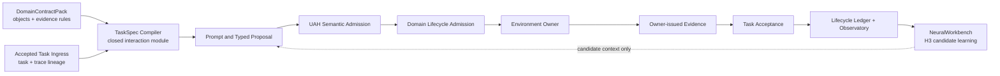

# Universal Agentic Harness and NeuralWorkbench

## Executive brief

**Prepared:** 2026-10-04

**Positioning:** evidence-governed infrastructure for deploying language models
inside operational systems

**Current maturity:** tested H0 contract proof, partial H1 runtime, H2 NAO
qualification in preparation, H3 NeuralWorkbench research seam defined

## The problem

Putting a capable model behind an application interface does not make it a
reliable subsystem agent. Each deployment must answer the same operational
questions:

- Which actions may this role inspect, propose, or execute for this task?
- Which system owns admission and execution?
- What proves that an effect occurred?
- How are model output, admitted operation, native result, and task acceptance
  kept distinct?
- How can the same model or role move between local and remote providers
  without losing identity, policy, or traceability?
- How does prior experience improve future operation without allowing online
  self-modification of trusted runtime code?

Most domain integrations solve these questions locally. The result is repeated
harness code, inconsistent traces, broad tool exposure, and failure modes that
are difficult to attribute across model, policy, runtime, or environment
owners.

## The product thesis

UAH treats an agent as a governed embodiment rather than a model process. A
task is compiled against a role, an abstraction frame, a versioned domain
contract, and a graph of typed abstraction-boundary (AB) objects. The model
receives the smallest valid task interaction surface. It proposes typed work;
deterministic UAH admission and the native domain lifecycle decide whether that
work may execute. Environment-owner evidence, not model text, determines task
closure.

The architecture creates three products that can be developed and packaged
independently while sharing one evidence model:

1. **UAH Kernel:** task compilation, semantic admission, identity, lifecycle,
   provider-neutral agent operation, and domain adapters.
2. **Observatory:** immutable operational evidence and comparison views for
   developers, evaluators, operators, and governance teams.
3. **NeuralWorkbench:** frame-relative retrieval, candidate search, failure-aware
   memory, and reviewed crystallization of repeated interaction structures.

## Why NeuralWorkbench matters

Static harnesses repeatedly expose the same tools and prompt instructions.
NeuralWorkbench is designed to make the interaction structure itself an
evidence-driven search object. Given a bounded task projection, it can compare
deterministic templates, retrieved prior attempts, model-generated candidates,
and hybrids. It preserves supporting traces, counterexamples, costs, verifier
coverage, and uncertainty.

Its authority is deliberately limited. NeuralWorkbench cannot execute domain
actions, edit the trusted registry, change permissions, or declare an effect.
It returns candidate context or a shadow proposal that must pass the normal UAH
and domain admission path. Repeated successful structures may become H4
crystallization candidates only after replay, counterexample, holdout, owner
review, provenance, and rollback gates.

The intended commercial advantage is a system that can accumulate operational
memory and improve task-specific interaction design while retaining auditable
control. That advantage remains an H3 hypothesis until holdout experiments
show improvement over fixed projections and no-memory baselines.

## Initial wedge and expansion path

The first reference environment is the NAO robotics stack. It contains distinct
chatbot, planner, orchestrator, perception, skill, and speech owners, making it
a demanding test of multi-actor lineage and effect evidence. H2 is designed to
qualify the planner path through recorded and fake or simulated contracts before
any live robot authority is considered.

The expansion thesis is based on reusing the same kernel while changing the
DomainContractPack and adapters:

| Environment | Initial value proposition | Proof required |
| --- | --- | --- |
| NAO robotics | Preserve planner and orchestrator ownership while adding bounded model use and complete traces | Recorded or simulated planner parity, failure attribution, no duplicate activation or speech |
| Watson and software engineering | Run local or remote models as stable named agents with scoped workspace operations and replayable evidence | Frozen task suite, provider-neutral model port, same-model harness ablation |
| iTrader | Separate proposer, solver, verifier, simulator, risk, and execution authority | Held-out replay, risk-engine evidence, no model-owned execution truth |
| Gamma and research systems | Compose bounded research or analysis agents without a global tool bag | Domain pack conformance and evidence-complete task acceptance |

NAO and Watson are the priority reference paths. iTrader and Gamma are
expansion candidates, not current implementation claims.

## Current proof

The repository currently demonstrates:

- a portable Python kernel with no ROS, NAO, or provider SDK dependency;
- frame-relative AB control bands and closed task projections;
- semantic object versus implementation-binding separation;
- candidate-binding quarantine and deterministic role/output gating;
- content-addressed domain ingress/effect authority, normalized ingress
  artifacts, and task-ingress decisions;
- owner-attested environment activation, deterministic task ingress, and
  ledger-authorized task starts;
- distinct environment-run, task, trace, and lifecycle-event identities;
- content-addressed TaskSpec compilation into one projection, obligation,
  prohibition, and budget artifact;
- content-addressed TypedProposal normalization, UAH semantic admission, and
  independent domain execution-lease issuance or typed rejection;
- reviewed portable input-schema validation with the validated schema identity
  pinned in each admitted operation;
- exact lease-only environment execution with complete binding fingerprint
  fencing, separate native result and normalized evidence artifacts;
- one common lifecycle ledger with strict restart replay and deterministic
  `VerifiedTraceDigest` construction for accepted, best-effort-deficit, and
  required-effect-rejected tasks,
  including atomic commit framing, advisory-lock writer coordination, and
  typed proposal/semantic/domain/evidence rejection replay;
- frame-relative operation edges and initial H1 budget, pre-dispatch
  cancellation, recorded-timeout, and retry-policy facts;
- required versus best-effort task acceptance from owner-issued evidence;
- append-only common lifecycle persistence and model-free restart replay;
- a ROS-free NAO canary with accepted lease execution, semantic no-dispatch
  rejection, a terminal counterexample, restart replay, and verified digest output;
- content-addressed role/model declarations and agent manifests, initial handle
  revisions, and ledger-backed actor attachment, standby, and termination;
- fixed exclusive model leases, fresh owner resource checks, bounded startup
  reports, deterministic prompts, and fake-provider invocation with atomic
  model-call accounting;
- read-only Observatory environment/task/trace and explicit actor views with
  honest terminal status and provenance labels;
- focused and full-suite validation in the development log. Complete
  pre-commit, generated-document, and clean-wheel gates are rerun before release.

The proof does not yet include stale-evidence or false-completion policy,
in-flight cancellation, live provider transport, dynamic allocation, durable
context, H2 NAO planner parity, a Watson/Bonsai comparison, production deployment,
or measured Workbench uplift. Fixed lease exclusivity is scoped to participating
actors sharing one host/ledger and does not govern external hardware consumers.

## Commercial hypothesis

The likely early buyer is a technical team integrating LLMs into an existing
system where actions have operational consequences and several owners must
remain intact. The initial sale is expected to be a design-partner engagement
that produces a qualified DomainContractPack, adapter, frozen task suite,
Observatory evidence, and deployment profile.

If repeated onboarding demonstrates reuse, the offer can progress toward:

- an enterprise UAH runtime and policy license;
- paid domain onboarding and qualification;
- Observatory evaluation and governance deployments;
- NeuralWorkbench adaptive-memory modules after H3 validation;
- support, conformance, and regulated-environment deployment services.

Pricing, market size, procurement cycle, and buyer willingness remain open
discovery questions. They should not be inferred from technical completion.

## Investment case

The investment case rests on four propositions that can be tested in sequence:

1. **Control reuse:** one kernel can replace repeated harness logic across
   domains without taking over native execution ownership.
2. **Evidence quality:** typed lineage and owner-issued evidence improve failure
   attribution, reproducibility, and operator confidence.
3. **Onboarding leverage:** a reviewed DomainContractPack plus thin adapters can
   qualify a new environment faster than writing another bespoke harness.
4. **Adaptive advantage:** NeuralWorkbench can improve candidate quality or
   recovery on held-out tasks without increasing unsafe actions or hiding
   uncertainty.

The next value-inflection gates are complete failure lifecycle replay, H1 agent
and provider runtime, H2 NAO planner parity, and one non-NAO adapter using the
unchanged kernel. These gates convert the project from a coherent contract proof
into a repeatable product claim.

## Diligence position

The architecture is intentionally conservative about claims. UAH does not
assert that AB levels measure intelligence, that model output proves effects,
or that frequent trajectories justify automatic skill promotion. It separates
proposal, admission, execution, evidence, acceptance, observation, and
adaptation so each claim can be inspected and challenged.

The principal investment risks are incomplete runtime integration, unproven
cross-domain reuse, uncertain Workbench uplift, integration cost, and an
unvalidated commercial motion. The roadmap turns each risk into a specific
qualification gate rather than treating system breadth as evidence of product
readiness.
