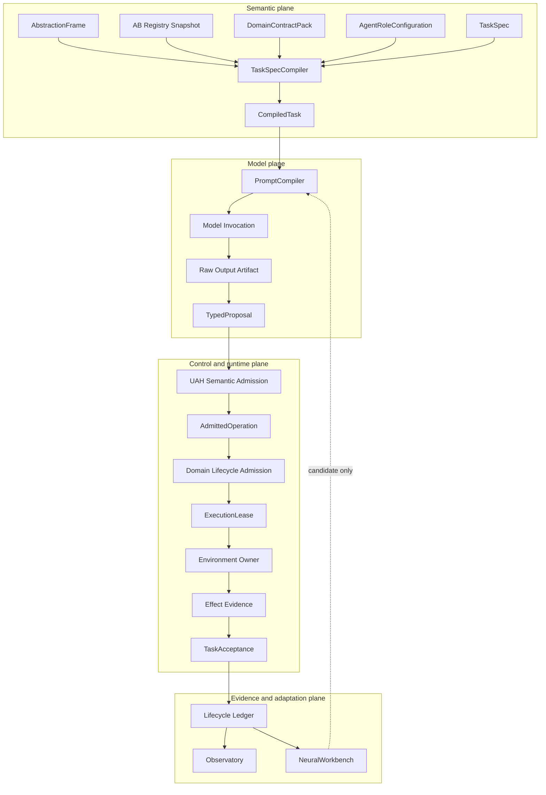

# UAH and NeuralWorkbench Technical Diligence

**Prepared:** 2026-10-02

**Scope:** product architecture, implementation evidence, authority boundaries,
NeuralWorkbench design, portability, security posture, and open engineering risk

## 1. Technical thesis

The Universal Agentic Harness is a portable semantic and runtime control kernel
for turning model output into bounded subsystem behavior. It does not replace
the native domain runtime. It compiles what one role may see and propose for one
task, validates typed proposals, requests domain admission, and accepts effects
only from the owner responsible for producing them.

NeuralWorkbench is a separate H3+ engine that searches and learns over the
interaction structures admitted by UAH. It consumes immutable evidence and
returns candidates. UAH retains scope, policy, admission, and execution
authority.

The design addresses a recurring integration failure: application code often
mixes model prompting, tool selection, authorization, execution, evidence, and
memory in one session abstraction. UAH assigns separate contracts and
identities to these concerns so a failure can be attributed and replayed.

## 2. System architecture



Solid nodes represent the target architecture. Current implementation status is
listed in Section 10. Two-stage admission and operation-scoped lease issuance
are implemented as a narrow H0 slice. Exact lease-only owner dispatch, accepted
common-ledger replay, and verified digests are implemented. PromptCompiler and
the complete failure lifecycle remain open.

## 3. Abstraction-boundary model

An AB object is a typed operation, observation, composition, strategy, or
coupled system defined within an explicit abstraction frame. AB coordinates are
frame-relative. AB1 in a robot runtime and AB1 in a software workspace need not
represent the same capability or complexity.

Each frame declares its substrate, atomicity rule, owners, and registry
revision. A role receives a control band that separates:

- inspectable objects;
- objects it may propose;
- directly controllable objects;
- effect claims that require owner evidence.

Higher-level work decomposes into an operation tree. Same-frame structure uses
`decomposes_to`; cross-frame work uses an explicit mapping or `delegates_to`
edge. This prevents an agent from treating a foreign frame as an untyped global
tool namespace.

The product claim is not that AB levels create reasoning. The claim is that an
explicit task-relative object graph provides a smaller and more inspectable
interaction surface than a flat catalog of unrelated tools.

## 4. Identity and lifecycle model

The identity model separates reusable configuration, persistent actors,
runtime activation, causal work, and provider resources:

```text
environment_profile_id
└── environment_run_id
    ├── agent_handle_id -> agent_id -> agent_run_id
    │   └── model_lease_id -> model_invocation_id
    └── task_id
        └── trace_id
            └── operation_id
                ├── proposal_id
                ├── admission_id
                └── execution_lease_id
```

- `role_configuration_id` defines model-independent authority, frames, skills,
  policy, budgets, and evaluation requirements.
- `agent_id` identifies one frozen role, model, prompt pack, harness, and
  adapter composition.
- `agent_handle_id` provides a stable operational name such as
  `nao.planner.primary`, with versioned revisions and rollback.
- `agent_run_id` is one bounded actor activation attached to exactly one
  environment run. Releasing a model lease does not terminate the logical
  actor.
- `task_id` remains domain-owned. `trace_id` is the UAH causal workflow.
- `operation_id` anchors exactly one frame-relative AB object. Cross-frame
  delegation creates another operation rather than assigning one operation
  several incompatible AB coordinates.

Environment registration never invokes a model or starts native infrastructure.
The environment owner attests readiness after native preflight. UAH verifies
that attestation against a frozen profile and DomainContractPack revision.

## 5. Task compilation

The implemented `TaskSpecCompiler` closes a major source of semantic drift.
Before this seam, callers could independently supply an object projection and
effect obligations. The compiler now produces one `uah.compiled_task/v2`
artifact from:

- a content-verified start-task decision bound to a content-addressed ingress
  artifact, whose exact lineage is already recorded in the lifecycle ledger;
- task and trace lineage;
- a versioned TaskSpec;
- role and frame policy;
- a content-addressed registry snapshot;
- an injected, content-addressed DomainContractPack revision.

The implemented `uah.domain_contract_pack/v1` revision covers the exact
role/task allowlists, ingress rules, effect-to-object and evidence-owner rules,
failure policy, and prohibited effects. Changing one of these rules changes the
revision. The environment profile that pins this revision is currently a
frozen validated in-memory contract, not a content-addressed artifact.

The task selects semantic effects and marks each as required or best-effort.
The domain pack determines which AB object owns the effect, which evidence owner
may prove it, and which failure policy applies. The compiler produces:

- a closed `InteractionModuleSpec`, including inspectable decomposition;
- frozen `EffectObligation` values;
- merged prohibited effects;
- declared finite wall-time, model-call, tool-call, and retry-attempt budgets;
- a content identity that excludes machine-local registry paths.

Compilation fails on owner drift, undeclared observables, ambiguous rules,
duplicate obligation identities, prohibited requested effects, mutable
collections, mismatched lineage, mismatched revisions, unsupported roles or
task types, and altered content identities. Resume and notification ingress
must resolve the original compiled artifact rather than compile another one.
Tool-call budget consumption is atomic with execution start. Retry and timeout
decisions use the compiled limits. Model-call consumption awaits the provider
port; token, cost, and hardware budgets are not implemented.

## 6. Two-stage admission

The implemented kernel seam preserves two distinct kinds of authority:

```text
raw model output
  -> TypedProposal
  -> UAH semantic admission
  -> AdmittedOperation
  -> domain lifecycle admission
  -> ExecutionLease or rejection
```

UAH semantic admission verifies role ownership, frame reach, AB object, binding
status and ownership, canonical arguments, reviewed input-schema content,
prohibited effects, and evidence obligations. The portable schema subset checks
required fields, top-level JSON types, and additional-property policy. It does
not validate output payloads or assert that the native environment is ready.

Domain lifecycle admission owns readiness and operation deduplication. The
current slice rechecks the environment run, DomainContractPack revision,
binding environment, lifecycle owner, and readiness attestation before issuing
an operation-scoped lease. Native concurrency, cancellation, supersession,
version fencing, and safety checks remain adapter-owned future work. A
semantically valid operation may still be rejected.

The accepted tracer reaches an `ExecutionLease`, records execution start, and
calls the environment handler only with that exact lease. Direct object and
argument dispatch is absent. Candidate bindings, foreign binding owners,
inspection-only objects, domain-revision drift, complete binding drift, and
tampered authority artifacts fail closed. An exact repeated lease request is
idempotent and returns the same lease; a changed domain context cannot
reconsider an already leased operation. The owner preserves the native result
and normalized evidence in a content-addressed receipt.

## 7. Evidence and task acceptance

Model text cannot prove an external effect. UAH distinguishes:

1. raw owner result;
2. normalized effect evidence;
3. deterministic obligation evaluation;
4. task acceptance.

`EffectObligation` identifies the semantic effect, AB object, evidence owner,
requirement class, and failure policy. `TaskAcceptanceEvaluator` produces:

- `accepted` when every required obligation is satisfied;
- `accepted_with_deficit` when required obligations succeed and a best-effort
  obligation does not;
- `suspended` when required evidence is still pending;
- `rejected` when a terminal required obligation fails.

The environment task registry records suspension or terminal judgment and
rejects later ingress for a terminal task. The strict,
content-addressed `uah.trace_event/v1` stream persists locally as canonical
JSONL and reconstructs registry and operation state after process restart
without invoking a model or rerunning acceptance. Every event carries a global
sequence, causal parent, and atomic `commit_id`/`commit_index`/`commit_size`
position. Reload rejects incomplete or interleaved multi-event facts.

The current store is local JSONL with advisory-lock coordination among
cooperating processes. It provides sequence, timestamps, causal links,
accepted-path replay, native execution-failure recording, and nonterminal
semantic/domain rejection replay. It rejects rather than repairs a
crash-truncated commit. Proposal/evidence rejection, pre-dispatch cancellation,
recorded timeout, retry policy, and terminal required-effect counterexamples
now replay. Stale evidence and false-completion policy remain open.

## 8. NeuralWorkbench

### 8.1 Role in the product

NeuralWorkbench is the proposed adaptive memory and search engine. It is not an
abstraction frame, model provider, runtime owner, or permission system. UAH
supplies the active frame, task projection, constraints, candidate budget, and
versioned context.

The external seam is deliberately small:

```text
describe() -> protocol and capability descriptor
propose(WorkbenchRequest) -> WorkbenchCandidateBatch
observe(WorkbenchObservation) -> no authority-bearing result
```

The existing UAH adapter implements a transport-neutral handshake and bounded
candidate exchange. Candidate output remains quarantined.

### 8.2 Candidate portfolio

The target engine compares mechanism-diverse candidates:

- deterministic templates;
- model-generated structures through a host-supplied inference port;
- retrieved prior traces adapted to the current task;
- hybrids of templates, retrieval, and generation.

Hard constraints and deterministic verification run before scoring. The target
score vector preserves validity, expected success, safety, evidence coverage,
uncertainty reduction, latency, cost, reversibility, and portability. A scalar
energy may rank the remaining candidates, but it is deployment policy rather
than truth.

### 8.3 Memory unit

NeuralWorkbench learns from completed evidence, not chat history alone. A trace
must join task, environment, role, model, candidate provenance, admission,
execution, owner evidence, acceptance, costs, and failures. The planned
`VerifiedTraceDigest` is the compact memory unit exposed to retrieval.

Successes and counterexamples remain first-class. Unknown evidence remains
unknown rather than being coerced into success or failure. Capability profiles
are keyed by object, task family, environment, and version.

### 8.4 Crystallization

Repeated graph structures may be proposed as higher-level AB objects at H4.
Frequency is insufficient. Promotion requires replay, removal and substitution
counterfactuals, opposing traces, disjoint holdout evaluation, owner review,
provenance, versioning, rollback, and continued monitoring.

NeuralWorkbench cannot publish directly into the trusted registry.

### 8.5 Current implementation boundary

The intended companion revision `e76ba7e` is described as a deterministic
symbolic prototype with template candidate generation, registry verification,
an inspectable hand-tuned energy score, candidate selection, JSONL trace
storage, and offline macro proposals. It does not yet implement the complete
retrieval-adaptation loop or learned search model.

The UAH repository declares the companion relationship, but the expected
gitlink is not currently mounted. The revision must be restored and verified
before a release may claim a pinned NeuralWorkbench dependency.

No repository evidence currently proves that NeuralWorkbench improves NAO,
iTrader, Watson, or another environment. The required experiment compares
fixed projection, retrieval from successes only, and retrieval from successes
plus failures on held-out tasks under the same model and acceptance checks.

## 9. Observatory

Observatory is a read-only projection over the common lifecycle ledger. It is
designed to render:

- environment-run, task, trace, agent-run, and operation views;
- raw model output, TypedProposal, admission, lease, native result, evidence,
  and terminal judgment as distinct artifacts;
- model and provider comparisons;
- Workbench requests, candidate provenance, scores, selection, counterexamples,
  and observations;
- replay and failure attribution.

Observatory does not execute, admit, mutate registries, issue evidence, or
decide what becomes memory. NeuralWorkbench may consume the ledger and
Observatory may display Workbench artifacts, but neither owns the other's
responsibility.

## 10. Implementation status

| Capability | State on 2026-10-02 | Evidence or gap |
| --- | --- | --- |
| Portable semantic kernel | Implemented H0 proof | Core has no ROS, NAO, provider SDK, or runtime-product imports |
| Registry projection and output gate | Implemented | Closed object projection, AB band checks, role/output reach, effect-claim rejection |
| Binding quarantine | Implemented | Candidate bindings cannot resolve for runtime use |
| Environment activation and ingress | Implemented narrow seam | Profile and attestation checks, content-addressed ingress and decisions, ledger-backed start/resume/notify lineage; environment close remains open |
| Domain contract authority | Implemented narrow seam | Content-derived revision covers role/task allowlists, ingress/effect-evidence rules, failure policy, and prohibitions |
| TaskSpec compilation | Implemented v2 | Content-verified decision plus ledger-recorded start, content-addressed projection, obligations, prohibitions, retry-aware budgets, and revision provenance; model-call provider accounting remains open |
| Task acceptance | Implemented narrow seam | Required, best-effort, suspended, and terminal outcomes |
| Common lifecycle persistence | Implemented H0 plus initial H1 controls | Global sequence, causal parents, operation edges, typed rejection branches, atomic dispatch budget, cancellation, timeout, retry, accepted/deficit/rejected replay, and verified digests; stale evidence and actor lifecycle remain open |
| Recorded NAO canary | Implemented | Injected domain pack, authoritative ingress admission, strict planner payload handling, accepted lease-only execution, semantic no-dispatch rejection, terminal required-effect counterexample, restart replay, and verified digest |
| PromptCompiler | Specified | No executable prompt artifact compiler |
| Two-stage admission and execution | Implemented narrow seam | Content-addressed proposal or normalization rejection, reviewed input-schema validation, semantic/domain decisions, exact lease-only dispatch, evidence decision, explicit operation edges, and replayable terminal counterexample |
| Agent identity and handles | Initial H1 slice | Content-addressed manifests, one-time handle registration, and roster-bound standby run attachment are in memory; role/model registries, persistence, run lifecycle, fixed leases, invocations, and fidelity evaluation remain open |
| Live model port and allocator | Not implemented | No Watson/Bonsai runner; fixed lease and startup preflight remain open |
| H2 NAO planner parity | Not started | No explicit `legacy`, `shadow`, and `uah` comparison report |
| Observatory renderer | Initial O1 slice | Validated-ledger trace projection, honest terminal status, control/rejection stages, explicit operation graph, static searchable HTML, and a committed recorded-canary example; full actor/configuration/comparison views remain open |
| NeuralWorkbench retrieval | Candidate slice only | Bounded UAH-side memory and protocol exist; complete companion attachment and uplift test remain open |
| Crystallization | Quarantined design | No promoted AB2+ object |

The current full suite reports **220 passing tests**, and the latest Ruff run
passes. The complete repository hook, Markdown/HTML synchronization, and clean
wheel gates are rerun before distributing a refreshed build.

## 11. Security and governance posture

The architecture applies least capability at task scope:

- runtime discovery is not authorization;
- candidate bindings do not execute;
- AB0 inspection does not imply AB0 control;
- model output cannot assert effect truth;
- environment owners remain responsible for native execution and evidence;
- cross-frame work requires explicit delegation;
- Workbench candidates cannot promote themselves;
- provider fallback must preserve model admission requirements and role
  fidelity;
- untrusted retrieved context remains data and cannot expand the compiled task;
- registries, evaluators, permissions, and promotion thresholds stay outside
  online model mutation.

The present code is research-stage infrastructure and has not completed a
formal security review, threat model, penetration test, or regulated-system
certification.

## 12. Portability model

Domain onboarding should normally produce declarative content:

- frames and AB objects;
- role projections and control bands;
- implementation bindings;
- evidence and task-ingress rules;
- environment profiles;
- prompt policy and qualification cases.

Custom Python adapters are reserved for irreducible native normalization or
parity behavior. The NAO-specific package is separate from the core. A second
domain must demonstrate that the unchanged kernel can compile, admit, trace,
and accept a materially different task before universality is claimed.

## 13. Principal technical risks

| Risk | Why it matters | Required evidence |
| --- | --- | --- |
| Contract breadth grows faster than executable depth | A large type system can appear complete without operating a full task | One minimal ingress-to-terminal tracer with replay and failure cases |
| Domain onboarding remains bespoke | Integration cost could dominate kernel reuse | Measured second-domain onboarding with unchanged core and a deletion budget |
| AB projection harms model performance | Narrow context can omit useful affordances | Same-model flat-tool versus compiled-projection ablation |
| Evidence rules are incomplete | False completion can remain hidden | Stale, missing, conflicting, delayed, and owner-failure fixtures |
| Two admission layers drift | UAH and domain may disagree without clear ownership | Typed reasons, immutable operation identity, parity fixtures, and replay |
| Local provider constraints block concurrency | Agent identity may be confused with loaded model capacity | Fixed lease first, then hardware-aware allocation and serialized multi-agent trials |
| Workbench amplifies early errors | Retrieved traces may bias future failures | Counterexamples, calibration, holdout, provenance, and rollback |
| Observatory becomes a second ledger | Views could disagree with execution truth | Projection-only renderer over one append-only store |
| NeuralWorkbench dependency is not pinned | Reproducibility and licensing cannot be verified | Restore gitlink, verify revision, tests, provenance, and license |

## 14. Next technical gates

1. Add stale-evidence and false-completion fixtures to the completed operation,
   rejection, and counterexample replay grammar.
2. Extend the initial agent/handle/standby registries with role/model identity,
   scoped activation events, fixed leases, preflights, and model invocation
   identity.
3. Add PromptCompiler, provider-neutral model port, fixed model lease, and
   startup preflight.
4. Owner-review and freeze the NAO `v1.0.0` DomainContractPack and
   package-owned parity fixtures.
5. Run planner `legacy | shadow | uah` parity with fake or simulated owners.
6. Attach NeuralWorkbench in shadow mode and run the first retrieval ablation.
7. Prove one non-NAO adapter with the unchanged kernel.

## 15. Reproduction entry points

From a configured repository checkout:

```bash
./scripts/setup_dev_tools.sh
./scripts/run_precommit.sh
PYTHONPATH=src .venv/bin/python -m ab_harness_nao
```

The smoke command is a deterministic adapter qualification over recorded
proposals and a fake environment. It is not a live model, ROS, or production
deployment claim.
