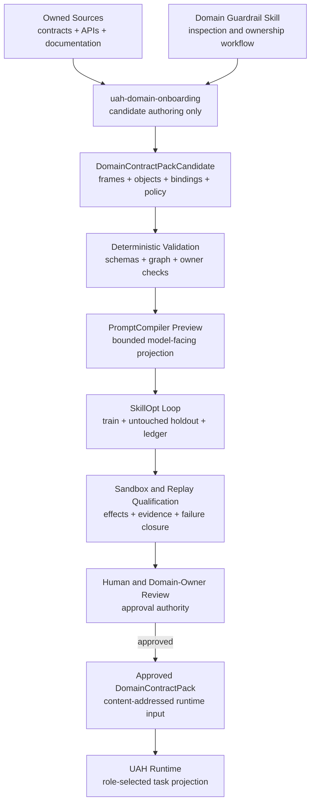

# Domain Initialization and AB Coupling

**Status:** Contract design active; assisted authoring remains H3+
**Date:** 2026-09-08
**Reference domains:** NAO, iTrader, Watson/Hermes

## 1. Product Goal

Domain initialization turns an unfamiliar environment into a candidate UAH
domain package without treating discovery, model confidence, or documentation
as authorization or execution evidence.

The intended onboarding experience is:

> Couple your model and environment to a bounded, inspectable AB harness.

Initialization is not required to close H2. H0-H2 uses hand-authored and
reviewed reference-domain contracts. Automated or LLM-assisted initialization
begins after those contracts prove the grammar.

## 2. One Artifact, Two Authoring Frontends

Manual and LLM-assisted initialization emit the same typed candidate package:

```text
DomainContractPackCandidate
  domain profile
  environment profile and stable agent-handle roster
  primary and auxiliary abstraction frames with atomicity rules
  AB registry objects and decompositions
  capability packs and role allowlists
  implementation binding candidates
  input/output/effect/evidence contracts
  operation-edge grammar and task-ingress policy
  required and best-effort effect-obligation templates
  permissions and approval requirements
  evidence adapters and freshness rules
  minimal domain prompt policy
  qualification cases and counterexamples
  source and model provenance
```

Manual authoring directly maps known APIs and internal seams. LLM-assisted
authoring reads operator-supplied sources and proposes the same objects through
a bounded coupling workflow. Neither frontend can approve its own output.

An approved `DomainContractPack` is the runtime source. A domain-specific
developer skill may explain how to inspect and validate it, but the
`PromptCompiler` never consumes developer-skill prose as domain authority.
Each environment run pins one approved pack revision. Registry changes produce
a new reviewed revision; they are never synchronized live into an active run.

## 3. Coupling Pipeline



```text
environment sources + documentation + API inventory + owner constraints
  -> inspect environment
  -> propose AB frame
  -> propose registry objects and bindings
  -> define evidence and permission obligations
  -> generate counterexamples
  -> deterministic graph and schema validation
  -> sandbox/replay qualification
  -> owner review
  -> content-addressed approved domain package
  -> UAH H0-H2 runtime
  -> NeuralWorkbench H3 adaptation
```

Discovery output is always `candidate`. Availability does not prove semantic
meaning, authorization, safe callability, observable effects, or evidence
quality.

## 4. `uah-domain-onboarding` Skill

The assisted workflow should eventually be exposed as a composed skill whose
operations remain individually traceable:

```text
inspect_environment
extract_candidate_surfaces
propose_ab_frame
propose_registry_objects
propose_bindings
define_evidence_adapters
define_environment_profile
define_task_ingress_policy
define_effect_obligations
generate_counterexamples
validate_graph
run_coupling_evals
repair_candidates
emit_review_package
```

The skill may iterate after deterministic rejection. It cannot activate a
registry, approve a binding, widen a role control band, or mark evidence valid.

The skill coordinates specialized development workflows without converting
them into domain-runtime objects:

- domain modeling fixes terminology, owners, and frame atomicity;
- code and contract inspection extracts source facts;
- TDD proves schema, projection, admission, and failure behavior through public
  interfaces;
- SkillOpt changes only model-facing descriptions, examples, domain-policy
  wording, or prompt-pack presentation after a baseline is frozen;
- deslop runs after behavior is green and remains limited to touched
  implementation code.

Every SkillOpt iteration locks the exact target artifact, one objective, train
set, untouched holdout set, and acceptance gate. An improved train result may
not activate a candidate when the holdout regresses or structural validators
fail.

## 5. Environment Coupling Versus Model Coupling

Environment coupling defines domain semantics, APIs, ownership, permissions,
bindings, and evidence. Model coupling defines projection presentation, context
packaging, structured-output behavior, tool-use reliability, limits, and an
empirical capability profile.

The canonical domain registry must not change meaning merely because a
different model generated or consumes it. Model-specific familiarity belongs
in projections and configuration-specific capability profiles.

Prompt coupling is a third, derived activity. The deterministic
`PromptCompiler` combines the stable UAH protocol kernel, role contract,
minimal domain policy, task-scoped AB projection, and current task context. It
records the prompt artifact hash but grants no authority and does not expose raw
binding locators to the model.

## 6. Coupling and Runtime Model Roles

`coupling_model` and `runtime_model` are independent configuration roles.

- A frontier coupling model is recommended for faster, higher-quality initial
  drafting.
- A user may use the intended local runtime model for coupling.
- A domain generated by one model may be operated by another only after the
  complete runtime configuration passes its own admission suite.
- Both identities, prompts, context limits, runtimes, quantizations, and source
  artifacts remain in provenance.

Each agent role references one versioned `model_admission_profile_id`. The
profile defines provider-neutral capability and behavioral requirements.
Deployment policy may narrow eligible providers, privacy modes, placements,
RAM, VRAM, context, and concurrency limits without changing the role semantics.

## 7. Model Admission Profile

Architecture, parameter count, and provider history are advisory metadata, not
proof of capability. Qualification measures the complete
model-harness-domain configuration:

- structured-output reliability;
- AB frame and level consistency;
- tool/API grounding and unknown-surface rejection;
- evidence-versus-model-claim separation;
- permission compliance;
- counterexample handling;
- repair after deterministic rejection;
- repeated-trial variance;
- latency, memory, context, and cost limits.

Admission levels reduce authority instead of banning participation:

| Level | Authority |
| --- | --- |
| `draft_only` | Candidate drafting with line-by-line review |
| `assisted_coupling` | Deterministic repair loop; no approval |
| `qualified_coupling` | Complete review package; sampled owner review |
| `bounded_runtime` | Operation inside an approved frame/control band |
| `expanded_runtime` | Additional authority earned through domain qualification |

An unsuitable model may still draft under explicit supervision or operate an
already-approved narrow projection. It cannot silently auto-iterate or activate
registry content.

## 8. Configuration Identity and Selective Retesting

Qualification attaches to a content-addressed configuration containing model,
weights/quantization, runtime, context/KV settings, prompt/projection version,
registry snapshot, adapter revision, environment revision, evaluator, and task
suite. Material changes invalidate or narrow the prior admission result.

Selective retesting is allowed when the dependency map proves which gates are
unaffected. Documentation-only changes do not rerun runtime qualification;
registry, adapter, prompt, quantization, or model changes rerun their affected
contract and behavior suites.

The identity registry separates:

```text
Outside-in semantic construction
domain sources
  -> DomainContractPackCandidate
  -> approved DomainContractPack
  -> role_configuration_id

Agent embodiment
role_configuration_id
+ model_configuration_id
+ prompt_pack_id
+ harness_build_id
  -> agent_id

Stable named actor
agent_handle_id
  -> agent_handle_revision_id
  -> active agent_id

Activation and work
environment_profile_id
  -> environment_run_id
  -> active agent_id -> agent_run_id
  -> environment_ingress_id
  -> task_id -> trace_id -> operation_id

Runtime allocation
provider_pool_id
  -> compatible model_instance_id
  -> model_lease_id
agent_run_id + trace_id + model_lease_id
  -> model_invocation_id
```

The chains join at `model_invocation_id`, which records `environment_run_id`,
`agent_run_id`, `trace_id`, and the actual `model_lease_id`. Reallocation among compatible
instances of the same model configuration does not change the agent identity.
A different model configuration produces a different `agent_id`. A stable
`agent_handle_id` may move to that agent only through a new immutable revision
after role-fidelity qualification; allocation alone cannot change it.

Handles use the stable namespace `<domain>.<role>.<slot>`. The initial slot is
`primary` even when only one embodiment exists:

```text
watson.system.primary
nao.chatbot.primary
nao.planner.primary
itrader.proposer.primary
```

The environment owner attests one native activation after readiness checks.
UAH validates that attestation, resolves the profile's roster, and attaches
agent runs. Approved bindings normalize native stimuli into
`EnvironmentIngress`; deterministic task-ingress policy assigns state-update,
start, resume, notify, or reject semantics before any model call.

Every operation receives one coordinate in one abstraction frame. Same-frame
structure uses `decomposes_to`; cross-frame work uses an explicit
`delegates_to` edge. Domain onboarding must include the target role or handle,
typed input and output artifacts, and authority boundary for every delegation.
Task templates declare required and best-effort effect obligations so terminal
acceptance can be derived from owner evidence without model-authored criteria.

`primary` names a deployment role, not an unqualified default. It leaves room
for explicit owner-defined slots without changing the role configuration or
overloading the agent identity.

Every role names one primary abstraction frame. Additional frame projections
are explicit, versioned allowlists with their own control bands and access
modes. A broad auxiliary capability pack may be approved at role level, but
each task still receives a bounded interaction projection.

Each additional projection declares a maximum `access_mode`:

- `inspect_only` permits bounded observations but no state-changing proposal;
- `direct_proposal` permits typed proposals that still pass UAH and domain
  admission;
- `delegate_only` permits a typed handoff to an agent whose primary frame is
  the target frame.

The role configuration owns this limit. `agent_id` inherits it as part of the
role composition, and task compilation may only narrow it. Effect-bearing
cross-frame work defaults to `delegate_only`; read-only foreign state defaults
to `inspect_only`.

## 9. Activation and Governance

Generated registries and bindings remain candidates until explicit environment
owner review. Read-only discovery can expose sensitive surfaces or false
semantics, so it does not auto-activate by default.

H3 NeuralWorkbench may use approved traces to propose better projections,
replacement pulse candidates, or candidate AB chains. H4 crystallization remains
quarantined behind replay, counterexamples, holdouts, provenance, owner review,
and rollback.

## 10. Deferred Gates

- minimal universal domain base classes after NAO, iTrader, and Watson mappings;
- source-ingestion sandbox and secrets policy;
- automatic sensitivity classification;
- admission thresholds and confidence intervals;
- customer-facing review UI in Observatory O2;
- signed domain packages and registry distribution.
- qualification requirements for rare `direct_proposal` cross-frame mappings;
- calibrated cross-frame mappings that preserve effects and evidence.
