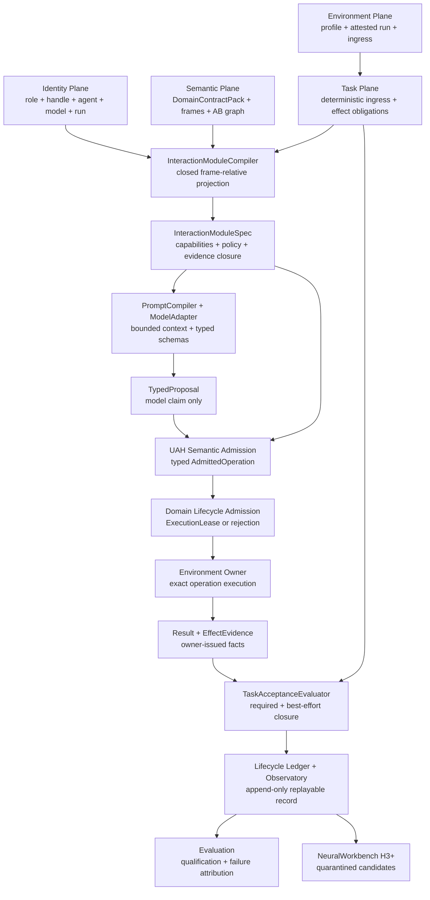

# Universal Agentic Harness: Implementation Masterplan

**Status:** Canonical implementation plan; H2 qualification gates active
**Date:** 2026-09-08
**Scope:** Model-agnostic and task-agnostic harness kernel with domain-specific AB frames and adapters
**Extends:** `../architecture/universal_agentic_harness_foundation.md` and `../architecture/neural_workbench_adaptive_ab_harness.md`
**Decision owner:** UAH H0-H2 core; NeuralWorkbench H3+ companion track; NAO remains the first reference environment

## 1. Executive Decision

The project should build a Universal Agentic Harness, but not by replacing the
model loop, tool runtime, sandbox, session store, or provider layer of every
existing agent.

The defensible architecture is a hybrid:

> Own the AB-semantic kernel, task projection, evidence gate, trace grammar,
> evaluation protocol, and promotion lifecycle. Reuse or adapt mature provider,
> session, extension, sandbox, and worker runtimes behind conformance adapters.

This gives the project a genuinely different basis vector from Hermes, Pi,
OpenClaw, OpenHands, Codex, or Claude Code. Those systems primarily organize
tools, context, permissions, sessions, and execution. Our kernel additionally
asks:

```text
Which abstraction frame applies?
Which AB objects may this role inspect, propose, or control for this task?
What decomposition and effect signatures make those objects real?
What evidence closes the claimed effect?
What trace changed our capability belief?
When may a repeated structure become a reviewed higher-level object?
```

The release strategy is deliberately conservative:

```text
H0  AB contract spine and deterministic gate             IMPLEMENTED PROOF
H1  Executable harness runtime and complete lifecycle     NEXT ENGINEERING TARGET
H2  Cooperative NAO adapter and parity ablation           FIRST REAL ENVIRONMENT
H3  Trace-adaptive Neural Workbench                       OFFLINE-FIRST ADAPTATION
H4  Crystallization and reviewed AB promotion             QUARANTINED LEARNING
H5  Cross-runtime federation and conformance              UNIVERSAL HARNESS v1
H6  AB5 policy-foundry hypothesis                         RESEARCH ONLY, NOT COMMITTED
```

The true Universal Agentic Harness is reached at H5, not when every feature of
every existing harness has been copied. H5 means that the unchanged semantic
kernel can govern more than one model family, runtime style, and task domain
through explicit adapters and comparable traces.

## 2. Target Contract

### Required outcome

Build a portable harness that can turn a model into a bounded subsystem agent
by compiling a task-specific interaction module from a versioned AB object
graph. The resulting system must:

- remain independent of ROS, NAO, any single model provider, and any single
  agent runtime;
- preserve domain ownership instead of absorbing the environment into the
  harness;
- expose the minimum sufficient AB closure for the current role and task;
- distinguish inspection, proposal, control, execution, and effect-claim
  authority;
- preserve an append-only, replayable, versioned execution trace;
- bind completion to deterministic evidence obligations;
- support local models, API models, and external frontier harness workers;
- adapt search and context from measured traces without silently rewriting the
  trusted runtime;
- propose reusable AB2+ interaction objects through quarantine, holdout, and
  owner review;
- compare model-harness configurations under frozen task and environment
  contracts.

### Non-goals

- A global ontology in which one absolute AB number has the same meaning in all
  systems.
- A universal bag of all tools, skills, prompts, and memories.
- Another LLM layer inserted between the current chatbot and planner.
- Automatic prompt rewriting without a bounded SkillOpt train/holdout ledger.
- Online publication of agent-authored skills into a trusted registry.
- Treating MCP discovery as authorization, effect truth, or evidence closure.
- Treating a lower energy score or lower entropy proxy as proof of correctness.
- Moving dialogue, planning, execution, knowledge, perception, or speech
  ownership out of their current NAO packages.
- Calling an adaptive AB4 system AB5 merely because it becomes more capable.

### Current H2 qualification contract

H2 closes the static UAH foundation and the first cooperative domain proof only
after H0 and H1 hard gates pass and the NAO planner ingress/egress completes
parity over recorded and fake/simulated contracts. A live robot is not required.
Schedule pressure does not relax evidence, ownership, replay, or promotion
gates.

**H2 launch definition:** an installable portable package identifies a complete
model-harness-domain configuration, executes accepted and rejected lifecycle
cases, exposes approved AB1 operations plus inspectable non-callable AB0 seams,
closes effects only from environment-owner evidence, replays without a model,
and demonstrates planner parity through an explicit NAO compatibility adapter.

Three qualification labels remain distinct:

| Label | Meaning | Minimum evidence |
| --- | --- | --- |
| UAH core qualified | Portable H0-H1 semantic kernel, lifecycle, replay, fake owner, docs and CLI | Deterministic recorded suite; no model or NAO parity claim |
| UAH H2 NAO planner qualified | Core plus planner ingress/egress projection, gate, fake-owner dispatch, evidence and parity report | Recorded/fake NAO success and failure suite under explicit authority mode |
| UAH H2 model qualified | H2 planner proof plus a frozen model comparison | Reproducible Watson/Bonsai run under the same configuration-controlled suite |

If model assets are unavailable, H2 may still close with recorded proposals and
must say that model qualification is absent. If planner parity fails, the
release remains core-qualified and may not be relabeled H2.

H3 is stretch scope only. A protocol handshake, Observatory view, or shadow
replacement pulse is useful, but no H3 feature is required to pass H2 and no
H3 candidate receives execution authority for this release.

#### Qualification prerequisites

These conditions must be true before the final launch evaluation begins:

1. `src/ab_harness` remains free of ROS, NAO, provider SDK, and runtime-product
   imports.
2. AB objects remain semantic and frame-relative; environment methods and
   endpoints remain revisioned bindings.
3. Candidate bindings, Workbench contexts, and learned structures cannot
   promote or execute themselves.
4. The accepted path, rejected path, effect owner, registry identity, binding
   identity, environment identity, and evaluator identity are deterministic.
5. The task suite and acceptance checks are frozen before NAO parity or
   Watson/Bonsai tuning.
6. A clean environment can install the package and run the smoke command.
7. Canonical Markdown, generated HTML, decision record, development log,
   research note, Observatory contract, and system-design artifact agree on
   implemented versus roadmap status.
8. NeuralWorkbench remains optional through H2. Its submodule revision and
   protocol are recorded, but it cannot become an undeclared runtime dependency.

#### Ordered delivery gates

| Order | Deliverable | Required exit evidence |
| --- | --- | --- |
| 1 | Freeze H2 contracts, repository boundaries, Workbench protocol, Observatory O1, and coupling decisions | Decision artifact, intended companion revision, focused protocol tests, synchronized plan |
| 2 | Complete H1 lifecycle schemas and deterministic failure grammar | Schema round trips; compile-to-terminal events; stale evidence, timeout, cancellation, retry exhaustion, unavailable binding, and false-completion attribution |
| 3 | Persist/replay lifecycle and implement planner-side NAO projection | Model-free replay equivalence; AB1 callable and AB0 inspect-only closure; provenance retained |
| 4 | Implement planner compatibility adapter and recorded/fake qualification | Accepted, rejected, clarification, recovery, and owner-evidence cases pass without ROS imports in core |
| 5 | Run `legacy | uah | shadow` parity fixtures and freeze provider-neutral manifests | Explicit authority mode; classified disagreements; exact model, quant, runtime, context, prompt, registry, adapter, and evaluator identities |
| 6 | Run the H2 candidate, clean-install rehearsal, and optional model matrix | Core and H2 gates pass in a fresh environment; model report recorded only if assets exist; docs rendered |
| 7 | Publish H2 status and artifacts | Version/tag decision, result summary, parity report, known limitations, rollback, and H3 gate decision |

Incomplete work remains at its current gate. Scope may be reduced before
evidence requirements are reduced, but a failed gate cannot be relabeled as a
pass.

#### Evaluation order

Evaluation runs from cheapest and most deterministic to most confounded:

1. **Package and identity:** clean install, import audit, configuration hash,
   registry hash, and CLI exit behavior.
2. **Accepted semantic path:** projection, role gate, approved binding, owner
   dispatch, declared observable, and terminal closure.
3. **Negative controls:** direct AB0 dispatch, unknown/out-of-projection object,
   candidate binding, wrong owner, and prohibited effect claim.
4. **Lifecycle failures:** stale evidence, unavailable owner, timeout,
   cancellation, retry exhaustion, and false completion.
5. **Replay:** replace the model with recorded proposals and require identical
   decisions and evidence obligations.
6. **NAO planner parity:** compare normalized legacy and UAH planner outcomes
   under explicit `legacy`, `uah`, and `shadow` authority modes.
7. **Workbench stretch:** if attached, retrieve supporting and counterexample
   traces or emit a shadow candidate; remain `candidate` with zero authority.
8. **Model matrix:** hold task, harness, environment, and evaluator fixed while
   swapping Watson and Bonsai configurations; then ablate flat versus projected
   context and failure-aware retrieval.

No later result can rescue an earlier failed hard gate. Faster decode, lower
memory, or a successful final answer cannot override a scope, ownership,
evidence, replay, or regression failure.

#### Hard H2 gates

| Gate | H2 acceptance |
| --- | --- |
| Portability | Forbidden-import audit passes and a fresh venv installs the package |
| Determinism | Recorded smoke produces stable configuration and candidate identities |
| Scope | No negative canary dispatches an out-of-projection or AB0 operation |
| Ownership | Only the registry-declared AB1 owner can issue accepted effect evidence |
| Evidence | Success, stale evidence, owner failure, and false completion receive correct terminal decisions |
| Replay | Model-free replay reconstructs the same lifecycle and outcome |
| NAO planner parity | Planner request, proposal, gate, fake-owner dispatch, evidence, clarification, failure, and replay cases are equivalent or reviewed improvements |
| Authority mode | `legacy`, `uah`, or `shadow` is explicit; no silent fallback contaminates qualification |
| Workbench quarantine | Optional H3 seams are versioned, shadow-only, bounded, and unable to mutate code, permissions, evaluators, bindings, or registries |
| Documentation | Canonical Markdown and generated HTML are synchronized; implementation claims match tests |

For **model-qualified H2**, add a hard paired-run gate: Watson and Bonsai use
the same frozen suite, with repeated trials and owner/evaluator effects reported
beside latency and memory. Memory efficiency alone cannot pass this gate.

#### H2 postconditions and next-stage gate

H2 completion produces:

- a versioned package and machine-readable configuration manifest;
- frozen smoke and failure suites;
- append-only lifecycle and optional Workbench experience artifacts;
- a launch result identifying `core`, `H2 NAO planner`, and optional
  `model-qualified` status;
- an explicit NAO planner parity and disagreement report;
- known limitations and blocked external dependencies;
- a tested rollback target and replay command;
- a dated next-stage decision.

H3 active replacement remains blocked until H2 parity, replay, failure
attribution, protocol conformance, counterexamples, holdout evaluation, owner
review, and rollback gates pass. H3 begins with in-process, transport-neutral,
shadow-only replacement candidates. Cooperative or live ROS authority remains
owned and gated by the NAO repository.

### Protected owners in the NAO reference environment

| Seam | Authoritative owner | Harness relationship |
| --- | --- | --- |
| Dialogue lifecycle and speech | `dialogue_manager` | Observe and relay typed dialogue outputs; never create a second speech authority |
| Route selection and planner handoff | `chatbot_llm` | Compile role projection and validate output reach; do not create executable plans |
| Planning and supervision | `planner_llm` | Validate plan object reach and evidence obligations; do not execute skills |
| Admission, deterministic dispatch, lineage, feedback | `nao_orchestrator` | Consume accepted plans and return authoritative execution events |
| KB query and mutation transport | `kb_skills` | Expose typed capabilities; never permit direct hidden writes |
| Scene facts and detector normalization | `nao_scene_grounding` | Supply bounded observations; never treat model claims as perception |
| Runtime effect evidence | AB1 skill owner | Close effects using fresh execution-time evidence |
| Canonical AB object graph | Neural Workbench `skill_common` registry | Read by snapshot/hash; changed only through registry governance |

### Semantic objects and implementation bindings

An AB object is a stable semantic object. A method, topic, service, endpoint,
MCP tool, fake handler, or provider operation is an implementation binding to
that object, not a new object by default.

```text
AB semantic object
  -> candidate producer/contract/consumer bindings
  -> source, schema, owner, replay, and holdout validation
  -> approved runtime-mode binding
  -> environment owner
  -> effect evidence
```

Multiple bindings may represent one interface. Their implementation owners may
differ from the registry's semantic owner. They must not collapse control
boundaries: the chatbot publishes an unadmitted handoff on
`/nao_orchestrator/planner_request`, the orchestrator gate emits an admitted
request on `/planner/request`, and the planner emits its typed executable-plan
candidate on `/intents`. Direct AB1 execution is stricter: the binding
implementation owner must be the registry-declared effect owner.

A future method-to-AB tool may discover or propose bindings, but may not
automatically promote methods into the canonical AB registry. This decision is
recorded in
`../architecture/decisions/0001-semantic-objects-and-shadow-first-bindings.md`.

### Acceptance definition

The implementation is accepted only when the same task contract can be replayed
with fixed models and environments and demonstrates:

```text
correct scope + correct ownership + valid output + evidence-complete effect
+ reconstructable trace + bounded cost/latency + no protected-path regression
```

## 3. Baseline Evidence

### Repository state checked on 2026-07-22

- Parent checkout: `feat/TFM-LLM_planner`, clean and synchronized with origin.
- `src/chatbot_llm`: `refactor/IRR-turn-engine`, clean and synchronized.
- NeuralWorkbench: clean `feat/base-implementation` at `e76ba7e` and
  synchronized with the Aily remote. This was the intended companion revision;
  the current UAH tree does not contain the declared gitlink.
- `python3 scripts/ros4hri_change_audit.py --mode working`: no ROS package
  changes detected before this documentation pass.
- `PYTHONPATH=src/ab_harness .venv/bin/python -m pytest -q
  src/ab_harness/test`: seven tests passed.
- `.venv/bin/python scripts/check_skill_registry_consistency.py`: canonical
  registry and projections passed consistency checks.
- System `python3` lacks PyYAML; this is an interpreter-environment gap, not a
  registry inconsistency.

### Implementation update checked on 2026-08-04

- UAH checkout: `feat/base-implementation-H0`; existing user work preserved.
- Latest chatbot integration branch inspected:
  `nao_chatbot_llm/origin/feat/planner_llm_hooks` at `a2ecca7`. Its source tree
  matches the local inspected checkout.
- Latest integrated NAO planner branch inspected:
  `nao-ros4hri-bridge/origin/feat/TFM-LLM_planner` at `9da89c0`. Runtime source
  matches the local checkout; the remote-only tree change is unrelated career
  material. This is a historical inspection snapshot, not the H2 qualification
  baseline. Qualification uses annotated tag `v1.0.0` at peeled commit
  `ebffe93a74be4e013ce0f60fdfc41268dba73fc3`.
- The portable NAO AB fixture models the distinct gate ingress
  `/nao_orchestrator/planner_request`, admitted ingress `/planner/request`,
  planner egress `/intents`, execution feedback, dialogue act, and scene summary
  as non-callable AB0 objects.
- Forty-two portable tests pass using the repository virtual environment and
  a workspace-local pytest temp root.
- The implemented H1 slice consumes recorded role outputs. It does not invoke a
  model provider, ROS node, container, or live robot.
- `python -m ab_harness smoke` now runs accepted and rejected boot canaries,
  emits a content-addressed configuration identity, and retrieves a quarantined
  Workbench context with supporting and counterexample traces.
- `ab_harness.workbench_protocol` now freezes JSON-compatible request,
  candidate-batch, observation, protocol handshake, and fail-closed in-process
  adapter contracts. A mismatch override is visibly observation-only.

### Architecture and baseline correction checked on 2026-09-03

- The immutable NAO compatibility baseline is annotated tag `v1.0.0`, peeled
  commit `ebffe93a74be4e013ce0f60fdfc41268dba73fc3`, on
  `feat/TFM-LLM_planner`. Later branch commits are comparative evidence only.
- The chatbot compatibility baseline remains `feat/planner_llm_hooks` at
  `a2ecca796...`.
- NeuralWorkbench revision
  `e76ba7eafbd90f9ed239a65f741d2598ecd033cb` remains the intended companion
  pin. `.gitmodules` declares the path, but the current UAH tree has no gitlink;
  documentation must not claim that the submodule is mounted until it is
  restored and verified.
- The role, model, agent, activation, task, trace, and operation identities are
  now distinct. `AgentRoleConfiguration` is model-independent.
- `agent_handle_id` supplies a stable deployment-facing identity such as
  `watson.system.primary`. Each immutable handle revision resolves to one `agent_id`,
  preserves the required role configuration, records fidelity evidence and
  retains rollback lineage. Hardware allocation cannot rebind the handle.
- The `PromptCompiler` produces a deterministic layered prompt from the UAH
  kernel, role contract, minimal domain policy, task AB projection, and current
  context. Prompt text cannot widen deterministic admission.
- UAH semantic admission and domain lifecycle admission are separate. Only a
  domain-issued `ExecutionLease` permits the exact immutable
  `AdmittedOperation` to reach its owner.
- Every role names one primary abstraction frame. Auxiliary frames are explicit
  versioned projections with `inspect_only`, `direct_proposal`, or
  `delegate_only` access. Task compilation may narrow but cannot widen the
  role-level declaration. Cross-frame equivalence remains unresolved unless a
  reviewed mapping proves it.

### Environment, ingress, and task-closure correction checked on 2026-09-08

- `environment_profile_id` identifies a reusable domain runtime contract and
  agent roster. `environment_run_id` identifies one owner-attested native
  activation and groups its agent runs, tasks, traces, ingress, and evidence.
- One `agent_run_id` is attached to exactly one environment run and may span
  many tasks, model leases, and model invocations. Releasing a lease moves the
  actor to standby; it does not terminate the run.
- Every native stimulus enters as immutable `EnvironmentIngress`.
  `TaskIngressPolicy` deterministically classifies it as a state update, new
  task, resumed task, notification, or rejection before any model call.
- One `trace_id` may contain several actor agent runs. Environment, task, and
  actor traces are read-only projections over the same append-only ledger.
- Each operation has one frame-relative coordinate. Same-frame refinement uses
  `decomposes_to`; cross-frame work uses a typed `delegates_to` edge.
- Task closure is compiled from typed required and best-effort
  `EffectObligation` values. Owner-issued evidence, not model text or an event
  named `execution_feedback`, determines acceptance.
- `VerifiedTraceDigest` is a deterministic, model-free memory projection for
  O1/O2 and H3 retrieval. It does not contain model-authored reflection.
- The NAO `report_result` skill remains AB1 in the planner runtime frame. It
  verifies runtime evidence, delegates grounded response composition to the
  chatbot agent run, and returns to the native communication owner within the
  original task and trace.
- The intended NeuralWorkbench registry revision contains an older
  `report_result` decomposition. H2 must reconcile it with NAO `v1.0.0` and the
  pinned chatbot source through an owner-reviewed DomainContractPack revision.

### What H0 actually implements

The parent-only `src/ab_harness` package is a real portable contract proof. It
contains no ROS or NAO imports in the core and currently proves:

| Implemented seam | Source | Current proof |
| --- | --- | --- |
| Frame-relative control band | `contracts.py` | Ordering, direct-control range, inspectable range |
| Read-only canonical registry snapshot | `registry.py` | JSON load, object views, SHA-256 content identity |
| Task projection and decomposition closure | `projection.py` | Requested objects plus inspectable lower decomposition |
| Deterministic role/output gate | `gate.py` | Output ownership, reachability, direct AB level, effect-claim rejection |
| Append-only trace proof | `trace.py` | JSONL append and round-trip reconstruction |
| NAO compatibility views | `nao_h0.py` | Chatbot route and planner-step mapping without nested package imports |
| Semantic implementation bindings | `bindings.py` | Stable AB objects, candidate quarantine, revisioned locators, runtime-mode resolution |
| Portable environment owner | `environment.py` | Approved AB1 dispatch, owner enforcement, normalized effect evidence |
| Recorded NAO qualification | `qualification.py` | Chatbot gate, planner gate, fake execution, terminal observable closure |
| Focused fail-closed tests | `test_h0_nao_harness.py` | Accepted paths, unknown object, inspection-only AB0, effect claim, trace replay |

### What H0 does not yet implement

The current proof is intentionally narrower than the desired H0 contract in the
earlier foundation document. These are open seams, not failures:

- no serialized `HarnessSpec`, `TaskSpec`, `ModelProfile`, permission policy,
  environment identity, or versioned schema envelope;
- registry object views do not yet carry full input/output schemas, owner
  authority, side-effect class, freshness, or evidence obligation types;
- projection starts from requested object IDs rather than compiling them from a
  complete task/effect contract;
- the output gate does not yet validate payload schemas, canonical aliases,
  preconditions, permissions, budgets, or evidence closure;
- the trace captures projection and gate decisions, not the full observation,
  model-call, validation, handoff, execution, feedback, cancellation, and
  terminal-evidence lifecycle;
- the chatbot adapter assumes `user_intent.type` can be interpreted as one
  object reference, which is not sufficient for all multi-intent or target
  cases;
- no live chatbot, planner, ROS, model provider, container, simulator, or
  external worker path invokes the package;
- the recorded qualification path is not yet serialized as complete lifecycle
  events and does not yet cover freshness, timeout, cancellation, or retry;
- no same-model harness ablation has measured uplift.

Therefore the correct status is:

> H0 contract proof implemented; H0 lifecycle completion and H1 runtime
> integration remain open.

### Existing seams worth preserving

`chatbot_llm` and `planner_llm` already paid much of the software-engineering
cost of a harness. Current source includes prompt-pack loading, provider
configuration, structured schemas, JSON cleanup, retries, skill projection,
grounded-context construction, route/plan validation, supervision, and trace
stages. The extraction objective is not to rewrite those working domain rules.
It is to separate provider-neutral mechanisms behind compatibility adapters and
measure parity one seam at a time.

## 4. AB Semantics: Capability Is Not Abstraction Order

### Frame-relative coordinates

An AB level is a structural coordinate relative to an explicit abstraction
frame, not a global intelligence score:

```text
F_AB = (frame_id, substrate, atomicity_rule, owners, registry_version)

coord_F(o) =
  (level, kind, input_signature, output_signature, effect_signature,
   decomposition, evidence_obligations)
```

In the NAO runtime frame, AB0 effect primitives compose AB1 callable skills. In
the ML architecture frame, tensor primitives and learned operators compose AB2
motifs, AB3 models, and AB4 coupled systems. Cross-frame relations must be
explicit mappings, never inferred from equal numbers.

### Why an LLM plus harness is AB4

The served LLM is an AB3 model object in the ML architecture frame. A harness
couples it to state, tools, memory, environment, verifiers, execution policy,
and feedback:

```text
H_AB4 = (O, Delta, M, E, V, R, Pi, Phi)

O      admitted AB objects and interaction modules
Delta  allowed graph, adapter, prompt, policy, or model transformations
M      trace, artifact, and capability memory
E      environment and runtime adapters
V      schema, effect, safety, and task verifiers
R      provider/model router
Pi     lifecycle and control policy
Phi    promotion, rollback, and governance policy
```

The coupled system is AB4 because the task-facing object is no longer the model
alone. It is the coordinated model-environment policy with typed effects.

### Static and dynamic learning inside AB4

The system can learn in two distinct channels:

| Channel | Examples | Representation |
| --- | --- | --- |
| Static/offline | model weights, adapters, fine-tuning, post-training | versioned `delta_AB` over model or policy objects |
| Dynamic/runtime-derived | trace retrieval, capability posterior, heuristic priors, context projection | versioned harness state and reviewed interaction objects |

Both can improve the same AB4 system. They may increase task success, reduce
uncertainty, reduce latency, improve calibration, or expand the verified
feasible region. None of those improvements automatically changes the AB level.

Use a maturity vector instead of abusing the level:

```text
maturity(o, F, t) =
  (coverage, reliability, calibration, evidence_completeness,
   recovery_quality, portability, cost_efficiency, safety)
```

### When AB5 would be a defensible claim

AB5 requires a new object boundary. A candidate AB5 object would govern a
family of AB4 systems by creating, comparing, revising, and retiring their
policies or abstraction frames under an independent contract:

```text
AB4: executes and adapts one coupled agent-environment policy

AB5 candidate: designs/governs a population of AB4 policies or Workbenches,
               proves cross-system effects, and maintains their lifecycle
```

The minimum AB5 evidence gate is:

1. the object accepts AB4 systems or policies as typed inputs;
2. it produces a materially new AB4 arrangement, policy, or frame mapping;
3. an independent evaluator measures effects across held-out systems/tasks;
4. the creator cannot publish its own proposal directly;
5. rollback and provenance preserve the replaced AB4 state;
6. the behavior cannot be equivalently described as ordinary search within one
   fixed AB4 policy space.

Until those conditions are met, the honest description is an increasingly
capable, adaptive, and efficient AB4 system.

## 5. Canonical System Architecture



The detailed identity, prompt, admission, lineage, and operation-tree diagrams
are canonical in
`../architecture/universal_agentic_harness_foundation.md`. Observatory event
and graph semantics are canonical in
`../architecture/observatory_contract.md`.

### Six planes

| Plane | Owns | Must not own |
| --- | --- | --- |
| Semantic | AB frames, objects, effects, decomposition, role authority | Provider transport or domain execution |
| Interaction compiler | Minimal task projection and evidence closure | Free-form prompt policy |
| Runtime | Lifecycle, cancellation, budgets, approvals, adapter calls | Domain truth not returned by owners |
| Trace | Versioned events, artifacts, lineage, environment identity | Unverified summaries as source of truth |
| Evaluation | Milestones, minefields, terminal acceptance, cost and process metrics | Self-reported model success |
| Workbench | Candidate portfolios, priors, uncertainty, proposal quarantine | Direct publication or trusted execution |

### Core contracts

The first stable grammar should contain:

| Contract | Purpose |
| --- | --- |
| `HarnessSpec` | Kernel version, policies, adapters, trace/eval configuration |
| `AgentRoleConfiguration` | Model-independent semantic role, model admission profile, primary frame, auxiliary frame allowlists, capability packs, control bands and authority |
| `ModelConfiguration` | Model artifact, provider runtime, decoding parameters and protocol capabilities |
| `ModelAdmissionProfile` | Provider-neutral capability, behavior, evaluation, and minimum resource requirements for models embodying one role |
| `AgentManifest` | Immutable role, model, prompt pack, harness and adapter composition identified by `agent_id` |
| `AgentHandleRevision` | Stable handle to active agent mapping, required role, fidelity evidence and rollback lineage |
| `EnvironmentProfile` | Reusable domain runtime, interface, resource, security, freshness, and agent-roster contract |
| `EnvironmentRunAttestation` | Owner-issued native readiness evidence used to register one environment activation |
| `EnvironmentRun` | One attested activation grouping ingress, agent runs, tasks, traces, and native evidence |
| `EnvironmentIngress` | Immutable normalized native stimulus before task association |
| `TaskIngressDecision` | Deterministic state-update, start, resume, notify, or reject result with lineage |
| `AgentRun` | One bounded actor activation attached to exactly one environment run and able to enter standby |
| `TaskSpec` | Goal, role, frame, effect obligations, prohibited effects, budgets, and acceptance policy |
| `DomainContractPack` | Environment-owned frames, objects, binding policy, evidence rules, qualification cases and minimal prompt policy |
| `AbstractionFrame` | Substrate, atomicity rule, owners, registry version |
| `ABObjectSpec` | Typed object, decomposition, effects, observables, permissions, callable status |
| `ABImplementationBinding` | Replaceable, revisioned pointer from a semantic AB object to an environment API |
| `ABControlBand` | Inspect, propose, direct-control, and effect-claim bounds |
| `InteractionModuleSpec` | Closed task projection presented to one role |
| `PromptPack` | Immutable model-facing wording and output-format artifact selected by the agent manifest |
| `ModelProfile` | Measured provider protocol, schema/tool capabilities, context, latency, trust tier |
| `TypedProposal` | Model-proposed typed operation without effect truth or authority |
| `AdmittedOperation` | Immutable UAH semantic decision carrying exact arguments, identities, binding and evidence obligations |
| `ExecutionLease` | Domain-owner lifecycle authority or rejection linked to one admitted operation |
| `OperationEdge` | Typed relationship such as same-frame decomposition, cross-frame delegation, or workflow continuation |
| `GateDecision` | Deterministic acceptance/rejection with machine-readable reasons |
| `EffectObligation` | Required or best-effort effect plus its evidence contract and terminal policy |
| `EffectEvidence` | Owner-issued observation satisfying or refuting a declared effect obligation |
| `TaskAcceptance` | Deterministic accepted, accepted-with-deficit, suspended, or rejected judgment |
| `VerifiedTraceDigest` | Model-free memory projection derived from immutable lifecycle and obligation events |
| `TraceEvent` | Append-only lifecycle event with lineage and artifact references |
| `CapabilityProfile` | Failure-aware empirical belief over object/task/environment slices |
| `InteractionSkillProposal` | Quarantined higher-order composition with proofs and counterexamples |

## 6. H0-H6 Delivery Spine

### Identity and allocation staging

The semantic identity spine is required before dynamic allocation. The runtime
scheduler is not.

| Phase | Required identity and allocation scope |
| --- | --- |
| H0 | Freeze serializable environment profile/run, ingress, role, model, agent, handle, run, task, trace, operation, edge, obligation, acceptance, and invocation identities. No dynamic scheduler. |
| H1 | Implement immutable agent manifests, handle resolution, environment registration, task ingress, run pinning and standby, obligation evaluation, and a deterministic allocator interface with a fake or single fixed instance. |
| H2 | Configure the NAO environment profile and named handles such as `nao.chatbot.primary` and `nao.planner.primary`; run provider/resource preflight and fixed leases; preserve multi-actor traces and `report_result` delegation. Hot model rebinding is not required. |
| H3 | Implement provider pools, hardware-aware `ModelAllocator`, lease/release policy, concurrent or serialized agent runs, and fidelity-gated handle promotion alongside the NeuralWorkbench attachment. |
| H4 | Permit reviewed Workbench or evaluator candidates to propose new agent embodiments or handle revisions; promotion remains external, versioned, and reversible. |
| H5 | Federate local and remote provider pools and require allocation, isolation, trace, and handle-fidelity conformance across runtimes. |
| H6 | Evaluate higher-order policy governance over AB4 harness and allocation configurations. H6 remains optional research and grants no automatic authority. |

The hardware module is called `ModelAllocator`, not `AgentAllocator`.
`AgentRegistry` creates and resolves immutable agent embodiments and handle
revisions. `ModelAllocator` only selects compatible runtime capacity for an
already resolved agent run. A later high-level `AgentRuntime` may coordinate
both interfaces without merging their ownership.

### H0: AB contract spine

**Purpose:** Prove that one model role can be scoped to a real task-relative AB
projection and rejected deterministically when it exceeds that projection.

**Current state:** The parent package proves the smallest core, but not the full
lifecycle.

**Complete H0 deliverables:**

- serialize and version `HarnessSpec`, `TaskSpec`, `ModelProfile`, and
  `EnvironmentProfile`, plus environment-run and ingress envelopes;
- expand `ABObjectView` with input/output, effect, evidence, freshness, side
  effect, permission, and owner fields;
- compile projection from required task effects and role policy, not only a
  caller-provided list of object IDs;
- distinguish `inspect`, `propose`, `direct`, `execute`, and `claim_effect`
  authority;
- add payload-schema and canonical-alias validation;
- define complete lifecycle event types and trace identity;
- define operation-edge grammar and required/best-effort effect obligations;
- create golden fixtures for dialogue, KB query, execution handoff, rejected
  reach, cancellation, and failed evidence closure.

**Acceptance gate:**

```text
all current H0 tests
+ schema round-trip/version tests
+ fail-closed permission and evidence tests
+ one complete synthetic lifecycle replay
+ no ROS or nested LLM import in core
```

### H1: Executable runtime kernel

**Purpose:** Turn the contracts into a small runnable harness without migrating
NAO nodes.

**Current state:** One deliberately narrow vertical slice is implemented. It
replays recorded chatbot and planner outputs, applies role/projection gates,
resolves an approved in-process AB1 binding, calls a fake environment owner,
checks owner-issued terminal evidence, and exposes a machine-readable smoke
CLI. It proves the control seam but is not the complete H1 lifecycle or a live
model loop.

**Deliverables:**

- deterministic lifecycle state machine: compile, observe, propose, gate,
  dispatch, receive, verify, recover, terminate;
- provider interface for local and OpenAI-compatible API calls;
- immutable agent registration and handle resolution with no model invocation;
- owner-attested environment registration, deterministic task ingress, attached
  agent-run standby, and task acceptance evaluation;
- non-reserving registration preflight plus a fixed-instance model lease and
  post-lease startup preflight;
- structured-output adapter with explicit parse/repair provenance;
- runtime adapter protocol for shell/API/simulator/MCP/worker calls;
- cancellation, time, token, tool, retry, and cost budgets;
- human approval and policy-intervention events;
- append-only event store with artifact addressing;
- reference CLI and synthetic deterministic environment;
- replay runner that can replace the model with recorded proposals.

**Key design rule:** H1 owns control mechanics, not environment semantics. A
runtime adapter returns typed observations; only the environment contract says
what those observations prove.

**Acceptance gate:** A frozen synthetic task suite must cover success, invalid
proposal, unavailable tool, timeout, cancellation, retry exhaustion, stale
evidence, and false completion. Every case must be reconstructable from events.

### H2: Cooperative NAO adapter

**Purpose:** Prove the harness against a real, already-engineered multi-node
system without moving ownership or degrading behavior.

**Migration order:**

1. read-only registry projection and trace correlation;
2. planner ingress/egress shadow-gating over recorded fixtures;
3. full planner proposal/gate/fake-owner/evidence implementation;
4. explicit NAO `legacy | uah | shadow` routing and parity report;
5. provider capability normalization behind current callers;
6. failure, cancellation, supersede, replan, and duplicate-speech validation;
7. owner-reviewed `report_result` registry reconciliation and cross-frame
   chatbot delegation parity;
8. chatbot compatibility projection after planner parity;
9. live robot validation only after fake/sim parity.

**Shadow mode:** The harness computes projection and decisions but cannot block
or dispatch. Differences against current validators are logged. This gives us
counterexamples before authority changes.

**Cooperative mode:** The planner ingress/egress is the first authoritative UAH
seam. Existing `planner_llm` remains a compatibility/reference implementation.
The NAO repository owns routing and exposes `legacy`, `uah`, and `shadow`
modes; no silent fallback is allowed during qualification.

The H2 projection includes approved AB1 planner-callable objects and the AB0
dialogue, KB, transport, execution, and feedback seams needed for inspection
and traceability. Those AB0 objects remain `runtime_callable=false`. Chatbot and
planner are separate role projections even when both are represented as
higher-order components in a system topology frame.

The first parity fixture must preserve this exact source-proven sequence:

```text
chatbot_llm PlannerHandoff
  -> /nao_orchestrator/planner_request
  -> nao_orchestrator PlannerGate.decide
  -> /planner/request
  -> planner_llm PlannerEngine/Supervisor
  -> /intents typed executable-plan candidate
  -> nao_orchestrator validation and AB1 dispatch
  -> /planner/execution_feedback
  -> planner_llm supervision or /planner/dialogue_act
```

`goal_id`, `request_id`, `plan_id`, `plan_version`, and stable `step_id` values
cross this flow unchanged except for explicitly recorded supersede/replan
transitions. UAH may wrap it with its own trace/configuration identity but may
not replace or infer missing NAO lineage.

#### NAO startup and preflight lessons

The immutable NAO baselines already prove the activation pattern that UAH
should preserve as behavior:

- chatbot revision `a2ecca796` builds configuration, transport, prompt/skill
  projection, and diagnostics during its lifecycle `on_configure`; it runs tiny
  and optional role-shaped model probes before `on_activate` exposes dialogue
  services;
- a required chatbot preflight failure returns lifecycle failure, while a
  successful configuration may start a bounded keepalive timer;
- NAO `v1.0.0` planner configuration runs a tiny structured JSON probe and an
  optional planner-shaped probe before subscriptions and publishers are
  considered ready; required failure aborts node startup;
- the launch graph configures `dialogue_manager` only after `chatbot_llm`
  reaches its active lifecycle state.

UAH generalizes this into three distinct gates:

```text
agent registration
  -> RegistrationPreflight: schemas + role + provider policy + capacity snapshot
     no model load, lease, or invocation
  -> AgentRun startup request
  -> ModelLease acquisition
  -> StartupPreflight: endpoint + model identity + tiny structured probe
     + optional role-shaped probe
  -> agent_run ready and task ingress exposed
```

The NAO probes are real model calls and therefore correspond to
`StartupPreflight`, not registration. UAH should reuse their configurable
timeouts, bounded attempts, required/advisory policy, role-shaped canary, visible
failure logs, and activation ordering. It must not import ROS lifecycle code or
copy the launch shell loops into the portable core. Keepalive belongs to model
lease policy and cannot extend a lease or an agent run implicitly.

**Required task set:**

| Family | Success case | Adversarial/failure case |
| --- | --- | --- |
| Dialogue | ordinary social turn | action wording must not create execution |
| Knowledge | current scene query | stale memory must not become current truth |
| Execution | grounded single-skill request | unknown/ambiguous target clarification |
| Plan | valid multi-step skill plan | unregistered or inspection-only AB0 step |
| Recovery | retryable skill failure | exhausted retry or non-retryable failure |
| Speech | one acknowledgement and one terminal result | no duplicate utterance authority |

**Acceptance gate:** Same proposal/model, prompt pack, task set, fixture, and
authority mode produce behavioral parity or an explicitly reviewed improvement
for the full planner path. No prompt wording change enters this phase without
SkillOpt. Live robot access is not required; recorded and fake/simulated owner
contracts are sufficient when evidence and failure semantics match.

### H3: Trace-adaptive Neural Workbench

**Purpose:** Let measured experience shape candidate generation, context, and
recovery without modifying trusted runtime policy online.

**Package boundary:** NeuralWorkbench is the sole H3+ engine for pulse creation,
candidate verification/scoring, adaptive trace products, entropy experiments,
and later crystallization. UAH supplies the model port, task/frame projection,
registry snapshot, mandatory execution ledger, deterministic gate, and owner
evidence. The first adapter is in-process but its payloads are transport-neutral.
Protocol mismatch fails closed; a development override is observation-only.
NeuralWorkbench is not an abstraction frame. `WorkbenchRequest` supplies the
named frame and closed object projection within which it searches. An MCP
transport may be added as another adapter to `WorkbenchEnginePort`, but cannot
replace or widen that semantic interface.

The H3 interaction hook has two directions. Before a configured model call, UAH
may request bounded candidates and filter them before any context artifact
reaches `PromptCompiler` or any replacement enters shadow evaluation. After a
run reaches terminal trace closure, UAH submits an immutable
`WorkbenchObservation`. The Workbench may update future search state but cannot
alter the active interaction module, admission decision, lease, registry, or
promotion state.

**Current pre-H3 slice:** `WorkbenchMemory` retrieves a bounded set of relevant
supporting and failed `TraceExperience` records and emits a deterministic,
provenance-bearing `WorkbenchContextCandidate`. Missing support or
counterevidence is explicit and the status remains `candidate`. This is an
early H3-compatible seam delivered before H3; it is not a capability posterior,
persistent trace memory, prompt optimizer, crystallizer, or H3 completion.

**Pinned companion audit:** NeuralWorkbench revision `e76ba7e` supplies a
deterministic template generator, registry verifier, hand-tuned energy scorer,
lowest-energy valid selector, append-only JSONL trace store, and offline
macro-candidate proposer. The proposal client does not yet retrieve and adapt
stored traces. Its specification nevertheless defines the H3 target as a
mechanism-diverse portfolio of deterministic, model-generated,
retrieved-and-adapted, and hybrid candidates. UAH therefore treats the pinned
code as the symbolic bootstrap rather than equating Workbench search with
deterministic lookup.

H3 does not require online model training. It first closes the loop through
typed trace ingestion, bounded retrieval, candidate adaptation, symbolic
verification, and shadow comparison. Learned embeddings or scorers are later
versioned adapters whose candidates must pass the same provenance, replay, and
UAH admission boundaries. H4 remains the first release that may evaluate
crystallization proposals for reviewed promotion.

**Deliverables:**

- normalized complete traces indexed by task, AB object, mechanism,
  environment version, model-harness configuration, and failure class;
- conservative capability posterior with explicit unknown state;
- retrieval of supporting and counterexample traces;
- mechanism-diverse candidate portfolio rather than paraphrased duplicates;
- shadow replacement candidates that may differ from the runtime model's first
  proposal but have zero execution authority until UAH qualification;
- deterministic graph verifier and hard-constraint filter;
- Pareto vector for success, risk, latency, cost, evidence, and uncertainty;
- symbolic entropy proxy only for declared observable variables;
- reviewed pulse heuristics with provenance and expiry;
- exploration floor so early trace errors cannot permanently collapse search;
- hardware-aware provider-pool snapshots and model-lease arbitration supporting
  serialized or concurrent agent runs without changing semantic identity;
- fidelity-gated handle promotion for qualified replacement embodiments, with
  immutable prior revisions and rollback.

**Running uncertainty:**

```text
H_proxy(task, t) =
  w1 * missing_required_inputs
+ w2 * unresolved_target_count
+ w3 * unknown_preconditions
+ w4 * (1 - grounded_confidence)
+ w5 * unresolved_effect_obligations
+ w6 * failure_or_staleness_uncertainty

delta_H_proxy = H_proxy_before - H_proxy_after
```

This is a measured proxy, not Shannon entropy unless a calibrated probability
distribution exists. Every term must name its observable and owner.

**Acceptance gate:** On held-out tasks, success-plus-failure retrieval and
shadow replacement must beat
no-memory and success-only baselines without degrading calibration, scope,
evidence completeness, or latency beyond budget. Allocation tests must also
reject impossible RAM, VRAM, context, and concurrency combinations, release
leases deterministically, and reassign compatible instances without changing
the resolved agent or trace identity.

### H4: Crystallization and reviewed AB promotion

**Purpose:** Convert repeated, causally supported interaction structures into
maintained higher-level AB proposals.

H4 crystallization may produce several candidate artifact types: a higher-order
AB object, capability or prompt pack revision, agent embodiment, or handle
revision. These remain distinct artifacts with their own evaluators. Repeated
model allocation or successful handle use is supporting evidence only and
cannot promote any candidate by frequency.

**Candidate lifecycle:**

```text
observed fragment
  -> normalized candidate
  -> decomposition/effect closure
  -> removal and substitution counterfactuals
  -> replay across supporting and opposing traces
  -> held-out task/environment tests
  -> security and owner review
  -> quarantine
  -> approved registry proposal
  -> monitored activation
  -> retain, revise, deprecate, or roll back
```

**Promotion is blocked by:**

- frequency without causal or counterfactual support;
- hidden side effects or unowned evidence;
- compression that erases a recovery or cancellation seam;
- performance measured only on training traces;
- proposer acting as sole verifier;
- unversioned model, prompt, environment, or registry state;
- absent rollback/decompression path.

**Acceptance gate:** At least one reviewed AB2+ proposal must compress a real
solution family while preserving effects, observability, recovery, and holdout
performance. Automatic runtime publication remains prohibited.

### H5: Universal federation and conformance

**Purpose:** Prove that the semantic kernel is independent of model provider,
agent runtime, and task domain.

**Required adapter classes:**

| Adapter | Minimum proof |
| --- | --- |
| Direct local/API model | capability handshake, structured output, token/cost/latency trace |
| Minimal embedded worker | Pi SDK or RPC adapter with explicit active tools |
| Sandboxed execution worker | OpenHands-style action/observation adapter with reproducible environment identity |
| Persistent personal-agent worker | Hermes or OpenClaw adapter with bounded toolset, memory scope, and session lineage |
| Frontier coding worker | Codex or Claude Code process/SDK adapter with permissions and artifact extraction |
| Protocol bridge | MCP discovery mapped into AB objects without granting implicit authority |
| Non-NAO domain | iTrader, Watson, or a synthetic AB4 system using the unchanged core |

**Conformance suite:**

- adapter capability negotiation;
- task projection equivalence;
- permission and approval equivalence;
- cancellation and timeout behavior;
- artifact and trace normalization;
- effect-evidence mapping;
- model-harness matrix evaluation;
- environment/version replay;
- provider/runtime failure isolation;
- no domain imports in the semantic core.

**Acceptance gate:** The same kernel version must run at least two model styles,
two runtime styles, and two domains, including one non-NAO AB4 task. Results are
reported as model-harness-environment configurations, not model scores alone.

### H6: Optional AB5 policy foundry

**Purpose:** Test whether the Workbench can govern a population of AB4 harnesses
or policies rather than merely tune one.

**Status:** Research hypothesis. It is not required for Universal Harness v1.

**Candidate experiments:**

- propose different AB4 harness configurations for a task distribution;
- train on one model/runtime subset and hold out other systems;
- compare, retire, and roll back whole harness policies;
- infer or revise cross-frame mappings with independent validation;
- test whether the operation is genuinely higher-order rather than ordinary
  H3/H4 search over a fixed AB4 space.

**Acceptance gate:** All six AB5 conditions in Section 4 must pass. Otherwise
the result remains an advanced AB4 Workbench.

## 7. Mapping Existing Phase Names

The earlier documents use three phase systems. They are retained for
provenance, but the H-series is the canonical product spine.

| Product release | Parent extraction phases | Adaptive research phases | Meaning |
| --- | --- | --- | --- |
| H0 | P0-P2 in part | A0-A1 in part | Contracts, frames, projection, deterministic gate, initial trace |
| H1 | P1-P2 | A2-A3 | Runtime state machine, graph verifier, complete trace |
| H2 | P3 | A3 and A7 | Cooperative NAO migration and parity ablation |
| H3 | P4 and P7 in part | A4-A5 | Capability posterior, entropy proxy, retrieval, reviewed heuristics |
| H4 | P7 | A6 and A9 | Counterfactual crystallization and versioned deltas |
| H5 | P5-P6 | A8 | External workers, serving control, and cross-domain proof |
| H6 | future | beyond A9 | Higher-order AB4 policy governance research |

The parent `P#` phases describe extraction/integration work. The adaptive `A#`
phases describe research mechanisms. The `H#` releases describe usable system
capability and are what implementation status should report.

## 8. Package and Subsystem Plan

The portable UAH core remains in this repository. NeuralWorkbench remains an
independently versioned companion repository pinned at `src/Neural-Wokbench`
and is optional through H2. UAH owns the adapter protocol; NeuralWorkbench owns
the H3+ search/adaptation engine.

| Proposed module | Responsibility | H release |
| --- | --- | --- |
| `ab_harness.contracts` | Frozen portable schemas and versions | H0 |
| `ab_harness.identity` | Role, model, agent, activation, task, trace and operation identity invariants | H0-H1 |
| `ab_harness.agent_registry` | Immutable agent manifests, handle revisions, run pinning and fidelity evidence lookup | H1, dynamic promotion H3 |
| `ab_harness.registry` | Read-only snapshots, frame maps, object resolution | H0 |
| `ab_harness.compiler` | Task/effect to minimal AB closure | H0-H1 |
| `ab_harness.prompt_compiler` | Deterministic UAH kernel, role, domain, projection and task-context assembly | H1-H2 |
| `ab_harness.policy` | Role authority, permissions, budgets, approvals | H1 |
| `ab_harness.admission` | Typed proposal normalization and UAH semantic admission | H0-H1 |
| `ab_harness.gate` | Schema, reach, effect, evidence, and terminal checks | H0-H1 |
| `ab_harness.runtime` | Domain lifecycle admission, execution leases and adapter orchestration | H1 |
| `ab_harness.trace` | Event grammar, JSONL/artifact stores, replay | H0-H1 |
| `ab_harness.eval` | Milestones, minefields, acceptance, cost/process metrics | H1-H2 |
| `ab_harness.providers` | Direct local/API model capability normalization | H1 |
| `ab_harness.model_allocator` | Fixed-instance lease interface and startup preflight in H1-H2; provider-pool scheduling and arbitration in H3 | H1-H3 |
| `ab_harness.configuration` | Content-addressed model-harness-environment identity | H0-H1 |
| `ab_harness.workbench` | Bounded success/counterexample retrieval and quarantined context candidates | v0 seam toward H3 |
| `ab_harness.workbench_protocol` | Transport-neutral request, candidate-batch, observation, handshake, and in-process adapter contracts | H2-H3 seam |
| `ab_harness.smoke` / `cli` | Deterministic accepted, rejected, and retrieval boot canaries | v0-H1 |
| `ab_harness.adapters.nao` | Temporary cooperative chatbot/planner/ROS views | H2 |
| `ab_harness.adapters.workers` | Pi, OpenHands, Hermes, OpenClaw, Codex, Claude | H5 |
| `ab_harness.adapters.mcp` | Protocol discovery and transport mapping | H5 |
| `neural_workbench.search` | Candidate families, graph verifier, scoring | H3 |
| `neural_workbench.capability` | Posterior, calibration, entropy proxies | H3 |
| `neural_workbench.crystallization` | Counterfactuals, quarantine, promotion | H4 |
| domain packages | Environment-owned registry content, bindings, evidence adapters, and qualification cases | H0+ |
| `uah-domain-onboarding` skill | Candidate DomainContractPack authoring, deterministic validation, SkillOpt, replay and owner-review preparation | H3+ |
| `uah-trace-debug-loop` skill | Trace review, owner-seam diagnosis, TDD, focused repair, replay and comparison | H1-H2 |
| NeuralWorkbench registry tools | Generic AB schema/graph helpers and migration fixtures; not universal domain-content authority | H3+ |

### Dependency rule

```text
portable contracts -> no ROS, NAO, provider SDK, or frontier harness imports
domain adapters     -> may depend on domain contracts
worker adapters     -> may depend on worker protocol/SDK
Workbench learning  -> consumes traces and registry snapshots, never executor internals
```

### Observatory O1 and O2

Observatory is the canonical trace visualization surface. O1 freezes a read-only
API and static HTML renderer for H1 lifecycle and H2 parity review. O2 is the
proper interactive implementation developed through H4 and polished at H5.
It may display registry, binding, proposal, gate, evidence, replay, pulse,
energy, entropy, retrieval, and crystallization graphs, but it never authorizes
execution or issues evidence. Conceptual and synthetic graphs are labeled and
cannot masquerade as measured traces. See
`../architecture/observatory_contract.md`.

The kernel always emits lifecycle events. Agent-visible observability is a
separate, explicit frame projection and is normally read-only and task-scoped.
The universal prompt explains evidence and trace semantics without exposing the
complete trace store to every role.

### Domain initialization and model coupling

Automated domain initialization is an H3+ product stream, not an H2 dependency.
Manual and LLM-assisted frontends produce the same
`DomainContractPackCandidate`.
Discovery never activates objects. Deterministic validation, replay/sandbox
qualification, and environment-owner review are required. Coupling and runtime
models are separate configuration roles, and admission is attached to the full
model-harness-domain configuration. See
`domain_initialization_and_ab_coupling.md`.

The onboarding workflow may use a domain guardrail skill, TDD, SkillOpt and
deslop. Those developer workflows do not become runtime AB objects unless a
named abstraction frame and approved binding explicitly make them so.

## 9. Build, Borrow, or Wrap

### Decision matrix

| System | Strong mechanism to reuse | Why not use as semantic core | Integration decision |
| --- | --- | --- | --- |
| Pi | Small loop, four-tool default, JSONL session tree, SDK/RPC, event interception, explicit tool allowlist | Security and orchestration intentionally delegated to extensions/environment; no AB/effect semantics | Prototype first embedded-worker adapter; borrow event/session patterns |
| OpenHands | Typed action-observation tools, isolated runtime, reproducible images, evaluator controller | Heavy software-engineering and container assumptions; no AB promotion semantics | Reuse as optional sandbox/runtime adapter, not kernel |
| Hermes Agent | Broad providers, toolsets, skills, memory, delegates, ACP/JSON-RPC/API integration | Large personal-agent surface and autonomous skill behavior exceed minimum trusted core | Wrap bounded sessions/toolsets; study skill lifecycle but require our quarantine |
| OpenClaw | Reusable agent core, harness registry, lifecycle, sessions, plugins, multi-channel persistence | Product-scale personal-agent policy and plugin ecosystem are broader than task projection | Adapter for persistent-agent tasks; borrow registry/lifecycle concepts |
| Codex | Scoped repository instructions, skills, MCP, sandbox/approval policy, worktrees, subagents | Closed product runtime; repository semantics are not our AB registry | External worker with task package, artifact contract, and trace bridge |
| Claude Code | CLI/SDK, tool permissions, structured streaming, sessions, MCP | Closed product runtime and provider-specific policy | External worker with bounded tools, turns, permissions, and artifact extraction |
| MCP | Dynamic capability discovery, tools/resources/prompts, local/remote transport | Protocol explicitly leaves context policy and model behavior to the host | Transport adapter only; map discoveries into reviewed AB objects |
| AgentSpec | Trigger-predicate-enforcement rule model | Research DSL, not full harness/runtime | Borrow policy-rule concepts and validate generated rules independently |
| Meta-Harness | Outer-loop search over harness code using scores and traces | Search can overfit or mutate trusted code without our governance | H4 offline optimizer candidate behind quarantine and holdout |
| AutoHarness | Environment-feedback synthesis of deterministic guard/policy code | Extreme synthesis can replace policy and overfit one environment | H4 bounded candidate generator, never direct activation |

### Cannibalization rule

Before copying source rather than adapting a public interface:

1. verify the exact repository, revision, and license;
2. identify the smallest independently testable mechanism;
3. preserve attribution and license obligations;
4. wrap it behind a harness-owned protocol;
5. add conformance tests before making it required;
6. retain a local reference implementation so the semantic kernel is not held
   hostage by one external runtime;
7. reject the dependency if AB closure or evidence ownership requires an
   invasive fork.

Pi and Hermes currently declare MIT licenses in their official repositories.
The exact licenses and dependency obligations of every selected revision must
still be recorded in an adoption ADR before source reuse.

## 10. Research Synthesis

### What recent evidence supports

| Evidence | Finding | Consequence for this roadmap |
| --- | --- | --- |
| [Harness-Bench](https://arxiv.org/abs/2605.27922) | Model-harness pairings differ substantially across completion, process, cost, and failures | Report configuration-level results and preserve complete traces |
| [Claw-SWE-Bench](https://arxiv.org/abs/2606.12344) | With a fixed model, adapter design can produce very large performance differences | Treat adapters as evaluated code, not glue |
| [Life-Harness](https://arxiv.org/abs/2605.22166) | Training-trajectory interface interventions can transfer across frozen models | H3 may learn reusable environment-side structures without weight updates |
| [Harness design and post-training](https://arxiv.org/abs/2606.25447) | Harness choices affect post-training and out-of-distribution behavior | Co-design future training with the harness; do not begin there |
| [Meta-Harness](https://arxiv.org/abs/2603.28052) | Outer-loop harness code search benefits from complete prior code, scores, and traces | H4 optimizer should see artifacted candidates and holdouts |
| [AutoHarness](https://arxiv.org/abs/2603.03329) | Synthesized code harnesses can prevent invalid actions and outperform larger models in bounded games | Crystallize deterministic checks where environment rules are provable |
| [Natural-Language Agent Harnesses](https://arxiv.org/abs/2603.25723) | Control logic can be externalized behind explicit contracts and durable artifacts | Natural language may express proposals/policy, but deterministic gates remain code |
| [AgentSpec](https://arxiv.org/abs/2503.18666) | Runtime trigger/predicate/enforcement rules can be lightweight and effective; generated rules still miss cases | Keep policy typed, inspectable, and independently tested |
| [SafeHarness](https://arxiv.org/abs/2604.13630) | Harness centrality makes it a security attack surface requiring lifecycle defenses | Integrate filtering, causal checks, privilege separation, rollback, and degradation |
| [ToolSandbox](https://arxiv.org/abs/2408.04682) | Stateful tool use needs intermediate milestones and minefields, not final text scoring | Make process acceptance first-class in `ab_harness.eval` |
| [DeployBench](https://arxiv.org/abs/2606.05238) | Agents often self-stop after checking a weaker target than the task requires | Compile terminal acceptance from `TaskSpec`; never trust self-declared completion |
| [SWE-agent ACI](https://arxiv.org/abs/2405.15793) | Agent-computer interface design materially changes behavior | AB projection is an interface design experiment, not ontology decoration |
| [Architectural Design Decisions](https://arxiv.org/abs/2604.18071) | Public harnesses vary repeatedly along subagents, context, tools, safety, and orchestration; high-assurance audit is rare | Keep these dimensions separate and make audit/evidence a differentiator |
| [Agent Systems with Harness Engineering](https://openreview.net/forum?id=nM5tDHrQsx) | Harness design spans workflows, memory, skills, orchestration, context, safety, and evaluation | The Workbench belongs in a broader lifecycle, not just a planner |
| [Code as Agent Harness](https://arxiv.org/abs/2605.18747) | Code supports action, environment modeling, verification, memory, and coordination | Keep executable contracts and verifiers as durable artifacts |
| [What makes a harness a harness](https://arxiv.org/abs/2606.10106) | A harness needs loop, tool interface, context management, and control, and is distinct from an SDK or evaluator | H0 alone is a contract proof; H1 is where the system becomes a runnable harness |
| [Quine](https://arxiv.org/abs/2603.18030) | POSIX processes already provide lifecycle, isolation, composition, and resource controls | Prefer OS/runtime primitives over custom orchestration where sufficient |

### What the literature does not prove for us

- No cited result proves that AB projection improves NAO, iTrader, or Watson.
- No cited result validates our AB levels as universal constants.
- No cited result makes an entropy proxy a calibrated probability measure.
- Cross-model transfer in one benchmark does not prove cross-domain transfer.
- Harness code search does not prove safe online self-modification.
- Better final-task performance does not prove correct effect ownership.
- A personal or coding harness succeeding on software tasks does not prove it
  can safely own embodied execution.

These remain explicit experiments in H2-H6.

## 11. Evaluation and Ablation Program

### Configuration identity

Every result must identify:

```text
role_configuration_id
+ model_configuration_id
+ agent_handle_id + agent_handle_revision_id
+ agent_id + agent_run_id
+ provider_pool_id + resource_snapshot_id
+ model_instance_id + model_lease_id + model_invocation_id
+ provider/runtime + harness version + adapter version
+ prompt pack hash + registry hash + environment image/state + task suite version
+ trace_id + task_id + operation_id
```

Changing the model, prompt pack, harness build or adapter composition creates a
new `agent_id`. Restarting that unchanged agent creates a new `agent_run_id`.
The same frozen task suite may be replayed across different agents for a valid
comparison. Hardware reallocation among compatible instances of the same model
configuration does not change `agent_id`; each lease and invocation records the
actual runtime used. Hidden fallback to another model configuration is an agent
transition, not an allocator decision. A stable handle may point to the newly
qualified agent only through a new immutable revision whose fidelity evidence
preserves the required role contract and supports rollback.

An agent-handle fidelity report must prove:

1. the required `role_configuration_id` is unchanged;
2. frame access and authority are unchanged or narrower;
3. the candidate agent passes the role's held-out behavioral and failure suite;
4. provider protocol and resource limits satisfy the deployment profile;
5. the prior handle revision remains available for rollback.

This mechanism is optional for H2 execution. It becomes the stable routing
surface for local model replacement, production replicas, and later Watson
deployment without weakening immutable evaluation identities.

### Three evaluation gates

The same test label must not collapse operability, promotion evidence, and
deployed monitoring:

| Gate | Question | Authority after passing |
| --- | --- | --- |
| Boot qualification | Can this exact immutable configuration safely accept bounded work? | Admit it to one bounded role; no general-capability claim |
| Promotion qualification | Does it improve the frozen intended distribution without unacceptable regression? | Publish a reviewed configuration or proposal with rollback |
| Runtime evaluation | Is the promoted configuration still inside its approved envelope? | Continue, degrade, quarantine, interrupt, or roll back; never self-promote |

Boot is short and deterministic. Promotion uses repeated, held-out,
execution-based cases. Runtime evaluation preserves complete traces and may
generate quarantined Workbench candidates, never trusted mutations.

### Failure attribution

Record one primary observed stage with supporting evidence:

```text
runtime_preflight | transport_or_provider | context_projection
model_proposal | gate_or_harness | environment_owner
evidence_closure | evaluator | resource_budget
```

This classification is diagnostic, not causal proof. Replay the same proposal
without the model and substitute one component at a time to sharpen cause.

### First Watson/Bonsai matrix

Run Watson as the strict-workflow control and Bonsai as the memory-efficient
high-context challenger over identical frozen cases:

1. flat/static interface;
2. AB projection plus deterministic gates;
3. AB projection plus success-only trace retrieval;
4. AB projection plus success, failure, and counterexample retrieval.

The suite covers chatbot handoff, valid AB1 proposals, direct AB0 and
out-of-projection rejection, stale evidence, false completion, tool failure,
retry, cancellation, recovery, strict structured output, and long-context
retrieval. Report terminal effects, milestones, minefields, reliability across
repeats, latency, and memory. Bonsai's memory advantage is a candidate operating
point, not agentic parity.

### Core metrics

| Dimension | Metrics |
| --- | --- |
| Task | terminal acceptance, milestone completion, minefield violations |
| Scope | projected object count, out-of-band proposals, permission denials |
| Evidence | obligation closure, stale evidence, fabricated claims, owner correctness |
| Process | retries, recovery success, cancellation latency, completion-judgment errors |
| Model | parse failures, repair attempts, context tokens, output tokens |
| Runtime | wall time, tool latency, sandbox startup, provider failures |
| Cost | API cost, compute time, repeated work, evaluator cost |
| Adaptation | posterior calibration, retrieval precision, delta-H proxy, counterexample use |
| Portability | adapter conformance, task-spec reuse, trace-schema equivalence |
| Safety | approval violations, privilege escalation, rollback success, unsafe behavior rate |

### Required ablations

1. Flat tool catalog versus AB-closed task projection.
2. Scalar desired level versus frame-relative role control band.
3. Current validator only versus shadow harness gate.
4. One candidate versus mechanism-diverse candidate portfolio.
5. No memory versus success-only retrieval versus success-and-failure posterior.
6. Final-result check versus compiled milestones, minefields, and terminal proof.
7. Symbolic energy only versus hard constraints, Pareto filtering, and energy.
8. No entropy term versus symbolic proxy versus calibrated distribution where
   available.
9. Frequency macro proposal versus counterfactual crystallization.
10. Direct model call versus Pi/OpenHands/frontier worker under the same task.
11. Static harness versus H3 adaptation under in-distribution and shifted tools.
12. NAO AB1 task versus non-NAO AB4 task under unchanged core schemas.

### Acceptance statistics

- freeze train/development and holdout splits before mutation;
- report per-task and aggregate results, not only averages;
- retain failed trajectories and counterexamples;
- use paired comparisons where model/task/environment are held fixed;
- report uncertainty intervals when sample size allows;
- reject changes that improve success while materially worsening evidence,
  safety, or protected-path behavior;
- do not promote from one anecdotal trace.

## 12. Approach Registry

| ID | Architecture family | Discriminating probe | Status | Exact gap or rejection reason |
| --- | --- | --- | --- | --- |
| UAH-01 | Build every harness layer from scratch | Compare development cost and conformance against a Pi/OpenHands adapter | Rejected as default | Reimplements mature sessions, providers, runtimes, and sandboxes without strengthening AB semantics |
| UAH-02 | Fork Hermes or OpenClaw as the whole product | Attempt AB closure/evidence gate without invasive changes | Bounded alternative | Attractive breadth, but product policy and plugin surfaces may dominate the semantic kernel |
| UAH-03 | Use Pi as the kernel | Implement AB projection/gate as extension and inspect trace/effect completeness | Active adapter hypothesis | Minimal core is promising; security and effect semantics must remain ours |
| UAH-04 | Use OpenHands as the kernel | Run same task through action-observation adapter and compare environment identity/replay | Active runtime hypothesis | Strong sandbox, but domain and container assumptions may be too heavy |
| UAH-05 | MCP-first object model | Encode ownership, freshness, effect proof, AB decomposition, and promotion in MCP alone | Rejected as semantic core | MCP intentionally standardizes exchange, not host context policy or effect truth |
| UAH-06 | Own semantic kernel, wrap runtimes | Complete H1 synthetic suite, then Pi/OpenHands conformance | Accepted leading route | Requires disciplined adapter boundary and independent eval suite |
| UAH-07 | Natural-language harness as trusted policy | Mutate policy prose and test deterministic safety/effect guarantees | Rejected for enforcement | Useful as proposal/configuration language, insufficient as sole trusted gate |
| UAH-08 | Online self-modifying Workbench | Let traces directly alter runtime and run adversarial replay | Rejected | Violates review, rollback, holdout, and owner boundaries |
| UAH-09 | Offline dual-loop Workbench | Compare frozen baseline to reviewed trace-derived candidates on holdout | Accepted research route | Needs representative traces and calibrated uncertainty |
| UAH-10 | Capability improvement implies higher AB | Improve an AB4 configuration and test for a new object boundary | Rejected | Performance and abstraction order are different axes |
| UAH-11 | AB5 policy foundry | Govern held-out populations of AB4 systems under independent evaluation | Blocked research route | No implemented system or evidence yet satisfies the AB5 gate |
| UAH-12 | Auto-promote every discovered method into an AB object | Compare registry stability across a private-helper refactor | Rejected | Confuses implementation structure with semantic identity and discovery with authority |
| UAH-13 | Stable AB objects plus reviewed implementation bindings | Replace one fake/live locator while retaining the same semantic tests | Accepted and partially implemented | Needs schema parity, source validation, holdout, and rollback before live approval |

## 13. Discriminating Probes and Results

| Probe | Observation | Route changed |
| --- | --- | --- |
| Inspect and test parent `ab_harness` | Seven tests pass; registry projection, gate, and trace proof are real | H0 is implemented in part, not merely planned |
| Compare desired H0 grammar to source | Task/provider/environment specs and complete lifecycle are absent | H0 must be completed before calling H1 operational |
| Run registry checker in system Python | Fails because PyYAML is absent | Environment issue; not evidence of registry drift |
| Run registry checker in repo venv | Consistency passes | Canonical registry remains a sound H0 substrate |
| Audit ROS package changes | No working ROS package changes | Documentation work can proceed without runtime interference |
| Inspect chatbot/planner source seams | Both already contain mature, package-owned harness mechanisms | Extraction must be cooperative and parity-gated, not a rewrite |
| Compare MCP specification to AB needs | MCP leaves model/context use to host and exposes transport primitives | Reject MCP as semantic core; retain it as adapter |
| Compare Pi, OpenHands, Hermes, OpenClaw | Each solves different runtime mechanics; none supplies our effect/promotion calculus | Accept hybrid semantic-core plus worker/runtime adapters |
| Review recent harness benchmarks | Same model changes materially across harnesses/adapters | Require frozen model-harness matrix and process traces |
| Apply AB5 boundary test | Current adaptive design tunes one AB4 system | Keep AB5 blocked until a governed population-of-AB4 object exists |
| Replace a fake binding locator under the same object | Semantic projection and object identity remain unchanged | Accept explicit object-to-implementation binding seam |
| Replay valid and out-of-projection recorded NAO proposals | Valid AB1 reaches the fake owner; invalid proposal never dispatches | Continue ROS-free shadow-first qualification |
| Return failed owner evidence | Terminal observable remains open | Preserve owner-issued evidence as the completion boundary |
| Run `python -m ab_harness smoke` | Accepted and rejected canaries pass under one content-addressed configuration | Adopt as the v0 boot qualification surface |
| Retrieve the smoke success and rejection | Workbench candidate contains both supporting and counterexample provenance | Accept bounded retrieval seam; keep promotion and mutation absent |

## 14. Adversarial Audit

- [x] The semantic core remains model-, ROS-, and NAO-independent.
- [x] NAO dialogue, planner, orchestrator, KB, perception, execution, and speech
  ownership remain unchanged.
- [x] The current H0 proof is separated from unimplemented lifecycle claims.
- [x] AB level is separated from capability, maturity, and performance.
- [x] AB5 has a structural evidence gate and is not used as marketing language.
- [x] MCP is transport/discovery, not authorization or effect truth.
- [x] External harnesses are adapters or substrates, not hidden semantic owners.
- [x] Completion requires task-owned evidence rather than model self-report.
- [x] Prompt changes remain under SkillOpt and are excluded from H0-H2 by
  default.
- [x] Online adaptation and offline promotion are separate loops.
- [x] Failed traces and counterevidence remain first-class.
- [x] The proposer cannot become its sole verifier.
- [x] Registry promotion remains reviewed, versioned, reversible, and
  decomposable.
- [x] Model-harness configuration is the evaluation unit.
- [x] Environment methods and endpoints are bindings, not automatic AB objects.
- [x] Candidate bindings cannot resolve for runtime use.
- [x] An executable binding cannot claim another package's effect ownership.
- [x] Configuration identity changes when registry or runtime parameters change.
- [x] Workbench retrieval is bounded, failure-aware, provenance-bearing, and candidate-only.
- [x] The smoke command has one accepted path and one no-dispatch rejection canary.
- [~] The first transport-neutral, fail-closed Workbench adapter contracts are
  tested; the declared NeuralWorkbench gitlink remains to be restored at the
  intended revision.
- [ ] Full H0 schemas and lifecycle traces are not implemented.
- [ ] Only one synthetic H1 vertical slice exists; the required failure suite is incomplete.
- [ ] No NAO shadow-mode adapter has been run.
- [ ] No external harness adapter has passed conformance.
- [ ] Entropy proxies and capability posteriors are not calibrated.
- [ ] No crystallized AB2+ interaction object has passed counterfactual holdout.
- [ ] No non-NAO AB4 implementation has proved universality.
- [ ] No AB5 candidate has passed the structural boundary test.

## 15. Decision

**Accept** the hybrid semantic-kernel architecture, H0-H6 delivery spine, with
H6 retained as an optional research boundary.

**Reject** a wholesale fork of a broad agent product as the default core,
MCP-first semantics, online self-publication, and AB-level inflation from
performance alone.

**Bounded handoff:** Complete the remaining H0 contract/lifecycle schemas, H1
runtime, and recorded/fake H2 planner parity before granting any live ROS or H3
replacement authority. Chatbot assimilation follows planner parity through a
compatibility adapter. External-worker spikes remain deferred until their
protocol is frozen and conformance-tested.

## 16. Ordered Implementation Queue

### Now: close H0-H1 for the H2 launch candidate

1. Freeze schema versioning and serialization conventions.
2. Add `HarnessSpec`, `TaskSpec`, `ModelProfile`, `EnvironmentProfile`,
   `EnvironmentRun`, `EnvironmentIngress`, and `TaskIngressDecision`.
3. Freeze `OperationEdge`, `EffectObligation`, `TaskAcceptance`, and
   `VerifiedTraceDigest` before adding runtime policy.
4. Confirm the first public TDD seam. The current recommendation is the pure
   obligation evaluator, then environment registration and task ingress.
5. Preserve the implemented semantic-object/implementation-binding split.
6. Expand AB object effect/evidence/permission fields through a read-only
   adapter over the canonical registry.
7. Compile one synthetic task from required effects to a closed object graph.
8. Extend the deterministic gate and reason codes.
9. Define full lifecycle `TraceEvent` variants and replay.
10. Add stale evidence, timeout, cancellation, retry exhaustion, and false
   completion fixtures beside the implemented success and rejection cases.
11. Keep the existing H0 API behind compatibility exports while tests migrate.

### In parallel: H1 executable kernel

1. Implement environment-run registration, ingress classification, attached
   agent-run lifecycle, and standby transitions.
2. Implement the minimal operation lifecycle state machine.
3. Add direct local/API model and synthetic runtime adapters.
4. Add budget, approval, cancellation, and obligation-based acceptance.
5. Implement milestones and minefields.
6. Run the frozen synthetic conformance suite and produce deterministic trace
   digests.
7. Deslop only after behavior is covered; avoid framework-building beyond
   tested needs.

### H2 target: cooperative NAO planner proof

1. Record frozen chatbot/planner fixtures and current test results against NAO
   tag `v1.0.0` and chatbot revision `a2ecca796...`.
2. Freeze a content-addressed NAO DomainContractPack and correct the
   `report_result` projection with owner review.
3. Add environment-run registration, deterministic ingress, named attached
   chatbot/planner runs, and the read-only AB1/AB0 trace bridge.
4. Implement planner ingress/egress through projection, gate, fake owner, and
   evidence closure.
5. Reproduce `report_result` as an AB1 planner operation with explicit chatbot
   delegation and native speech ownership.
6. Run explicit `legacy | uah | shadow` parity and classify disagreements.
7. Run same-model standalone versus harness-backed ablations.
8. Validate fake/sim success, required-effect failure, and best-effort deficit
   paths.
9. Run live robot tests only when the operator and robot are available.

### Stretch after parity: H3 shadow seam, then H3-H5

1. Attach the pinned NeuralWorkbench through the in-process transport-neutral
   protocol and host-supplied model port.
2. Normalize complete traces and implement failure-aware posterior.
3. Add shadow replacement candidates, reviewed retrieval, and symbolic
   uncertainty experiments.
4. Build counterfactual crystallization quarantine.
5. Prototype Pi and OpenHands adapters.
6. Add one persistent-agent or frontier-worker adapter.
7. Prove a non-NAO AB4 task with the unchanged core.
8. Publish a conformance matrix and declare Universal Harness v1 only after H5.

## 17. Key Targets and Success Criteria

| Target | Near-term measure | v1 success |
| --- | --- | --- |
| Scope precision | projected graph smaller than flat catalog without missing required objects | minimal sufficient projection across domains |
| Effect integrity | no model-only effect claims accepted | all terminal effects closed by owner evidence |
| Traceability | synthetic task reconstructable | cross-runtime comparable lifecycle traces |
| Portability | no domain imports in core | two domains, two runtimes, two model styles |
| Recovery | explicit failure/cancel paths | measured recovery without hidden retries or duplicate effects |
| Adaptation | posterior preserves unknown and counterexamples | holdout uplift without safety/evidence regression |
| Crystallization | proposal quarantine exists | one reviewed AB2+ object with rollback |
| Efficiency | bounded context/tool surface | improved success-cost frontier against flat baseline |
| Governance | versioned policies and approvals | reproducible activation, deprecation, and rollback |

## 18. Continuous Research Points

### AB frame comparability

How can different frames remain locally meaningful without becoming arbitrary?
The next theorem-sized task is to define frame invariants and partial mappings
that preserve effect signatures and decomposition depth where possible.

### Projection optimality

Minimal tool exposure may remove useful affordances. We need projection
precision and recall, not only smaller catalogs. Counterfactual task replays can
measure whether omitted objects were genuinely unnecessary.

### Entropy calibration

Symbolic uncertainty is useful only if it correlates with terminal acceptance
and human/domain labels. The project must distinguish count-based proxies,
Bayesian/posterior uncertainty, model uncertainty, and world-state uncertainty.

### Harness-model co-adaptation

H3 should first adapt the interface around frozen models. Later work may compare
harness-aware post-training against generic post-training under tool and task
shift. Weight changes remain versioned deltas and never erase harness evidence.

### Completion judgment

The terminal verifier must compile the exact required effect and artifact
checks from the task contract. A model saying it is finished is an action
proposal, not a terminal fact.

Each task declares typed required and best-effort effect obligations before
execution. Required obligations determine acceptance; best-effort failures are
retained as explicit deficits. An operation's result is never rewritten merely
because a later reporting or delivery operation failed.

### Security and untrusted context

AB scope reduces reach but does not eliminate prompt injection, malicious tool
descriptions, credential leakage, or poisoned memories. Security must follow
the lifecycle: input provenance, causal/action checks, privilege separation,
artifact scanning, rollback, and degradation.

### Multi-agent and AB4 composition

Subagents are not automatically higher AB objects. A multi-agent system is AB4
when the coupled coordination policy, memory, environment, and verification
form the task-facing object. More agents can also mean more uncorrelated state,
cost, and authority; orchestration must earn its complexity in ablation.

Each role has one primary frame. A Watson-style system may receive explicit
auxiliary frame projections, but the task compiler still emits a bounded graph
and the primary frame supplies the policy for choosing or delegating into those
frames. Each additional projection declares one maximum access mode:
`inspect_only`, `direct_proposal`, or `delegate_only`. Effect-bearing
cross-frame work defaults to `delegate_only`, so a separately configured agent
whose primary frame matches the target receives the task. Read-only foreign
state and Observatory views default to `inspect_only`. `direct_proposal`
requires explicit role authorization and reviewed cross-frame ownership and
mapping contracts.

### AB5 boundary

The decisive experiment is not “can the system optimize itself?” It is “does a
new governed object operate over a family of AB4 systems with independently
verified cross-system effects?” Until then, research should report AB4 maturity
and `delta_AB`, not AB5.

A fixed swarm of AB4 agents remains AB4. AB5 becomes defensible only when a
higher-order, independently evaluated policy creates, selects, revises, or
coordinates a family of AB4 configurations and preserves rollback and
provenance.

## 19. Residual Risk and Next Probe

| Risk | Current evidence gap | Next discriminating probe |
| --- | --- | --- |
| Core becomes another overbuilt framework | Only one narrow H1 slice exists | Complete lifecycle replay with a deletion budget and no plugin system |
| AB projection harms model flexibility | No same-model ablation | Flat versus projected task suite with missing-object analysis |
| External harness semantics leak inward | No adapter conformance | Pi RPC spike using only frozen contracts and normalized events |
| Sandbox dominates latency | No measured runtime matrix | Direct local runtime versus OpenHands sandbox on identical tasks |
| Trace priors amplify early errors | No posterior calibration | Inject controlled false successes and measure recovery with counterevidence |
| Entropy proxy rewards easy observables | No correlation study | Compare proxy delta to terminal acceptance and domain labels |
| Crystallization hides unsafe detail | No promoted object | Decompress candidate and verify every effect/recovery seam on replay |
| Frontier worker cannot expose complete trace | Product APIs differ | Define minimum artifact/event contract and classify unavailable fields |
| Environment restarts mix evidence | No implemented environment-run registry | Replay two identical tasks across distinct attested activations and require isolation |
| Cross-agent trace projections diverge | No multi-actor ledger implementation | Render environment, task, chatbot, and planner views from one event store and compare event identities |
| NAO `report_result` semantics drift | Intended registry and `v1.0.0` runtime disagree | Owner-review the DomainContractPack revision and run recorded delegation parity |
| Task closure overclaims success | No obligation evaluator | Drive required failure and best-effort failure from the same owner evidence set and require distinct judgments |
| AB5 remains relabeled optimization | No higher-order object | Require held-out population-of-AB4 governance experiment |

The immediate next probe is a narrow H1 synthetic tracer after public-interface
confirmation: register one attested environment run, classify one ingress into
a task with one required and one best-effort obligation, execute a recorded
admitted operation through a fake owner, derive `TaskAcceptance`, produce a
`VerifiedTraceDigest`, and replay the lifecycle without a model. A second case
must fail only the best-effort obligation and remain accepted with a recorded
deficit. This tests the semantic center without touching the live NAO stack or
committing to an external harness.

## 20. Primary Sources and Implementation References

### Research

- [Harness-Bench](https://arxiv.org/abs/2605.27922)
- [Claw-SWE-Bench](https://arxiv.org/abs/2606.12344)
- [Adapting the Interface, Not the Model / Life-Harness](https://arxiv.org/abs/2605.22166)
- [The Interplay of Harness Design and Post-Training](https://arxiv.org/abs/2606.25447)
- [Meta-Harness](https://arxiv.org/abs/2603.28052) and its
  [reference implementation](https://github.com/stanford-iris-lab/meta-harness)
- [AutoHarness](https://arxiv.org/abs/2603.03329)
- [Natural-Language Agent Harnesses](https://arxiv.org/abs/2603.25723)
- [AgentSpec](https://arxiv.org/abs/2503.18666)
- [SafeHarness](https://arxiv.org/abs/2604.13630)
- [ToolSandbox](https://arxiv.org/abs/2408.04682)
- [DeployBench](https://arxiv.org/abs/2606.05238)
- [SWE-agent Agent-Computer Interface](https://arxiv.org/abs/2405.15793)
- [Architectural Design Decisions in AI Agent Harnesses](https://arxiv.org/abs/2604.18071)
- [Agent Systems with Harness Engineering](https://openreview.net/forum?id=nM5tDHrQsx)
- [Code as Agent Harness](https://arxiv.org/abs/2605.18747)
- [What makes a harness a harness](https://arxiv.org/abs/2606.10106)
- [Quine: LLM Agents as Native POSIX Processes](https://arxiv.org/abs/2603.18030)
- [OSWorld](https://arxiv.org/abs/2404.07972)

### Harnesses and protocols

- Pi [coding-agent README](https://github.com/earendil-works/pi/blob/main/packages/coding-agent/README.md)
  and [extensions](https://github.com/earendil-works/pi/blob/main/packages/coding-agent/docs/extensions.md)
- OpenHands [runtime architecture](https://docs.openhands.dev/openhands/usage/architecture/runtime)
  and [typed tool system](https://docs.openhands.dev/sdk/arch/tool-system)
- Hermes Agent [repository](https://github.com/NousResearch/hermes-agent) and
  [programmatic integration](https://github.com/NousResearch/hermes-agent/blob/main/website/docs/developer-guide/programmatic-integration.md)
- OpenClaw [runtime architecture](https://docs.openclaw.ai/agent-runtime-architecture)
  and [repository](https://github.com/openclaw/openclaw)
- Model Context Protocol [architecture](https://modelcontextprotocol.io/docs/learn/architecture)
- Anthropic [Claude Code CLI and permissions](https://docs.anthropic.com/en/docs/claude-code/cli-usage)
- OpenAI Codex documentation: [AGENTS.md](https://developers.openai.com/codex/guides/agents-md),
  [skills](https://developers.openai.com/codex/skills), and
  [security](https://developers.openai.com/codex/security)

### Internal foundations

- `docs/architecture/universal_agentic_harness_foundation.md`
- `docs/architecture/neural_workbench_adaptive_ab_harness.md`
- `docs/architecture/observatory_contract.md`
- `docs/plans/domain_initialization_and_ab_coupling.md`
- `docs/artifacts/decisions/2026-08-04_uah_h2_neural_workbench_grill.md`
- `src/Neural-Wokbench/docs/neural_workbench/08_entropy_machines_and_capability_space.md`
- `src/Neural-Wokbench/docs/neural_workbench/Neural_Workbench_AB_ML_Object_Theory.html`
- `src/Neural-Wokbench/docs/plans/Neural_Workbench_Formal_Masterplan_Extended.html`
- `src/Neural-Wokbench/docs/plans/neural_workbench_codex_handoff.md`
